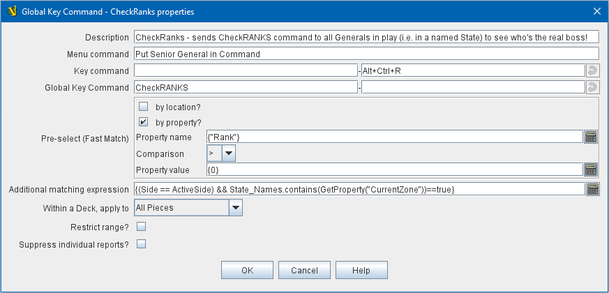

== VASSAL Reference Manual
[#top]

[.small]#<<index.adoc#toc,Home>> > <<GameModule.adoc#top,Module>> > <<PieceWindow.adoc#top,Game Piece Palette>># [.small]#>  <<GamePiece.adoc#top,Game Piece>># [.small]#> *Global Key Command*#

'''''

=== Global Key Command

This <<GamePiece.adoc#Traits,Trait>> adds an action that applies a key command to other pieces, similar to the <<Map.adoc#GlobalKeyCommand,Global Key Command>> component of a Map Window.

Global Key Commands are the main avenue by which Pieces can prompt action by other Pieces.
As such, they are very powerful, but they do come at the price of some performance lag, as each time one is issued Vassal must generally check it against every piece on the board.

See the combined <<GlobalKeyCommands.adoc#top>> page for full details of Global Key Commands.

*EXAMPLE 1:*

[.text-center]
image:images/CounterGlobalKeyCommand.png[]

A leader counter and infantry counters both have <<PropertyMarker.adoc#top,Marker>> traits to specify their nationality and type.

A <<Layer.adoc#top,Layer>> trait represents the rallied state of an infantry counter, uses _Ctrl+A_ to activate the Layer, and uses _Rally_ as the name.

A Global Key Command on the leader counter can select and rally all infantry counters within two hexes of the same nationality that are not rallied by checking the 
boxes for _Restrict Range_ and _Fixed Range_, specifying _Range_ of 2 and additional matching properties _{ type == "Infantry" } && { nation == "$nation$" } && { Rally_Active == "false" }_.

Or, as in the example
shown in the dialog box, the _type=="Infantry"_ check can be made faster by moving it out of the additional matching expression and into the Fast Match, by checking _by Property?_, and putting the expression _{ "type" }_ for
the property name and _{"Infantry"}_ for the property value. Likewise, the effects can be restricted to pieces on the main map by checking the _by Location?_ box selecting _Specific Map_, and putting _{"Main Map"}_ in the _Map_ field.

If
instead you wanted to match pieces on the same map as the issuing piece, you could select _Current Map_ instead.

*EXAMPLE 2:*

[.text-center]

An Army unit that may stack with multiple generals can be given a command to "Put Senior General In Command" with the shortcut key command Alt+Ctrl+R.

When the menu item or shortcut key are activated, this trait sends the <<NamedKeyCommand.adoc#top,Named Key Command>> _CheckRANKS_ to the pieces representing generals who might be put in command.

Eligible generals are found by checking first if they have a property _Rank_ which is > 0, since only generals have ranks.

Next their _Side_ property ("Union" or "Confederate") is compared to a Global Property _ActiveSide_ so that we don't accidentally put Ulysses Grant in command of the Confederate army.

Notice that
the _Rank_ check uses the Fast Match comparison to eliminate all pieces that don't have ranks (all the non-generals) very quickly; the same comparison (Rank > 0) could be included in the Additional Matching Expression,
for convenience, but it would not run as quickly.

