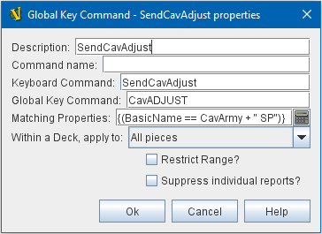

== VASSAL Reference Manual
[#top]

[.small]#<<index.adoc#toc,Home>> > <<GameModule.adoc#top,Module>> > <<PieceWindow.adoc#top,Game Piece Palette>># [.small]#>  <<GamePiece.adoc#top,Game Piece>># [.small]#> *Global Key Command*#

'''''

=== Global Key Command

This <<GamePiece.adoc#Traits,Trait>> adds an action that applies a key command to other pieces, similar to the <<Map.adoc#GlobalKeyCommand,Global Key Command>> component of a Map Window.
Global Key Commands are the main avenue by which Pieces can prompt action by other Pieces.
As such, they are very powerful, but they do come at the price of some performance lag, as each time one is issued Vassal must generally check it against every piece on the board.

[width="100%",cols="50%a,^50%a",]
|===
|*Description:*:: A short description of this trait for your own reference.

*Menu command:*:: Name of the right-click context menu item.
If left blank, no context menu item will appear.

*Key command:*::  A Key Command or <<NamedKeyCommand.adoc#top,Named Key Command>> that initiates the action.
For example a keyboard shortcut which, when typed with this piece selected will cause the Global Key Command to be issued.
This is _not_, however, the command that will be issued to the other pieces (see next field).

*Global Key Command:*::  The Key Command or <<NamedKeyCommand.adoc#top,Named Key Command>> that will be applied to other Pieces (and potentially this piece as well). As with all Key Commands, this can either be an actual keyboard shortcut like Ctrl+F, or a Named Key Command such as FireForwardPhasers.
Other pieces which have that same shortcut or Named Key Command filled in as the Key Command for one or more of their <<GamePiece.adoc#Traits,Traits>> will have those traits activated.

*Pre-select (Fast Match):*::  New from VASSAL 3.5, the *Fast Match* selections can be used to improve the performance of "slow" Global Key Commands by pre-matching the location and/or a single property value of the target piece. Essentially these run limited but much faster comparisons, to screen out some of the potentially hundreds of pieces needing to be checked for each Global Key Command. Fast Match expressions are _optional_ in that the same comparisons can always be run in the standard "Additional matching expression" field. Judicious use of them, however, can improve the performance of a Global Key Command by 25-33%.
+
See the <<FastMatch.adoc#top>> page for full details on Fast Matches.

*Additional matching expression:*::  If further refinement of which target pieces should receive the Global Key Command is needed, or if you do not wish to use Fast Match pre-selections, an Additional Matching Expression can be used. The Global Key Command will only be applied to Game Pieces which match the specified <<PropertyMatchExpression.adoc#top,Property Match Expression>>. Note that the properties named in _this_ expression are evaluated against the properties _of the target pieces_, not the properties of the piece issuing the Global Key Command.
For example if you provided the expression _{ CurrentZone == "Europe" }_, that would use the CurrentZone property of each potential target piece (checking if _it_ is "Europe") to determine whether to apply the Global Key Command.
If you want to compare a property in the target pieces against the value of _a property in *this* piece_, then use $property$. All $...$ property references will be evaluated against this piece before testing against other pieces.
Note that this will often mean the expression needs to be put inside of quotation marks if the property in question is a string value.
For example if the expression provided is { CurrentZone == "$CurrentZone$" } then the CurrentZone of each potential target piece will be checked against $CurrentZone$ which will read the CurrentZone of the _issuing_ piece (see also example below).

*Within a Deck, apply to:*::  Select how the Global Key Command will be applied to pieces in a <<Deck.adoc#top,Deck>>. Options are _All pieces_, _No pieces_, or _Fixed number of pieces_.
If _Fixed number of pieces_ is selected, a field appears to allow entry of the number of Pieces in the Deck to affect, starting at the top of the Deck.
Thus, selecting 1 for the fixed number would cause only the top card or piece in a Deck to be affected.

*Restrict Range:*::  If selected, the command will only apply to pieces located within a specified distance of this piece.<<Properties.adoc#top>>

*Range:*:: Only others pieces within this distance, inclusive, of this piece will have the command applied to them.
If the pieces are on a board with a <<HexGrid.adoc#top,Hex Grid>> or <<RectangularGrid.adoc#top,Rectangular Grid>>, then the distance is in units of the grid.
Otherwise, the distance is measured in screen pixels.

*Fixed Range:*::  If selected, then the range is specified as a fixed number.
If unselected, then the range will be given by the value of the named <<Properties.adoc#top,property>>.

*Range Property:*::  The name of a Property that contains the range to use when Fixed Range is not selected.

*Suppress individual reports:*::  If selected, then any reports (whether auto-reporting or <<ReportChanges.adoc#top,Report Action>> traits) by the affected Pieces will be disabled throughout the processing of this Global Key Command.
  You may wish to use a <<ReportChanges.adoc#top,Report Action>> trait on this piece to provide a summary message in their place.

*EXAMPLE 1 (see upper right):*::  A leader counter and infantry counters both have <<PropertyMarker.adoc#top,Marker>> traits to specify their nationality and type.
A <<Layer.adoc#top,Layer>> trait represents the rallied state of an infantry counter, uses _Ctrl+A_ to activate the Layer, and uses _Rally_ as the name.
A Global Key Command on the leader counter can select and rally all infantry counters within two hexes of the same nationality that are not rallied by checking the 
boxes for _Restrict Range_ and _Fixed Range_, specifying _Range_ of 2 and additional matching properties _{ type == "Infantry" } && { nation == "$nation$" } && { Rally_Active == "false" }_. Or, as in the example
shown in the dialog box, the _type=="Infantry"_ check can be made faster by moving it out of the additional matching expression and into the Fast Match, by checking _by Property?_, and putting the expression _{ "type" }_ for
the property name and _{"Infantry"}_ for the property value. Likewise the effects can be restricted to pieces on the main map by checking the _by Location?_ box selecting _Specific Map_, and putting _{"Main Map"}_ in the _Map_ field. If
instead you wanted to match pieces on the same map as the issuing piece, you could select _Current Map_ instead. 

*EXAMPLE 2 (see below):*::  An Army unit that may stack with multiple generals can be given a command to "Put Senior General In Command" with the shortcut key command Alt+Ctrl+R.
When the menu item or shortcut key are activated, this trait sends the <<NamedKeyCommand.adoc#top,Named Key Command>> _CheckRANKS_ to the pieces representing generals who might be put in command.
Eligible generals are found by checking first if they have a property _Rank_ which is > 0, since only generals have ranks.
Next their _Side_ property ("Union" or "Confederate") is compared to a Global Property _ActiveSide_ so that we don't accidentally put Ulysses Grant in command of the Confederate army. Notice that
the _Rank_ check uses the Fast Match comparison to eliminate all pieces that don't have ranks (all the non-generals) very quickly; the same comparison (Rank > 0) could be included in the Additional Matching Expression,
for convenience, but it would not run as quickly.

|image:images/CounterGlobalKeyCommand.png[]

 +
|===

image:images/CounterGlobalKeyCommand2.png[]

'''''
