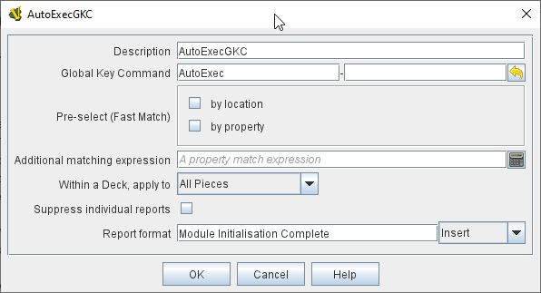

== VASSAL Reference Manual
[#top]

[.small]#<<index.adoc#toc,Home>> > <<Concepts.adoc#top,Concepts>> >  *Global Key Commands*#

'''''

* <<#top,Global Key Commands>>
* <<#shared,Common Attributes>>
* <<#examples,Examples>>
* <<#module,Module GKCs>>
* <<#map,Map GKCs>>
* <<#startup,Startup GKCs>>
* <<#deck,Deck GKCs>>
* <<#counter,Counter GKCs>>

=== Global Key Commands
Global Key Command (or GKCs) are a fundamental aspect of VASSAL and are used in many places in a Vassal module.

GKCs select a group of pieces according to supplied criteria and then apply a Key Command to each of the selected pieces. This allows a set of actions to be performed on multiple pieces at once.

There are 5 different kinds of GKCs:

* <<#module,*Module GKCs*>>  are defined in the top level <<GameModule.adoc#top,Module>> component and are initiated by an associated <<Toolbar.adoc#top, Toolbar>> button and can affect any piece in the current game.
* <<#map,*Map GKCs*>> are defined in a <<Map.adoc#top,Map>> and are initiated by an associated <<Toolbar.adoc#top, Toolbar>> button and can affect any piece on the <<Map.adoc#top,Map>> they are defined on.
* <<#startup,*Startup GKCs*>> are defined in the top level <<GameModule.adoc#top,Module>> component and are initiated when a new game is started or loaded and can affect any piece in the current game.
* <<#deck,*Deck GKCs*>> are defined in a <<Deck.adoc#top,Deck>> and are initiated by a right-click menu item on the Deck, and can affect any piece currently residing in the Deck the are defined in..
* <<#counter,*Counter GKCs*>> are a piece trait that can be included in any Piece definition. They are initiated by a Menu Command or Key Command on the piece and can affect any piece in the current game.

The action of all types of GKCs follows the same pattern:

. Replace any $$ variables in the _Additional matching expression_ with property values from the component or trait that is running the GKC.

. Select a group of piece (not components) based on the _Fastmatch_ selection criteria and/or the _Additional matching expression_.

. For each piece selected, in order, set any <<DynamicProperty.adoc#top,Dynamic Properties>> specified in the _Set Dynamic Properties in target pieces_ field, then apply the specified _Global Key Command_.

. After completion, generate a report in the Chat Window if a _Report format_ has been specified.

NOTE: The order of the pieces selected by a GKC is not defined and cannot be depended upon not to change in future versions of VASSAL. The Key Command applied to each piece will completely finish executing, plus any of the further actions the piece initaites as a result of the Key Command, before the next piece is processed.

The different types of GKCs share a lot of functionality in common. The next section describes all the attributes that are shared by more than one type of GKCs.

[#shared]
=== Common Global Key Command attributes
[width="100%",cols="30%a,15%a,55%a",]
|===
|Field | Used By | Description

| Description
| <<#module,Module>> +
<<#map,Map>> +
<<#startup,Startup>> +
<<#deck,Deck>> +
<<#counter,Counter>>
| An optional description of the action (for distinguishing between multiple similar commands in the Editor window).

| Button Text
| <<#module,Module>> +
<<#map,Map>>
| Text to appear on Toolbar Button

| Tooltip text
| <<#module,Module>> +
<<#map,Map>>
| Mouse-over hint text for the Toolbar button.

| Button icon
| <<#module,Module>> +
<<#map,Map>>
| Icon for the Toolbar button.

| Hotkey
| <<#module,Module>> +
<<#map,Map>>
| Keyboard shortcut or <<NamedKeyCommand.adoc#top,Named Key Command>> for the Toolbar button.
This is the key command that will _initiate_ the Global Key Command, not the one that will be sent to the matching pieces

| Toolbar button can be disabled by a property
| <<#module,Module>> +
<<#map,Map>>
| If this box is checked, you will be able to enable/disable the Toolbar Button by changing the value of a Global Property. See also: <<Toolbar.adoc#toolbarconfig, Toolbar Configuration>>

| Global Property to disable this button when "true"
| <<#module,Module>> +
<<#map,Map>>
| The name of a <<GlobalProperties.adoc#top,Global Property>> that will control when this Toolbar Button is enabled or disabled. If the property contains the string _true_,  the button will be disabled; if it contains any other value the button will be enabled.

| Button Icon when disabled
| <<#module,Module>> +
<<#map,Map>>
| If you select an alternative icon here, then that icon will be used when the button is currently disabled. If you leave the icon empty, then the normal icon, if any, will stay in place. Any button text for the toolbar button will be greyed out when the button is disabled, regardless of your choice in this field.

| Menu Command
| <<#deck,Deck>> +
<<#counter,Counter>>
| Name of the right-click context menu item for Deck and counter GKCs.
If left blank, no context menu item will appear.

| Global Key Command
| <<#module,Module>> +
<<#map,Map>> +
<<#startup,Startup>> +
<<#deck,Deck>> +
<<#counter,Counter>>
| The key command or <<NamedKeyCommand.adoc#top,Named Key Command>> that will be sent and applied to the selected pieces. +
Each piece selected by the GKC will have this Key Command applied to it as if applied manually by a player.

| Pre-select (Fast Match)
| <<#module,Module>> +
<<#map,Map>> +
<<#startup,Startup>> +
<<#counter,Counter>>
| *Fast Match* selections can be used to improve the performance of "slow" Global Key Commands by pre-matching the location and/or a single property value of the target piece.

All Location-based Fast Match options use indexes maintained by VASSAL to provide extremely fast access to pieces. The Property-based matches are less efficient, but can help improve performance if the _Additional match expression_ is complex.

Fast Match expressions are _optional_ in that the same comparisons can always be run in the standard "Additional matching expression" field, however, substantial performance improvements can be achieved by judicious use of Fast Match options.

Wherever possible, specify a Location-based Fast Match that will minimise the number of pieces selected. Then, try and specify a Property Fast Match on the property that will eliminate as many pieces as possible from those remaining. Adding a Property-based Fast Match that matches most of the pieces will have little or no effect.

See the <<FastMatch.adoc#top,Fast Match>> page for full details on Fast Matches.

| Additional matching Expression +
| <<#module,Module>> +
<<#map,Map>> +
<<#startup,Startup>> +
<<#counter,Counter>>
|  If further refinement of which target pieces should receive the Global Key Command is needed, or if you do not wish to use Fast Match pre-selections, an Additional Matching Expression can be used. The Global Key Command will only be applied to Game Pieces which match the specified <<PropertyMatchExpression.adoc#top,Property Match Expression>>. Note that the properties named in _this_ expression are evaluated against the properties _of the target pieces_, not the properties of the piece issuing the Global Key Command.

For example if you provided the expression _{ CurrentZone == "Europe" }_, that would use the CurrentZone property of each potential target piece (checking if _it_ is "Europe") to determine whether to apply the Global Key Command.

If you want to compare a property in the target pieces against the value of _a property in *this* piece_, then use $property$. All $...$ property references will be evaluated against this piece before testing against other pieces.

Note that this will often mean the expression needs to be put inside of quotation marks if the property in question is a string value.

For example if the expression provided is { CurrentZone == "$CurrentZone$" } then the CurrentZone of each potential target piece will be checked against $CurrentZone$ which will read the CurrentZone of the _issuing_ piece (see also example below).

| Within a Deck, apply to
| <<#module,Module>> +
<<#map,Map>> +
<<#startup,Startup>> +
<<#counter,Counter>>
| Select how this command applies to pieces that are currently stacked in a <<Deck.adoc#top,Deck>>. +

_No pieces_;; means that pieces in a Deck ignore the command.

_All pieces_;; means that the command can apply to any piece in the entire Deck that matches the expression.

_Fixed number of pieces_;; allows you to specify the number of pieces (drawn from the top) that the command will potentially apply to--the piece(s) in question must still match the expression in order to be included. This value can be an expression.

| Suppress individual reports
| <<#module,Module>> +
<<#map,Map>> +
<<#startup,Startup>> +
<<#deck,Deck>> +
<<#counter,Counter>>
|  If selected, then any reports (whether auto-reporting or <<ReportChanges.adoc#top,Report Action>> traits) by the affected Pieces will be disabled throughout the processing of this Global Key Command.

You may wish to use a <<ReportChanges.adoc#top,Report Action>> trait on this piece to provide a summary message in their place.

| Suppress individual sounds
| <<#module,Module>> +
<<#map,Map>> +
<<#startup,Startup>> +
<<#deck,Deck>> +
<<#counter,Counter>>
| If selected, then any sounds generated by Play Sound traits on any affected pieces will be suppressed during the processing of this Global Key Command.

| Report format
| <<#module,Module>> +
<<#map,Map>> +
| A <<MessageFormat.adoc#top,Message Format>> that will be echoed to the chat area when the button is clicked or the hotkey pressed.

| Set Dynamic Properties in target pieces
| <<#module,Module>> +
<<#map,Map>> +
<<#startup,Startup>> +
<<#deck,Deck>> +
<<#counter,Counter>>
| Allows you to set the values of the named <<DynamicProperty.adoc#top,Dynamic Properties>> that exist in pieces that are selected by this GKC.

Property names used in the Expression will be replaced by the value of those properties in the matched pieces.

You can use $$ variables to replace values in the expression from the source GKC. This will be values from the issuing piece for a Counter GKC, the owning Map for a Map or Deck GKC or the Game Module for a Module or Startup GKC.

The values are set into the new marker before the _Global Key Command_ is applied to the piece. This means the values are set even if the _Global Key Command_ is not recognized by the matched pieces. You can specify a dummy _Global Key Command_ in order to just set the Dynamic Properties in the target pieces without taking other actions.

NOTE: The named <<DynamicProperty.adoc#top,Dynamic Properties>> must ealready exist in the target Pieces. This option does not create new Dynamic Properties

See <<PassingValues.adoc#marker,Passing values to pieces>> for more detailed information on using this feature.

|===

''''
[#examples]
*EXAMPLE 1*

[.text-center]
image:images/CounterGlobalKeyCommand.png[] +
_Example 1_

A leader counter and infantry counters both have <<PropertyMarker.adoc#top,Marker>> traits to specify their nationality and type.

A <<Layer.adoc#top,Layer>> trait represents the rallied state of an infantry counter, uses _Ctrl+A_ to activate the Layer, and uses _Rally_ as the name.

A Global Key Command on the leader counter can select and rally all infantry counters within two hexes of the same nationality that are not rallied by checking the
boxes for _Restrict Range_ and _Fixed Range_, specifying _Range_ of 2 and additional matching properties _{ type == "Infantry" } && { nation == "$nation$" } && { Rally_Active == "false" }_.

Or, as in the example
shown in the dialog box, the _type=="Infantry"_ check can be made faster by moving it out of the additional matching expression and into the Fast Match, by checking _by Property?_, and putting the expression _{ "type" }_ for
the property name and _{"Infantry"}_ for the property value.

Likewise, the effects can be restricted to pieces on the main map by checking the _by Location?_ box selecting _Specific Map_, and putting _{"Main Map"}_ in the _Map_ field.

If
instead you wanted to match pieces on the same map as the issuing piece, you could select _Current Map_ instead.

*EXAMPLE 2*

[.text-center]
image:images/CounterGlobalKeyCommand2.png[] +
_Example 2_

An Army unit that may stack with multiple generals can be given a command to "Put Senior General In Command" with the shortcut key command Alt+Ctrl+R.

When the menu item or shortcut key are activated, this trait sends the <<NamedKeyCommand.adoc#top,Named Key Command>> _CheckRANKS_ to the pieces representing generals who might be put in command.

Eligible generals are found by checking first if they have a property _Rank_ which is > 0, since only generals have ranks.

Next their _Side_ property ("Union" or "Confederate") is compared to a Global Property _ActiveSide_ so that we don't accidentally put Ulysses Grant in command of the Confederate army. Notice that
the _Rank_ check uses the Fast Match comparison to eliminate all pieces that don't have ranks (all the non-generals) very quickly; the same comparison (Rank > 0) could be included in the Additional Matching Expression,
for convenience, but it would not run as quickly.

''''
[#module]
=== Module Global Key Commands
A Module GKC has an associated toolbar button that is added to the main module toolbar and can select pieces from any Map in the game.

Use a Module GKC when you want to process pieces across more than one Map, or where you want the toolbar button to be in the main Toolbar, or a Toolbar Menu on the main Toolbar.

*Module GKC Example:*
[.text-center]
image:images/ModuleGlobalKeyCommand.png[] +
_Module Global Key Command example_

''''
[#map]
=== Map Global Key Commands
A Map GKC has an associated toolbar button that is added to the toolbar associated with the Map it is defined on and by default, will only select pieces from that Map.

Map GKCs have an additional option _Apply counters to this map only_ which can be disabled to make them act like a Module GKC and select pieces from all Maps in the game.

Use a Map GKC when you want the toolbar button to appear in the Map Toolbar, or on a Toolbar Menu on the Map toolbar.

*Map GKC Example:*

[.text-center]
image:images/MapGlobalKeyCommand.png[] +
_Map Global Key Command example_

''''
[#startup]
=== Startup Global Key Commands
Startup GKCs are run automatically when a game is started or loaded. They can be used to display message on game startup, or do New Game initialization tasks.

Otherwise, it works as a standard Global Key Command, but has no associated toolbar, unless the Global Hotkey mode is enabled.

Unlike other Global Key Commands, a Startup GKC can be configured to send a Global Hotkey (to affect toolbar buttons and Decks) rather than a Global Key Command (which affects pieces). See the second example below.

NOTE: Any Startup GKCs configured are guaranteed to run in the order they are defined in the module.

*Startup GKC example 1:*
[.text-center]
 +
_At the start of each fresh game, set the Dynamic Property PreGame on each piece in the game to false and send each piece the AutoExec Key Command._

The _When to Apply_ option controls exactly when the Startup GKC runs:

[width="100%",cols="40%a,60%a",]
|===
| Option | Description

| On First Game Launch/Load Of Session
| Run every time the _module_ starts up, regardless of whether it is to begin a new game or to load and continue an existing one.

| On Every Game Launch/Load Of Session
| Run every time a game is launched or loaded during the session.

| At Start Of Every Fresh Game Only
| Run only when a _new game_ is starting. If the game is saved and later restored, or is being exchanged back and forth in log form, the key command will not fire on subsequent loads.

NOTE: A new game started from a <<GameModule.adoc#PredefinedSetup, Pre-defined Setup>> _does_ count as a fresh new game.

| At Start of Fresh Game or Player Join/Side-Change
| Run only when a _new game_ is starting _OR_ a new player joins or a player changes sides.

|===

*Startup GKC example 2:*
[.text-center]
image:images/StartupGlobalKeyCommand2.png[] +
_Send a Global Hotkey on startup._

The _What to Apply_ field allows selection of Global Key Command mode (affects pieces) or Global Hotkey mode (affects toolbar buttons and decks).

''''
[#deck]
=== Deck Global Key Commands
Deck GKCs are a cut-down version that can only select pieces in the <<Deck.adoc#top,Deck>> the Deck GKC is defined in.

Deck GKCs do not have a Fast Match option, just a _Matching expression_ field which works in the same way as the _Additional matching expression_ of the other types.

The _Affects_ field is cut-down version of the _Affects in Deck_ field of the other types, allowing either All pieces, or a limited number of pieces to be affected.

*Deck GKC Example:*
[.text-center]
image:images/DeckGlobalKeyCommand.png[] +
_Sent Ctrl-M to the first piece in the Deck which is not a "Blockade" piece._

''''
[#counter]
=== Counter Global Key Commands
The Counter version of Global Key Command is a trait that can be added to a Game Piece.

The main <<#examples,Examples>> above are Counter GKCs.

'''''
