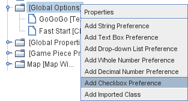

== VASSAL Reference Manual
[#top]

[.small]#<<index.adoc#toc,Home>> > <<GameModule.adoc#top,Module>> > *Global Options*#

'''''

=== Global Options
The Global Options component allows you to define your own custom preferences for a module.
It also contains other settings that apply to the module as a whole, as well as providing a location to configure button images and hotkeys for some of the basic Toolbar buttons.
If an option has a _Use Preferences Setting_ choice, selecting it will add an entry to the Preferences window to allow players to choose their own setting at game time.

[width="100%",cols="50%a,^50%a",]
|===
|
*Description:*::  A short description of this component that appears on the main editor dialog (optional).

*Allow non-owners to unmask pieces:*::  By default, only the player who originally masked a piece (see the <<Mask.adoc#top,Mask trait>> for Game Pieces) is allowed to unmask it.
This option allows other players to unmask a masked piece.

*Auto-report moves:*::  This option will automatically report a text description (e.g.
"3rd Cav moves A10 ->B11") to the chat log of the control window whenever a player moves a piece in a Map Window.

*Player Id format:*:: A <<MessageFormat.adoc#top,Message Format>> that is used to identify players when typing chat text.
It is available for use as a short-cut in other message formats such as move auto-reporting as well.

*Enable HTML Support in Chat Log:*::  This option, if enabled, will allow messages sent to the <<ChatLog.adoc#top,Chat Log>> to include HTML tags.
It is recommended that for new modules you set this option to _Always_, as the other settings exist only to maintain compatibility with VASSAL modules created before HTML support existed that might have included symbols in their text messages, e.g.
< > which could otherwise be misinterpreted as HTML tags.

*Toolbars On Closed Map Windows Accept Hotkeys:*:: This option, if enabled, will allow toolbar buttons and items (such as Global Key Commands, Dice rollers, and Global Property setters) to receive Global Hotkeys sent by Game Pieces even when their Map Window is currently closed. This option is "off" by default, meaning that the toolbar items on windows are disabled while the windows are closed.

*Inventory can see into Private Windows not accessible to current player:*:: This option, if enabled, allows <<Inventory.adoc#top,Inventory>> windows to see into private windows and hands even if the current player doesn't normally have access to those windows.

*Send-to-Location trait generates Movement Trails:*:: If this option is enabled, Send-to-Location traits generate Movement Trails (and mark pieces moved) when they cause a piece to move, assuming the piece in question has a Movement Trail trait of course.

[#leadingzeros]
*Preserve leading zeros in Integers:*::  This option should not normally be used. It is for the specific case where you use leading zeros in Grid co-ordinates and need to maintain these leading zeros for later reporting. By default, Vassal will strip leading zeros off and convert to an integer. Enabling this option forces Vassal to keep the leading zeros and store the number 02 as the string "02", not the number 2.
NOTE: If you later need to do arithimetic on this value in a Beanshell expression, you will have to explicitly convert it to a number using Integer.parseInt(value).

*Icons and hotkeys:*:: You can specify your own button icons and keyboard shortcuts for the logfile step/undo buttons and the button that shows/hides the server controls and the button that displays the Debug Window.

|image:images/GlobalOptions.png[]
|===

'''''

[width="100%",cols="50%a,^50%a",]
|===
a|
=== Sub-Components

You may add your own arbitrary preference settings to the global options.
To add your own preferences, right-click on the _[Global Options]_ component in the Editor and select one of the _Add_ options.
The different sub-components support different constraints on the values of the preference setting.
The values of these preference settings are exposed as <<Properties.adoc#top,Properties>>.

_You must save and re-load the module before these sub-components will show up in the Preferences window_

[#String]
==== String Preference

A simple string value.

[#TextBox]
==== Text Box Preference

A multi-line string value.

[#DropDown]
==== Drop-down List Preference

A drop-down from which the player selects from a list of specified values.

[#Integer]
==== Whole Number

An integer value.

[#Float]
==== Decimal Number Preference

A floating-point value.

[#Boolean]
==== Checkbox Preference

A true/false value.

|
|===

