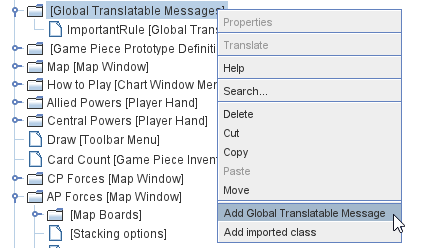
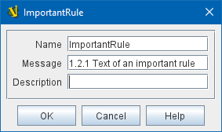

== VASSAL Reference Manual
[#top]

[.small]#<<index.adoc#toc,Home>> > <<GameModule.adoc#top,Module>> > *Global Translatable Messages*#

'''''

[width="100%",cols="50%,50%",]
|===
a|
=== Global Translatable Messages

Global Translatable Messages are similar to <<GlobalProperties.adoc#top, Global Properties>>, except that instead of holding a value that might change during the game,
they hold a message that _might_ be translated into a foreign language (e.g. if running the module "in Spanish"). Global Translatable Messages _are_ <<Properties.adoc#top,Properties>>,
but they should _only_ be referenced in <<MessageFormat.adoc#top, Message Formats>> for display, or in <<Expression.adoc#top, Expressions>> used exclusively to generate messages to be displayed. They should not, in other words, be used to change
the "game state", since they may hold different values if two players in the same game are playing the module in two different languages.

To add a Global Translatable Message to your module, use the Editor's configuration window to navigate to the _[Global Translatable Messages]_ component, which is one of the top-level components of your module.
Right-click on the _[Global Translatable Messages]_ component and select _Add Global Translatable Message_.
Your new Global Translatable Message will be added to the bottom of the list.

|
|===

[cols=",",]
|===
|*Name:*  The name of the property that will contain this message.

*Message:*  The message itself. This is the message that can be translated into a foreign language.

*Description:*  Plain English description of the message - not used during gameplay, just a "comment" for organizing your module.

| +
|===

'''''
