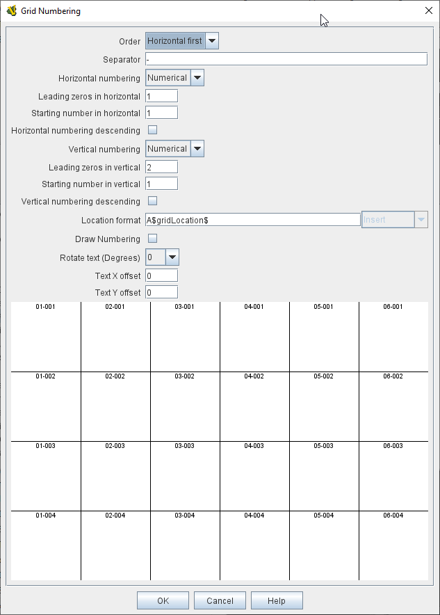
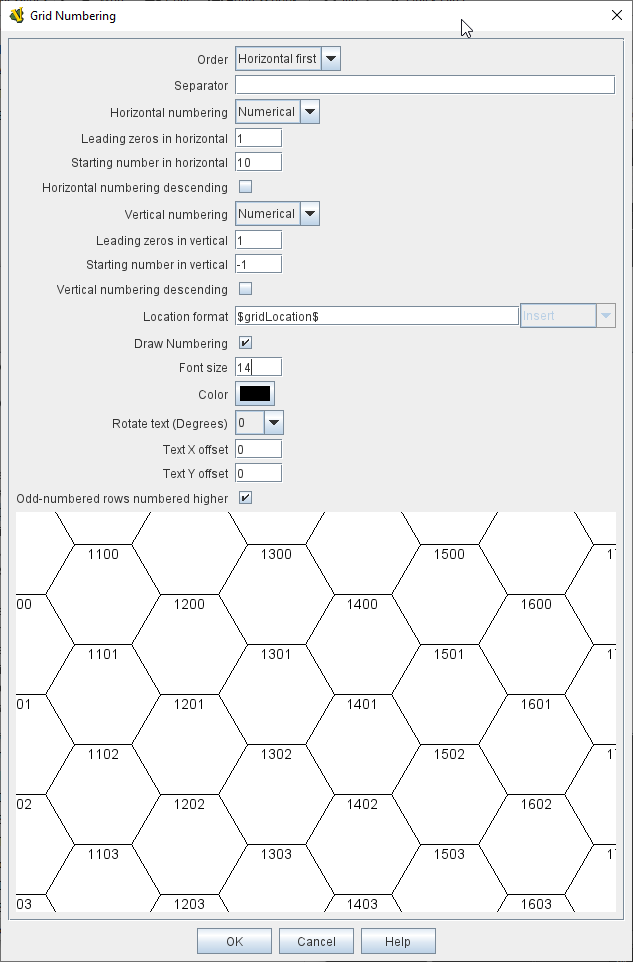

== VASSAL Reference Manual
[#top]

[.small]#<<index.adoc#toc,Home>> > <<GameModule.adoc#top,Module>> > <<Map.adoc#top,Map>> > <<Board.adoc#top,Board>> > Grid > *Grid Numbering*#

'''''

=== Grid Numbering

Specifies how identifying names/numbers are assigned to cells in a <<HexGrid.adoc#top,Hex Grid>> or <<RectangularGrid.adoc#top,Rectangular Grid>> on a <<Board.adoc#top,Board>>, the format of those grid references, and whether the names are to be drawn on top of the board image.

NOTE: When using Grids with fully numeric Column and Row numbers with leading zeros (e.g. 0203), then Vassal will internally remove leading zeros of any grid references generated. This makes it difficult to use column or row numbers in Beanshell expressions and keep the leading zeros intact. This can be overcome by setting the <<GlobalOptions.adoc#leadingzeros,Preserve leading zeros in Integers >> Global Option.

[width="100%",cols="50%a,^50%a",]
|===
|

*Order:*::  Grid reference order, row/column vs.column/row. +
_Horizontal first_ - The row reference is reported first.
_Vertical first_ - The column reference is reported first.

*Separator:*::  Text to place between the row and column, such as a comma or hyphen.

*Horizontal/vertical Numbering:*:: Whether to use an Alphabtic or Numeric naming scheme for the Horizontal and Vertical references. +
_Alphabetical_ - (A,B,C, ... AA, BB, CC, etc.) +
_Numeric_ - (1,2,3 ...).

*Leading zeros in horizontal/vertical:*::  When the _Numeric_ numbering scheme is selected, then this option sets how many leading zeros will be added to a single digit grid reference. One leading zero means  use a minimum of two digits for the row/column.
Two leading zeros mean use a minimum of three digits, etc.

*Starting number in horizontal/vertical:*::  The number of the first cell ('A' is equivalent to 0 if using alphabetic numbering).
NOTE: If you are creating a grid inside a <<ZonedGrid.adoc#top,Zone>> the first cell refers to the first cell if the grid was applied to the whole board. You will have to allow for how many cells are between the board edge and the zone edge.

*Horizontal/Vertical numbering descending:*::  If checked, numbering of rows/columns begins on the bottom/right edge of the board and increases up/left.

*Location format:*::  A <<MessageFormat.adoc#top,Message Format>> used to generate a piece's LocationName <<Properties.adoc#top,Property>> and for reporting locations within a map window (e.g.
for move reporting).
+
The default value of _$gridLocation$_ is the automatically generated name as drawn on the sample grid.
+
You can add additional information to the generated grid reference, such as a board prefix.
+
You can also over-ride the automatically generated reference format and use your own. The values _$row$_ and _$column$_ are provided to help with this.

*Draw numbering:*::  If checked, the generated grid references will be drawn on top of the board image.

*Font size:*::  Size of the font to use when drawing the numbering.

*Color:*:: Color to use when drawing the numbering.

*Rotate text:*:: Orientation of the numbering text.

*Text X offset:*:: Distance in pixels to the right (relative to the text's orientation) of its default position that the text will be drawn.
By default, text is center-justified at the top of the cell.

*Text Y offset:*:: Distance in pixels downward (relative to the text's orientation) of its default position that the text will be drawn.
By default, text is center-justified at the top of the cell.

*Odd-numbered rows numbered higher:*::  For hex grids only.
If checked, then the first number of staggered columns on the grid will be one greater than non-staggered columns.

|

|===

'''''

