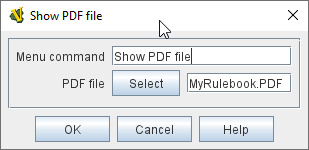

== VASSAL Reference Manual
[#top]

[.small]#<<index.adoc#toc,Home>> > <<GameModule.adoc#top,Module>> > *Help Menu*#

'''''

=== Help Menu

The "Help" menu in the main control window contains general help files for VASSAL.
You may add more help files specific to the module you are creating by right-clicking on the _[Help Menu]_ component in the Editor and selecting the appropriate _Add_ option.

This can also be used to include a PDF file, e.g.
of a rulebook, in your module (see <<#PDF,Using PDF Files>> , below).

'''''

=== Sub-Components

[#HtmlHelpFile]
==== HTML Help File

Adds an entry to the help menu.
Selecting the menu item opens an external browser on the user's machine with HTML content that you specify.

[width="100%",cols="50%a,^50%a",]
|===
|
*Menu command:*::  The menu item to be added to the Help menu.

*Contents:*::  A folder on your local file system.
The contents of the folder will be copied into the module and expanded onto the user's machine when the user selects the menu item.
The folder can contain any number of sub-folders and can include image data, style sheets, etc.
Be sure that your HTML content makes use of relative URLs.

*Starting Page:*::  The file within the Contents folder that the user's browser will be pointed to.

NOTE: You can launch an external URL in the user's browser by specifying the URL as the Starting Page and leaving the Contents set to null.

|
|===

[#PDF]
==== PDF Help File
Adds an entry to the help menu. Selecting the menu item opens an external browser to view a specified PDF file.

[width="100%",cols="50%a,^50%a",]
|===
|
*Menu command*:::  The menu item to be added to the Help menu.

*PDF file*:::  A PDF file you select from your local file system. It will automatically be copied into the module and will be distributed with it.
|
|===

==== Plain Text Help File

Adds an entry to the Help menu in the main controls window.
Selecting the menu displays a new window with the contents of a plain text file.

[width="100%",cols="50%a,^50%a",]
|===
|
[#HelpFile]

*Menu command:*::  The menu item to be added to the Help menu.

*Text file:*::  A file containing the contents of the window to be displayed.

| +
|===

[#AboutScreen]
==== About Screen

You may use any image you wish as an 'About' screen for your module.
Feel free to include text in the image that credits you and any other contributors to the module.

The About Screen will always display the current version of both the VASSAL and engine and your module.

The About Screen image is also used as a "Splash Screen" when starting your module.

[width="100%",cols="50%a,^50%a",]
|===
|
*Menu command:*::  The menu item to be added to the Help menu.

*Image:*::  The image to display.

|
|===

[#Tutorial]
==== Tutorial

You may create a tutorial by writing a logfile and making it accessible from the help menu.

[width="100%",cols="50%a,^50%a",]
|===
|
*Menu command:*::  The menu item under the Help Menu

*Logfile:*::  The logfile that players will step through when they select the corresponding menu item.

*Launch automatically on first startup:*::  If selected, then players will automatically be prompted to run the tutorial the first time they load the module.

*Auto-launch confirm message:*::  The text in the yes/no dialog that is displayed to the player when they load the module for the first time.
Answering "yes" will load the tutorial logfile.

*Welcome message:*::  The message that displays in the chat log when the tutorial is loaded.

|image:images/Tutorial.png[]
|===
