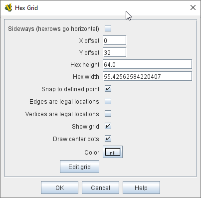
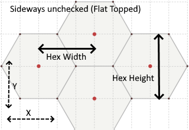
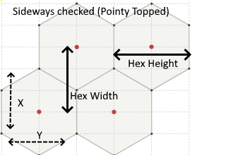
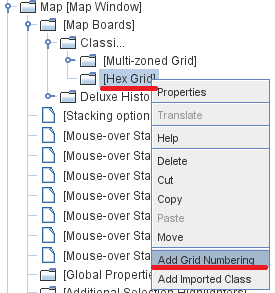

== VASSAL Reference Manual
[#top]

[.small]#<<index.adoc#toc,Home>> > <<GameModule.adoc#top,Module>> > <<Map.adoc#top,Map>> > <<Board.adoc#top,Board>> > *Hex Grid*#

'''''

=== Hex Grid

A standard hexagonal grid for regulating movement on a <<Board.adoc#top,Board>>. The default hexagonal grid layout is "Flat Topped".

[width="100%",cols="50%a,^50%a",]
|===
|
*Sideways (hexrows go horizontal):*::   Check this box to make the hexrows of the grid run right-to-left instead of top-to-bottom.
This changes the hexagonal grid layout from "Flat Topped" to "Pointy Topped".

NOTE: Setting the grid to be sideways switches the meanings of horizontal/vertical, Height/Width and X/Y below.

*X,Y offset:*::  The horizontal and vertical position of the center of the first hex of the grid.

*Hex Height/Width:*::  Pixels from hex center to hex center.
If you specify only the height, the width will automatically adjust to maintain aspect ratio; or you can create oblong hexes by also specifying a width.

*Snap to defined point:*:: If checked, pieces placed anywhere within the grid will automatically snap to the nearest legal location.
If unchecked, pieces may be placed anywhere.
If it is useful for most pieces to snap to legal locations, but for certain types of markers to be allowed anywhere, this can be accomplished by checking this box but adding a <<NonStacking.adoc#top,Does Not Stack>> trait to the pieces which should ignore the grid and then selecting that trait's _Ignore map grid when moving_ option.

*Edges/Vertices are Legal Locations:*::  Determines whether pieces can be placed on hex edges and/or corners, instead of only at hex centers.

*Show Grid:*::  If checked, then the grid will be drawn over the Board image using the specified color.

*Draw Center Dots:*::  If checked, dots are drawn at the center of each hex using the specified color.

*Edit Grid:*::  Clicking the Edit Grid button brings up a graphical interface for positioning and sizing the grid over top of the Map.

|

|
|
|===

'''''

=== Sub-Components

==== <<GridNumbering.adoc#top,Grid Numbering>>

Used to assign names to hexes on the grid, useful for automatically reporting moves, and/or using the <<SendToLocation.adoc#top,Send To Location>> trait to send a piece to a specific hex.

To add Grid Numbering to a Hex Grid, it is necessary to first add the Hex Grid: in the Editor's configuration window, navigate to the _[Board]_, _[Multi-Zoned Grid]_, or _[Zone]_ to which you want to add it, right+click on the component, and select _Add Hex Grid_.
Then right-click on the _[Hex Grid]_ entry in the Editor and select _Add Grid Numbering_ (see diagram at right).

