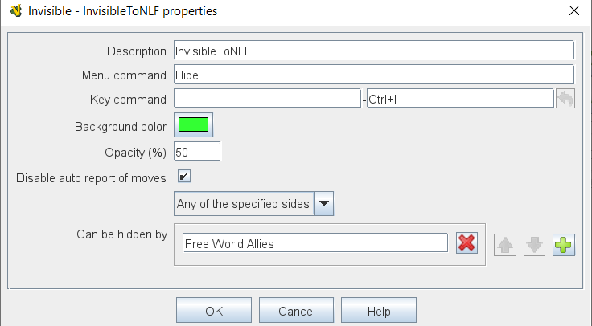

== VASSAL Reference Manual
[#top]

[.small]#<<index.adoc#toc,Home>> > <<GameModule.adoc#top,Module>> > <<PieceWindow.adoc#top,Game Piece Palette>> > <<GamePiece.adoc#top,Game Piece>> > *Invisible*#

'''''

=== Invisible

[cols=",",]
|===
|This trait gives a Game Piece the capability to be made invisible to opponents and other non-owning players.
Specify the key which the user will press to make the piece invisible (or a <<NamedKeyCommand.adoc#top,Named Key Command>>) and the name for the command that will appear in the right-click context menu.
The same command turns the invisible piece visible again.
To the player who turned it invisible, the piece will appear transparent against a background of the specified color.
To other players it will not appear at all.

*NOTE:*  _This trait actually only hides those traits which appear *before* it in the list of traits, so it should generally be the <<GamePiece.adoc#TraitOrder,last trait>> of a Game Piece._

*Key Command:* The keystroke to turn the piece invisible, or a <<NamedKeyCommand.adoc#top,Named Key Command>>.

*Menu Text:* Text of the associated item on the piece's right-click context menu, or leave blank if no menu item is desired.

*Background Color:* The background color that the owner sees the piece drawn against when invisible.

*Opacity(%):* The level of opacity that the owner sees when the piece is invisible to others (0% = completely transparent, 100% = full normal opacity)

*Can be hidden by:* Specifies who may hide this piece (and see it once hidden). _Any Player_ means that any player may hide this piece, including observers.
_Any Side_ means that any player who has been assigned a <<GameModule.adoc#Definition_of_Player_Sides,side>> in a game (not an observer) can hide this piece.
If the player resigns and another player takes the side, then the new player for that side will be the owner.
_Any of the Specified Sides_ allows you to enter a list of sides.
Only players assigned to one of the named sides can hide the piece, but the players of all the listed sides will be able to see and modify the piece.
This is useful for referee players or games with multiplayer teams.

|
|This piece sets the <<Properties.adoc#top,Property>> _InvisibleToOthers=true_ when invisible.
|
|===

'''''
