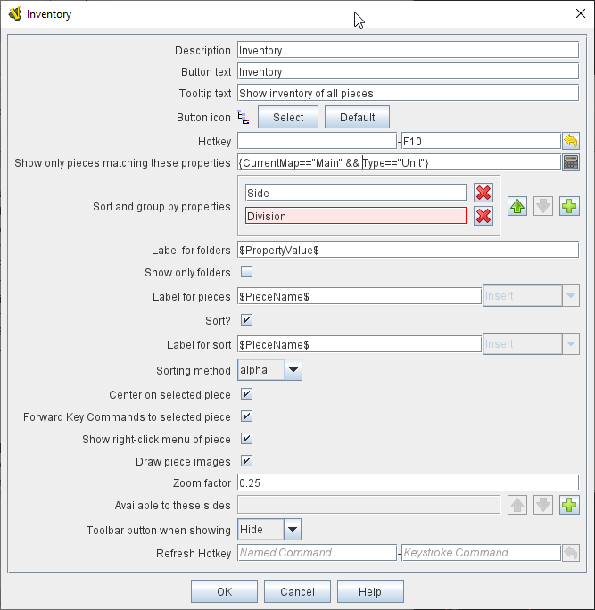

== VASSAL Reference Manual
[#top]

[.small]#<<index.adoc#toc,Home>> > <<GameModule.adoc#top,Module>> > *Game Piece Inventory Window*#

'''''

=== Game Piece Inventory Window

Places a button in the module's Toolbar.
Clicking the button will open a window that organizes and summarizes the pieces in the game in a tree view (similar to browsing a file system, or indeed the VASSAL Editor). You can define exactly which pieces are included in the window and how they are organized.

[width="100%",cols="50%a,50%a",]
|===
|
*Description:*:: A short description of this component for your own reference.

*Button text:*:: Text for the button on the module's Toolbar.

*Tooltip text:*:: Text displayed when the cursor hovers over the Toolbar button.

*Hotkey:*:: <<NamedKeyCommand.adoc#top,Keyboard or Named Command>> for the Toolbar button.

*Show only pieces matching these properties:*:: A <<PropertyMatchExpression.adoc#top,Property Match Expression>> to filter which Game Pieces appear in the window.
The window will only summarize pieces for which the matching expression evaluates to true.
<<Properties.adoc#top,Properties>> of the pieces can be used in the expression to create the desired set of summaries.
+
(_Examples_: limit the pieces to a single map with the _CurrentMap_ property, e.g.
_{ CurrentMap == "Main Map" }_, or only select pieces with a a given value of a <<PropertyMarker.adoc#top,Marker>> trait, e.g.
_{ Type == "Infantry" }_)

*Sort and group by properties:*:: A list of <<Properties.adoc#top,Property>> names.
Pieces with the same value of a given property will be grouped together at the same level.
+
(_Example_: listing the _CurrentBoard_ and _LocationName_ properties will give a top-level folder for each board and a second-level folder for each location that contains a piece.)

*Label for folders:*::  A <<MessageFormat.adoc#top,Message Format>> specifying the text used to label each folder in the tree.
The _PropertyValue_ property gives the value of the property that defines its group.
+
(for example, _CurrentBoard_ for the board name or _LocationName_ for the location name). Any property of the form __sum___XXX will be replaced with the sum of Property XXX for all pieces within that folder.
+
( _Example_:  A Game Piece uses a <<Layer.adoc#top,Layer>> trait named _Manpower_, giving it an automatic property named _Manpower_Level._  Using the _sum_Manpower_Level_ property in the folder label will report the total manpower for all pieces inside that folder.

*Show only folders:*::  If selected, then individual pieces within a folder will not be shown in the view.

*Label for pieces:*::  A <<MessageFormat.adoc#top,Message Format>> specifying the text used to label each piece in the tree.

*Sort:*::  If selected, then sort pieces.

*Label for sort:*::  A <<MessageFormat.adoc#top,Message Format>> specifying the text by which pieces are sorted.
+
(_Example_: A piece is named 3rd Bn, 4th Reg, 3rd Div; for sorting the markers $div$ $reg$ $bn$ are used rather than the pieces name)

*Sorting method:*::  alpha sorts the inventory tree alphabetically, numeric by the value of the first integer found, and length uses the string length first.
When two entries are equal for numeric and length, alpha is used for sorting.
+
(_Example_: $id$ is the Label for sort.
Three gamepieces have the ids 'a', 'aa', and 'b'. Sorting by alpha and numeric is _['a', 'aa', 'b']_.
Sorting by length is _['a', 'b', 'aa']_.
Three gamepieces have the ids 'a3', 'b2', 'c-4'. Sorting by alpha and length is _['a3', 'b2', 'c-4']_.
Sorting by numeric is _['c-4', 'b2', 'a3']_.)

*Center on selected piece:*::  If selected, then clicking on a piece in the tree will center the map on that piece.

*Forward key strokes to selected piece:*::  If selected, then any keys pressed in the window will be sent as key commands to the selected piece.
Selecting a folder will send the command to all pieces within that folder.

*Show right-click menu of piece:*::  If selected, then right-clicking on a piece in the tree will display its context menu, which can be used to modify the piece or give it a command.

*Draw piece images:*::  If selected, the tree will draw reduced-size images of the piece at the specified zoom factor.

*Zoom factor:*::  The magnification factor for drawing pieces in the tree.

*Available to these sides:*::  The Toolbar button will only be visible to the <<GameModule.adoc#Definition_of_Player_Sides,player sides>> listed here.
An empty list makes the button visible to all players.

*Refresh hotkey:*:: <<NamedKeyCommand.adoc#top,Keyboard or Named Command>> to refresh the display of the Inventory window.
|

image:images/InventoryWindow.png[]

|===

'''''
