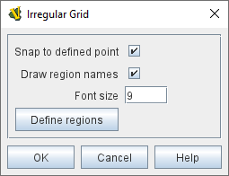

== VASSAL Reference Manual
[#top]

[.small]#<<index.adoc#toc,Home>> > <<GameModule.adoc#top,Module>> > <<Map.adoc#top,Map>> > <<Board.adoc#top,Board>> > *Irregular Grid*# +
 +

'''''

=== Irregular Grid

[cols=",",]
|======================================================================================================================================================================================================================================================================================================================================================================================================================================================================================================================
|An irregular grid is used for area-based games. It allows you to define a set of named Regions at arbitrary locations.  +
 +
*Snap to defined point:*  If checked, pieces placed anywhere within the grid will automatically snap to the nearest legal Region. If unchecked, pieces may be placed anywhere. If it is useful for most pieces to snap to legal locations, but for certain types of markers to be allowed anywhere, this can be accomplished by checking this box but adding a <<NonStacking.adoc#top,Does Not Stack>> trait to the pieces which should ignore the grid and selecting that trait's _Ignore map grid when moving_ option. +
 +
*Draw region names:*  If checked, the names of the Regions will be drawn on the map. +
 +
*Font size:*  The font size used to draw the Region names. +
 +
*Define Regions:*  Click this button to bring up a window for defining the Regions. Right click anywhere on the board to add a new Region, or right click on an existing Region's name to change its name or remove it. +
 +
 + | +
 +
image:images/DefineRegions.png[image]   +
|======================================================================================================================================================================================================================================================================================================================================================================================================================================================================================================================

 +

 +
