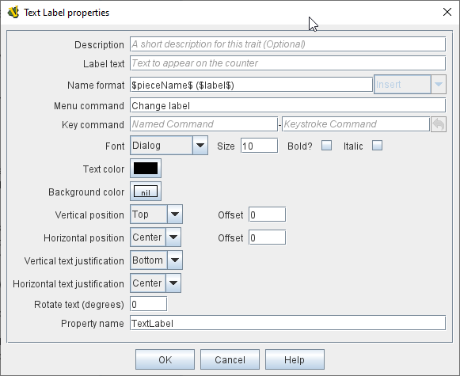

== VASSAL Reference Manual
[#top]

[.small]#<<index.adoc#toc,Home>> > <<GameModule.adoc#top,Module>> > <<PieceWindow.adoc#top,Game Piece Palette>> > <<GamePiece.adoc#top,Game Piece>> > *Text Label*#

'''''

=== Text Label

This trait displays a text label on or near the piece.
The text of the label can be fixed or specifiable by a player at game time.

*Description:*  A description of the purpose of this label that is displayed in the Piece Definer.

*Text:*  The starting value for the label text. The string entered in the *Text* field is evaluated as follows:

. Check if the entered label is a Beanshell expression, then evaluate it as such.
. Check if the entered label can be interpreted as is an integer. This is the case if the label only contains digits.	
. Check if the entered label is a $$ Variable Substitution (defined by a string enclosed between $ characters). This allows <<Properties.adoc#top,Properties>> of the piece to be substituted with $..$ notation, as in a <<MessageFormat.adoc#top,Message Format>>
. If no check is true the entered string is displayed.

A known limitation of the evaluation order above is that if you enter a sequence of digits starting with 0s, these will be removed when the string is evaluated as integer.
A workaround to this is to enter the same string via a Beanshell expression. For example to display a sequence of 3 zeroes as label text you can use *{"000"}*.
Note that the Beanshell expressions should be preferred to $$ Variable Substitutions. The latter are only available for historical reasons.

By enclosing the text within tags, you can use simple HTML format to specify various colors, fonts and sizes.

Example: 
****
_<html><b>Bold text</b>
with a line break
and different colors</html>_ will display as:

*Bold text* +
with a line break +
and [red]#different# [blue]#colors#
****

[width="100%",cols="50%a,^50%a",]
|===
|
*Description:*:: A short description of this trait for your own reference.

*Label text:*::  A <<MessageFormat.adoc#top,Message Format>> that specifies how the name of this piece will be reported: _pieceName_ is the name of the piece excluding the label, _label_ is the value of the label text (including, unfortunately, HTML tags). If the label is empty, then the default name of the piece is always used.

*Menu command:*::  If not blank, gives the text of the corresponding menu item in the piece's right-click context menu, selection of which will result in the text of the label being updated.

*Menu command:*  If blank, the text of the label is permanent.
If set, then gives the key command or <<NamedKeyCommand.adoc#top,Named Key Command>> to update the text of the label.

*Font:*::  The Text Label is drawn using this font.

*Font size:: / Bold / Italic:*  The Text Label is drawn at this size, optionally in bold or italics.

*Text color:*::  The Text Label is drawn using this color.

*Background xolor:*::  The Text Label is drawn within a solid rectangle of this color.
Click Select and then Cancel to use a transparent background.

*Vertical Position:*::  Draw the Text Label with the given offset from the top, bottom, or center of the piece.

*Horizontal Position:*::  Draw the Text Label with the given offset from the left, right, or center of the piece.

*Vertical justification:*::  Whether the top edge, bottom edge, or center of the Text Label will be drawn at the Horizontal Position specified above.

*Horizontal justification:*::  Whether the right edge, left edge, or center of the label will be drawn at the Vertical Position specified above.

*Rotate Text:*::  The text will be rotated clockwise by this angle.
Rotation is performed after the horizontal/vertical justification and positioning specified above.

*Property Name:*::  The value of this label will be exposed as a <<Properties.adoc#top,Property>> with the given name.

|
|===