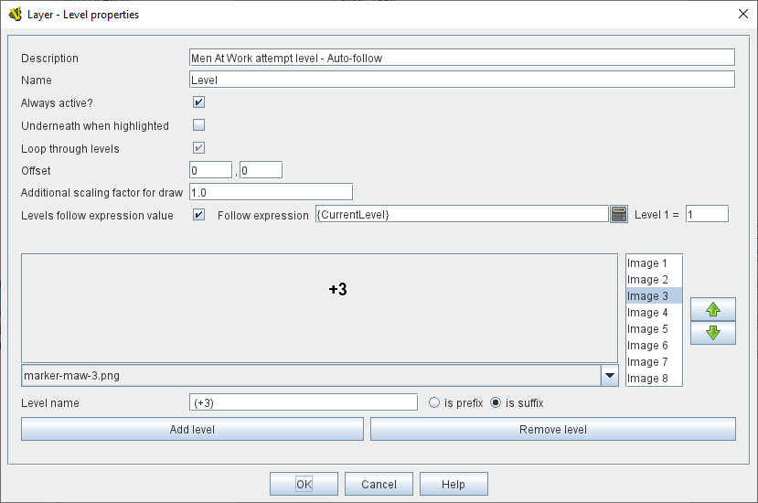

// Layer is internally known as Embellishment
== VASSAL Reference Manual
[#top]

[.small]#<<index.adoc#toc,Home>> > <<GameModule.adoc#top,Module>> > <<PieceWindow.adoc#top,Game Piece Palette>> > <<GamePiece.adoc#top,Game Piece>> > *Layer*#

'''''

=== Layer

A Layer is the standard trait for adding images, sub-images, and image-swapping functionality to game pieces in VASSAL.
A Layer consists of a number of "levels", each of which has an image and a name.
A Layer may be "active" or "inactive", and only active layers are drawn--a Layer can be activated with a key command, and players can change the current level during play.
The image from the current level will be drawn whenever the Layer is active.
The Layer is drawn on top the traits that appear before it in the piece's list of traits.

While editing a layer, several keyboard shortcuts are available, including _Alt+Enter_ to change the image of the currently selected level, _Alt+I_ to jump focus to the list of levels, _Alt+Insert_ to insert a level, _Alt+Delete_ to delete the currently selected level, _Alt+Up/Alt+Down_ to move the currently selected level up/down the list, and _Alt+N_ to jump focus to the name field.

[width="100%",cols="50%a,^50%",]
|===

|
*Description:*:: A brief description of this trait for your reference.
*Name:*::  The name of this Layer, used for reference during editing and as the prefix for the name of any <<Properties.adoc#top,Properties>> defined by this Layer.

*Always active:*::  If checked, then this layer is always active, i.e.
the image corresponding to the current level will always be displayed.
If unchecked, then the layer must be activated (by the specified key command) in order to display the current level.

*Underneath when highlighted:*::  If checked, then this layer will be drawn underneath the rest of the piece when the counter has been selected (e.g.
by clicking on it).

*Loop through levels:*::  If checked, then increasing the level past the last one will loop back to the first level and vice versa.
Otherwise, increasing the level has no effect if the current level is the last level.

*Offset:*::  The image for the current level is drawn with this offset from the center of the underlying piece by a number of pixels specified by the "offset" boxes, with positive numbers giving an offset down and to the right.
+
For example, if a layer image is 40x40 pixels, and you want it to be drawn so that the lower-left corner is at the center of the GamePiece, set the offset to 20,-20.

*Additional scaling factor for draw:*::  An additional scaling factor which is applied when drawing images for this Layer. Useful when downscaling categories of art supplied in higher resolution than other items.

*Levels follow expression value:*::  If selected, then you can enter an <<Expression.adoc#top,Expression>> that is evaluated to determine the active level, rather than having the trait respond directly to key commands.
A typical case will reference the name of a <<DynamicProperty.adoc#top,Dynamic Property>> or occasionally a <<GlobalProperty.adoc#top,Global Property>>. Note that larger expressions (e.g., comparisons, arithmetic, etc.) are permitted, but performance may suffer as this expression will be checked every time a piece with the expression is drawn. You can also specify the numeric value of the Property that should correspond to the first level of this Layer.

*Only show layer if property:*::  An additional property name can be filled in here; if it is supplied, then the piece will be checked for the named property, and this layer will only be drawn if the property value matches the setting of the combo box -- you can choose either to check for "true, non-zero, non-blank" or "false, 0, or blank".

*Activate/Increase/Decrease:*::  Specify the right-click context menu text and <<NamedKeyCommand.adoc#top,Keystroke or Named Command>> that will activate the Layer and increase or decrease the current level.

*Reset to level:*::  Specifies a key command that resets the Layer to a specific level.

*Reset to level number:*:: An <<Expression.adoc#top,Expression>> that specifies the level that the _Reset to level_ command will set the current level to.

NOTE: The _Reset to Level_ command does _not_ automatically _activate_ the Layer.

*Randomize:*::  Specifies a right-click context menu text and <<NamedKeyCommand.adoc#top,Keystroke or Named Command>> key command to set the Layer to a random level.

*Level Images:*::  Specify the image to be shown for each level of the layer by double-clicking the image field to add a new image, or selecting an existing image from the drop-down menu.
An image can be left blank to display nothing for that level.
Using transparency in the images can be very useful.

*Level Name:*::  Each level can be given an individual name, which is used to change the name of the piece for reporting purposes during play.
The level's name either replaces the piece's normal name, or else modifies the piece's normal name as a prefix or suffix.

NOTE: Each individual level has its own replace/prefix/suffix setting, which must be configured separately.

|image:images/Layer.png[]

|===
*NOTES:*

* Leaving a _Menu Command_ field blank means no entry appears in the right-click context menu, but you can still use a <<NamedKeyCommand.adoc#top,Keystroke or Named Command>>.
* Key commands can be the same as those used by other traits.
Pressing the key will perform all corresponding actions.

*EXAMPLES:*

* For a basic two-sided counter, add a Layer, and select an image that represents the reverse side.
Change "Activate" to "Flip" and set the key to Ctrl+F.
* An alternative approach to the same two-sided counter: rather than give the counter an image in the Basic Piece trait, remove that and instead have two images (one for each side of the counter) here in the Layer trait.
Check the _Always Active_ and _Loop Through Levels_ box.
Change "Increase" to "Flip" and its key command to Ctrl+F.
* To represent fatigue in an Army counter, give it a Layer named "Fatigue."  Select _Always Active_, choose four images that represent the levels, and change "Increase" to "Increase Fatigue" and "Decrease" to "Decrease Fatigue". A Reset command named "Rest" using Ctrl+R could be used to bring the Army counter back to full strength.
Name the levels " (fatigue 1)", etc., and check _is suffix_ to append the current fatigue level to the piece's name.

'''''

[#Properties]
A Layer defines a number of <<Properties.adoc#top,Properties>>.  In the name of the properties, _<layer_name>_ is the name of the overall Layer as specified in the top field of the properties.

* _<layer_name>_Image_ returns the name of the currently-active level's image file
* _<layer_name>_Name_ returns the name of the currently-active level <<Map.adoc#top>>
* _<layer_name>_Level_ returns the number of the current level <<Map.adoc#top>>
* _<layer_name>_Active_ returns _true_ if the Layer is active, _false_ otherwise

*EXAMPLE:*  A Layer named _Manpower_ that is active and showing level 4 defined with image _Man04.gif_ and name _(strength 4)_ would have the following properties:

* Manpower_Image = Man04.gif
* Manpower_Name = (strength 4)
* Manpower_Level = 4
* Manpower_Active = true

These properties could be used in a <<GlobalKeyCommand.adoc#top,Global Key Command>> to automatically remove all counters whose manpower was zero.
