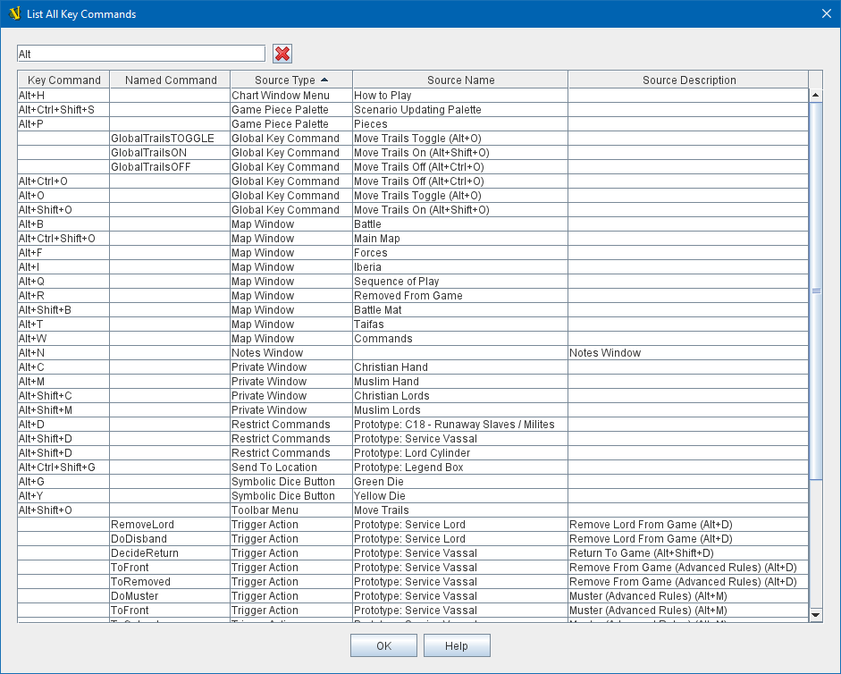

== VASSAL Reference Manual
[#top]

[.small]#<<index.adoc#toc,Home>> > <<Tools.adoc#top,Tools>> > *List Key Commands*#

'''''

=== List Key Commands
When working on a large module it can be helpful to have a centralized list of what <<NamedKeyCommands.adoc#top,keystrokes>> have already been assigned to actions--whether to prevent conflicts in the first place or to resolve them when you've discovered them later. Similarly, finding all references to a particular <<NamedKeyCommands.adoc#top,Named Command>> can come in handy.

The _List Key Commands_ tool on the <<Editor.adoc#top,Editor's>> _Tools Menu_ can help you with this. It will provide a list of every key command and named key command reference in the entire module. You can then apply filters (e.g. "Alt+K") to find the ones you're looking for, and you can sort the columns if desired.

[width="100%",cols="50%,^50%",]
|===
|To list all command references, go to the _Tools_ menu in the _Editor_ and select _List Key Commands_.

The filter at the top allows you to filter the results -- note that the filter will display a row if *any* column contains the filter string. So you e.g. could filter on "Alt+" to find Alt keys without also matching the word "Alternate" in a description. Or you could filter for a specific Named Key Command instead of a keystroke, or only look for "Trigger" traits, etc.

Click on any of the column headers to sort by that column.
|+
|===

