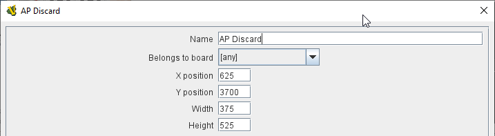
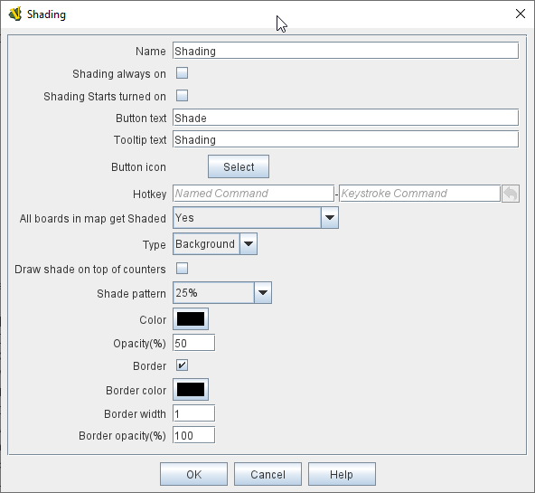
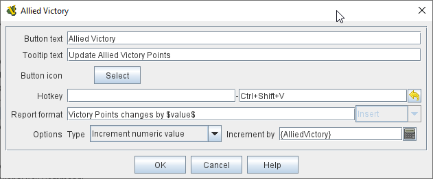
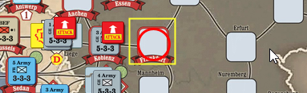

== VASSAL Reference Manual
[#top]

[.small]#<<index.adoc#toc,Home>> > <<GameModule.adoc#top,Module>> > *Map Window*#

'''''

[#MarkUnmoved]
=== Map Window

A Map Window contains the main interface for playing games with VASSAL.
It displays the playing surface on which the players move <<GamePiece.adoc#top,Game Pieces>> by dragging and dropping with the mouse.
It is possible to have two or more Map Windows; the players may drag and drop pieces between the different windows.
A Map Window should be configured with at least one Map Board (in the "Map Boards" component).

To add additional Map Windows to your module, use the Editor to navigate to the _[Module]_ entry at the very top of the Editor's configuration window hierarchy.
Right-click on the _[Module]_ entry and select _Add Map Window_.
Your new Map Window will be added to the very bottom of your Module's list of components.
You can then open the _[Map Window]_ entry, where you should right-click on the _[Map Boards]_ subcomponent and add at least one <<Board.adoc#top,Board>>. You can also add additional subcomponents by right-clicking the _[Map Window]_ entry and selecting one of the appropriate _Add_ options.
See <<#SubComponents,Sub-Components>>, below.

Every map window (including player hands and private windows) exposes a property _MapName_isVisible_ which will hold "true" if the map is currently visible, or "false" otherwise. This allows the
module to know whether Global Hotkeys sent to that map's components will currently be accepted or not. If the Map's name contains spaces, the property name can optionally include '_' characters in place of spaces.

*SEE ALSO:*  <<PlayerHand.adoc#top,Player Hands>> and <<PrivateWindow.adoc#top,Private Windows>> are specialized forms of Map Window and share most of its properties and subcomponents.
They are designed for holding pieces and cards that are private to one player or side.

[width="100%",cols="50%a,50%a",]
|===
|*Map name:*::  The name of this map window.

*Mark pieces that move (if they possess the proper trait):*:: If checked, then any pieces with the <<MarkMoved.adoc#top,Mark When Moved>> trait will be marked whenever being moved in this map window.
The module designer can also allow players to control this option in their preferences.

*"Mark unmoved" button text:*::  Configuring _button text_ and/or a _button icon_ causes a button to appear on the map window's Toolbar; clicking this button clears the movement history for all Game Pieces on the map: this removes the movement "mark" from any such Game Pieces, and also clears their Movement Trails if they also contain a <<MovementTrail.adoc#top,Movement Trails>> trait.

*"Mark unmoved" tooltip text:*:: Tooltip text for the Map button.

*"Mark unmoved" button icon:*:: Icon for the Map button.

*Vertical/Horizontal padding:*::  The amount of blank space surrounding the boards in the window. This is empty space that is not on any Map and can be used to place pieces not currently being used.

*Background color:*::  The color to use in the blank space padding.

*Can contain multiple boards:*::  If checked, this map window can contain several boards arranged into rows and columns.

*Border color for selected counters:*::  The color of the border to draw around pieces that have been selected.

*Border thickness for selected counters:*::  The thickness of the border to draw around pieces that have been selected.

*Include toolbar button to show/hide (Docking state won't change until module restarted):*::  If checked, then this map window will not be automatically shown when a game begins.
Instead, a button to show/hide this window will be added to the main module Toolbar.

NOTE: changing this option will not take effect until the module has been reloaded (exit from the Module Editor and restart it).

*Button text:*::  The name of the show/hide Toolbar button

*Tooltip text:*::  Optional tooltip text for the show/hide Toolbar button

*Button icon:*::  An icon for the show/hide Toolbar button

*Hotkey to show/hide window:*::  A <<NamedKeyCommand.adoc#top,Keystroke or Named Command>> that toggles the Map between showing and not showing.

*Hotkey to show window:*:: A <<NamedKeyCommand.adoc#top,Keystroke or Named Command>> that forces the map to be visible.

*Hotkey to hide window:*:: A <<NamedKeyCommand.adoc#top,Keystroke or Named Command>> that hides the window.

NOTE: The following reports are separate from, and in addition to, any reports the piece itself generates with <<ReportChanges.adoc#top,Report Action>> traits in response to the Key Command applied by the bottom field.

*Auto-report format for movement within this map:*::  A <<MessageFormat.adoc#top,Message Format>> that will be used to automatically report movement of pieces completely within this map window: _$pieceName$_ is the name of the piece being moved, _$location$_ is the location to which the piece is being moved (in the format specified below), _$previousLocation$_ is the location from which the piece is being moved.

*Auto-report format for movement to this map:*::  A <<MessageFormat.adoc#top,Message Format>> that will be used to report movement of pieces to this map window from another map window: In addition to the properties noted for the above item, _$previousMap$_ is the name of the map from which the piece is being moved.

*Auto-report format for units created in this map:*::  A <<MessageFormat.adoc#top,Message Format>> that will be used to report pieces that are dragged to this map window directly from a <<PieceWindow.adoc#top,Game Piece Palette>>: The properties mentioned in the previous two items may be referenced as appropriate.

*Auto-report format for units modified on this map:*::  When a <<ReportChanges.adoc#top,Report Action>> trait of a Game Piece on this map is activated, this <<MessageFormat.adoc#top,Message Format>> will be used to format the message that trait requests to display.
_$message$_ is the text message from the Report Action trait.
It could optionally be modified to include e.g.
the name of this Map.

*Key Command to apply to all units ending movement on this map:* :: The Key Command or <<NamedKeyCommand.adoc#top,Named Key Command>> to be automatically applied to each piece that ends movement on this map, whether it is moved by drag-and-drop or by a <<SendToLocation.adoc#top,Send To Location>> trait.
+
This Key Command can be used, for example, to trigger actions that need to be taken when a piece enters or leaves a new space (for example maintaining piece type counts in a Zone -- see Example 4 in the <<TriggerAction.adoc#top,Trigger Action>> trait), or to generate more elaborate <<ReportChanges.adoc#top,Report Action>> chat log messages than can be created with the Auto-report format (for example, ensuring that the message is only displayed if the piece has actually changed regions rather than merely being adjusted in its space). |image:images/Map.png[]

image:images/Map2.png[]
|===

'''''

[#SubComponents]
=== Sub-Components

Map are created with several default sub-components, but new ones can be added.
To add sub-components to a map, navigate to the _[Map Window]_ component entry in the Editor, right-click on the _[Map Window]_ component, and select the appropriate _Add_ option for the sub-component you would like to add.
Once you configure it, your new sub-component will appear at the bottom of the Map's list of sub-components.

|===
|<<#SelectionHighlighter,Additional Selection Highlighters>> |<<SetupStack.adoc#top,At-Start Stack>> |<<Deck.adoc#top,Deck>> |<<Flare.adoc#top, Flare>>
|<<GamePieceLayers.adoc#top,Game Piece Layers>> |<<#GlobalKeyCommand,Global Key Command>> |<<GlobalProperties.adoc#top,Global Properties>> |<<#HidePieces,Hide Pieces Button>>
|<<#ImageCapture,Image Capture Tool>>|<<#LastMoveHighlighter,Last Move Highlighter>> |<<#LOS,Line of Sight Thread>> |<<#MapBoards,Map Boards>> |<<#MapShading,Map Shading>>
|<<#StackViewer,Mouse-over Stack Viewer>> |<<#OverviewWindow,Overview Window>> |<<#PieceRecenterer,Recenter Pieces Button>> |<<#StackingOptions,Stacking Options>>
|<<#StartupGlobalKeyCommand,Startup Global Key Command>> |<<#TextCapture,Text Capture Tool>> |<<ToolbarMenu.adoc#top,Toolbar Menu>> |<<#Zoom,Zoom Capability>>
|===

'''''

[#MapBoards]
==== Map Boards

This component contains all the boards that may appear in this map window.
It contains <<Board.adoc#top,Board>> components and defines the dialog that is used to select boards when a new game is started.

[width="100%",cols="50%a,^50%a",]
|===
|

*Dialog title:*:: The title of the dialog window for choosing boards on this map.

*"Select Boards" prompt:*::  The prompt message in the drop-down menu for selecting boards

*Cell scale factor:*::  The relative size of the boards in the dialog compared to their final size during play.

*Cell width:*::  The width of a cell when no board has been selected.

*Cell height:*::  The height of a cell when no board has been selected.

*Default Board Setup:*:: Click this button to choose a default set of boards.
+
When a default has been set, the dialog will not be shown to players when a new game is begun.
Instead, the game will always be started with the boards you select.
+
If you click this button and then clear the boards, then dialog will again be shown at the start of each game.|
|===

[#StackingOptions]
==== Stacking Options

This component controls how stacking is handled in this Map Window.
It may not be removed.

[width="100%",cols="50%a,^50%a",]
|===
|*Disable stacking:*::  If checked, then pieces will never form stacks in this window.

*Horizontal separation when expanded:*::  The distance in pixels from the left edge (right edge if negative) of a piece in a stack to the edge of the piece above it when the stack is expanded.

*Vertical separation when expanded:*::  The distance in pixels from the bottom edge (top edge if negative) of a piece in a stack to the edge of the piece above it when the stack is expanded.

*Horizontal separation when not expanded:*::  The distance in pixels from the left edge (right edge if negative) of a piece in a stack to the edge of the piece above it when the stack is compact.

*Vertical separation when not expanded:*::  The distance in pixels from the bottom edge (top edge if negative) of a piece in a stack to the edge of the piece above it when the stack is compact.

*Color of pieces when not expanded:*::  If set, then pieces below the top piece in a compact stack will be drawn as plain squares of this color and a black border.
+
If not set (click the "Select" button and cancel the color-selection dialog to "unset" this) then pieces will be drawn normally.
|

|===

[#OverviewWindow]
==== <<OverviewMap.adoc#top,Overview Window, or "Mini Map">>

The Overview window displays a separate "Mini Map" subwindow over the top of the main map display. The subwindow contains a view of the entire playing area at a smaller scale than displayed in the parent map window.

The area of the map currently visible in the main map window is highlighted in the overview map with a colored rectangle.
A player may click on the Overview window to center the Map Window at the point clicked on.

This component can be used by players to quckly get a high-level view of the whole map and scroll quickly to another area of the map.

See <<OverviewMap.adoc#top,full article>> for details.

image:images/OverviewMapExample.png[]

'''
[#LOS]
==== <<LineOfSight.adoc#top,Line of Sight (LOS) Thread>>

The Line of Sight (LOS) Thread is a component that allows players to use the mouse to draw lines between two points on the map.

Options are provided to control color, snapping of thread ends, range display, reporting and visibility.

See <<LineOfSight.adoc#top,full article>> for details.

'''

==== <<ToolbarMenu.adoc#top,Toolbar Menu>>
Groups buttons in the toolbar into a single drop-down menu.
See <<ToolbarMenu.adoc#top,full article>> for details.
[width="100%",cols="^.^50%a,50%a",]
|===
|

image:images/ToolbarMenuExample.png[] |image:images/ToolbarMenu.png[]
|===

[#HidePieces]
==== Hide Pieces Button

Adds a button to the Toolbar of the Map Window.
Clicking the button will temporarily hide all pieces on the map, until the button is clicked again.

[width="100%",cols="50%a,^50%a",]
|===
|*Button text:*:: Specifies the button text for the Toolbar button

*Tooltip text:*:: Specifies optional tooltip text for the Toolbar button

*Hotkey:*:: Specifies a <<NamedKeyCommand.adoc#top,Keystroke or Named Command>> for the Toolbar button

*Icon when pieces are showing:*::  Configures an icon which is shown when pieces on the map are currently visible.

*Icon when pieces are hidden:*::  Configures an icon which is shown when pieces on the map have currently been hidden by this button.
|image:images/HidePieces.png[]
|===

[#Zoom]
==== Zoom capability

Adds the ability to zoom in and out of the Map.
Toolbar buttons for "Zoom in", "Zoom out", and "Select Zoom Level" are added to the Map Window's toolbar.

NOTE: Zoom in and out can also be performed by holding the Control key down while using the mouse wheel.

[width="100%",cols="50%a,^50%a",]
|===
|
*Preset Zoom Levels:*::  Configures a series of fractional scale factors for display of the Map Window.
In the list on the right-hand side, all of the currently configured scale factors are listed.
The one with an asterisk (*) indicates the scale factor at which the Map Window will begin when the module is started.
The other scale factors represent the settings along a range which clicking the "Zoom in" and "Zoom out" buttons will move the zoom level.
+
*_Add:_*  To add a new scale factor, type it into the blank and then click the "Add" button.
The new scale factor will appear in the list to the right.
+
*_Remove:_*  To remove an unwanted scale factor from the list, select it in the list at right and then click the "Remove" button.
+
*_Set Initial:_*  To select the scale factor at which the Map Window will begin when the module is started, select it from the list at right and click the "Set Initial" button.
An asterisk (*) will appear next to the new at-start scale factor.

*Zoom in:*:: Configure the tooltip text, button text, button icon and hotkey for a Toolbar button and/or hotkey that causes the Map Window scale factor to jump to the next higher magnification level.

*Zoom Select:*::  Configure the tooltip text, button text, button icon and hotkey for a Toolbar button and/or hotkey that will allow the player to pick a specific scale factor, including by typing in an arbitrary scale factor manually.

*Zoom Out:*:: Configure the tooltip text, button text, button icon and hotkey for a Toolbar button and/or hotkey that causes the Map Window scale factor to jump to the next smaller magnification level.

| +
|===

[#StackViewer]
==== <<MouseOver.adoc#top,Mouse-over Stack Viewer>>

Adds a tool that displays the contents of the current Map location when the player leaves the mouse resting over the map.

The information displayed is highly configurable, including piece images, per piece text and summary text.

NOTE: You can define multiple mouse-over stack viewers for the same map, each operating on a different selection of pieces.

See <<MouseOver.adoc#top,full article>> for details.

'''
[#LastMoveHighlighter]
==== Last Move Highlighter

Draws a colored border around the last piece to have been moved, added, or deleted in a logfile or by an opponent during live play.

The highlight is cleared by clicking on the map.

[width="100%",cols="50%a,^50%a",]
|===
|
*Enabled:*:: Allows the highlighter to be turned on or off.

*Color:*:: Set the color of the border.

*Thickness:*:: Set the border thickness.
|
|===

[#GamePieceLayers]
==== <<GamePieceLayers.adoc#top,Game Piece Layers>>

Allows you designate certain "layers" of Game Pieces to be drawn before others.
Pieces in higher layers are always drawn on top of lower layers, and pieces never combine into stacks with pieces from other layers.

See full <<GamePieceLayers.adoc#top,Game Piece Layers>> article for details.

'''
[#ImageCapture]
==== Image Capture Tool
Adds a "Camera" button to the Toolbar of the Map Window.
Clicking the button will dump the contents of the Map Window to an image file.
This allows you to take a screen shot even if the Map Window is too large to fit entirely on the screen.

[width="100%",cols="50%a,^50%a",]
|===
|
*Button text:*:: Specifies the button text for the Toolbar button

*Tooltip text:*:: Specifies optional tooltip text for the Toolbar button

*button icon:*:: Icon for the Toolbar button.

*Hotkey:*:: Specifies a <<NamedKeyCommand.adoc#top,Keystroke or Named Command>> for the Toolbar button

|image:images/ImageCapture.png[]
|===

[#TextCapture]
==== Text Capture Tool

Adds a "Save Text" Button to the Map Window's Toolbar.
Clicking the button will write a plain text summary of the contents of the map to a text file, using the names assigned to the pieces and the appropriate numbering and/or naming of the board's grid.

[width="100%",cols="50%a,^50%a",]
|===
|
*Button text:*:: Specifies the button text for the Toolbar button

*Tooltip text:*:: Specifies optional tooltip text for the Toolbar button

*button icon:*:: Icon for the Toolbar button.

*Hotkey:*:: Specifies a <<NamedKeyCommand.adoc#top,Keystroke or Named Command>> for the Toolbar button
|image:images/TextCaptureTool.png[]
|===

==== <<Deck.adoc#top,Deck>>

[width="100%",cols="50%a,^50%a",]
|===
|A deck of cards, a bag of chits, or a fixed supply of counters.

Decks are versatile containers for collections of pieces -- especially the kind that need to be shuffled, randomized, hidden, and drawn from.

See <<Deck.adoc#top,full article>> for details.|
|===

==== <<SetupStack.adoc#top,At-Start Stack>>

[width="100%",cols="50%a,^50%a",]
|===
|A group of one or more pieces which begin the game on the map.

See <<SetupStack.adoc#top,full article>> for more details.

|image:images/AtStartStack.png[] +

|===

[#MoveCameraButton]
==== Move Camera Button
Adds a button to the map window's Toolbar.
Clicking the button will center the camera (i.e. the map's view) on a designated location. The location can be computed through a variety of means, including expressions.

[width="100%",cols="50%a,^50%a",]
|===
|
*Button text:*:: Specifies the button text for the Toolbar button

*Tooltip text:*:: Specifies optional tooltip text for the Toolbar button

*button icon:*:: Icon for the Toolbar button.

*Hotkey:*:: Specifies a <<NamedKeyCommand.adoc#top,Keystroke or Named Command>> for the Toolbar button

*Destination:*:: Determines how the destination will be determined.

*Board:*:: The Board for the destination. Can be left blank on maps with only one board at a time.

*Zone:*:: The Zone for the destination.

*Region:*:: The Region for the destination.

*X Position:*:: The X position for the destination.
*Y Position:*:: The Y position for the destination.

*Additional X Offset:*:: Additional X offset for the destination, once the destination has been otherwise computed from the previous fields.
*Additional Y Offset:*:: Additional Y offset for the destination, once the destination has been otherwise computed from the previous fields.

*Property Match:*:: Property match expression for finding a counter.

*Zoom Level:*:: Sets the zoom level to view the map, expressed as a decimal value (1.0 = 100% size). If 0 or left blank, then no zoom adjustment is made.

|image:images/MoveCameraButton.png[]
|===

[#PieceRecenterer]
==== Recenter Pieces Button
Adds a button to the map window's Toolbar.
Clicking the button will shift the position of all pieces on the map such that they are centered around the middle of the map as much as possible.
This is useful for games where there are no absolute terrain features, such as some air and naval games.

[width="100%",cols="50%a,^50%a",]
|===
|
*Button text:*:: Specifies the button text for the Toolbar button

*Tooltip text:*:: Specifies optional tooltip text for the Toolbar button

*button icon:*:: Icon for the Toolbar button.

*Hotkey:*:: Specifies a <<NamedKeyCommand.adoc#top,Keystroke or Named Command>> for the Toolbar button
|
|===

[#StartupGlobalKeyCommand]

==== Startup Global Key Command

Can print a welcome message, or perform some other task that needs to be done whenever the module is started up.

image:images/StartupGlobalKeyCommand.png[]

An extension of <<#GlobalKeyCommand,Global Key Command>> that fires automatically upon completion of module load, once all the key listeners are started up.
All fields behave identically to the corresponding ones in <<#GlobalKeyCommand,Global Key Command>>, except that those pertaining to the physical representation of a Toolbar button are suppressed as being inapplicable.

As of VASSAL 3.6, multiple start-up global key commands _can_ be depended on to run in the order they are listed in the module.

Startup Global Key Commands can be configured to any of three modes:

**(1) On First Game Launch/Load Of Session**: These fire every time the _module_ starts up, regardless of whether it is to begin a new game or to load and continue an existing one.

**(2) On Every Game Launch/Load Of Session**: These fire every time a game is launched or loaded during the session.

**(3) At Start Of Every Fresh Game Only**: These fire only when a _new game_ is starting. If the game is saved and later restored, or is being exchanged back and forth in log form, the key command will not fire on subsequent loads. For clarity, a new game started from a <<GameModule.adoc#PredefinedSetup, Pre-defined Setup>> _does_ count as a fresh new game.

'''
[#GlobalKeyCommand]
==== Global Key Command

Adds a button to the map window's Toolbar.
Clicking the button will pick certain pieces from the map window and apply the same key command to all of them.

[width="100%",cols="50%a,^50%a",]
|===
|
*Description:*::  An optional description of the action (for distinguishing between multiple similar commands in the Editor window).

*Button text:*::  Text for the Toolbar button.

*Tooltip text:*::  Mouse-over hint text for the Toolbar button.

*Button icon:*::  Icon for the Toolbar button.

*Hotkey:*:: Keyboard shortcut or <<NamedKeyCommand.adoc#top,Named Key Command>> for the Toolbar button.
This is the key command that will _initiate_ the Global Key Command, not the one that will be sent to the matching pieces -- the command to be sent is the one defined in the "Global Key Command: " field below.

*Global Key Command:*:: The key command or <<NamedKeyCommand.adoc#top,Named Key Command>> that will be sent and applied to the selected pieces.

*Apply to counters on this map only?:*::  If checked, then only pieces on this map will be eligible to receive the key command.
Otherwise all pieces in the game will be eligible provide they match the expression above.

*Pre-select (Fast Match):*::  New from VASSAL 3.5, the *Fast Match* selections can be used to improve the performance of "slow" Global Key Commands by pre-matching the location and/or a single property value of the target piece. Essentially these run limited but much faster comparisons, to screen out some of the potentially hundreds of pieces needing to be checked for each Global Key Command. Fast Match expressions are _optional_ in that the same comparisons can always be run in the standard "Additional matching expression" field. Judicious use of them, however, can improve the performance of a Global Key Command by 25-33%.
+
See the <<FastMatch.adoc#top,Fastmatch>> page for full details on Fast Matches.

*Additional matching expression:*::  The command will apply to all pieces on the map that match the given <<PropertyMatchExpression.adoc#top,Property Match Expression>>. The Expression can use comparisons to match relevant <<Properties.adoc#top,Properties>> of the pieces on the map to determine which ones should receive the key command, such as _{ LocationName != "Rome" }_ or _{ ArmorValue < Hits + 5 }>_.
An empty expression field matches every piece it finds.

*Within a Deck, apply to:*::  Select how this command applies to pieces that are currently stacked in a <<Deck.adoc#top,Deck>>. +

_No pieces_;; means that pieces in a Deck ignore the command.

_All pieces_;; means that the command can apply to any piece in the entire Deck that matches the expression.

_Fixed number of pieces_;; allows you to specify the number of pieces (drawn from the top) that the command will potentially apply to--the piece(s) in question must still match the expression in order to be included.

*Suppress individual reports:*::  If selected, then any auto-reporting of the action by individual pieces via <<ReportChanges.adoc#top,Report Action>> traits will be suppressed.

*Report Format:*::  A <<MessageFormat.adoc#top,Message Format>> that will be echoed to the chat area when the button is clicked or the hotkey pressed.

*Example:*:: Suppose you have configured some pieces to contain a Layer indicating that a piece has fired, activated by Ctrl+F and with the name__Fired__.
Give each piece the <<PropertyMarker.adoc#top,Marker>> trait with property name _canFire_ and value _true_.
Configure the Global Key Command to apply to pieces whose properties match _{ canFire == "true" && Fired_Active == "true" }_. 
Specify CTRL-F as the key command.
Now clicking the Global Key Command's button will set all marked pieces on the map to not having fired. (Optionally take advantage of Fast Match
by checking _by Property_ in the Fast Match area, setting _Property name_ to _{"canFire"}_, the _Comparison_ to _==_, and _Property value_ to _{"true"}_. In this case
the _canFire == "true"_ can be removed from the _Additional matching expression_ as targets will be pre-screened for the _canFire_ property -- this will slightly speed
execution of the Global Key Command)|image:images/GlobalKeyCommand.png[]
|===

[#MapShading]
==== Map Shading

Applies a semi-transparent solid color or image tiling to the Map.
In background mode, can be used to overlay a repeating image over solid-color boards.
In foreground mode, the area is determined by the pieces on the map that name this Map Shading in an <<AreaOfEffect.adoc#top,Area of Effect>> trait.

[width="100%",cols="50%a,^50%a",]
|===
|*Name:*::  A short name of this shading for reference by pieces with the <<AreaOfEffect.adoc#top,Area of Effect>> trait.

*Shading always on:*::  If selected then the shading is always drawn.
Otherwise, visibility is controlled by a button on the Toolbar.

*Shading starts turned on:*::  If true, then the shading will begin visible when the module is loaded.

*Button text:*::  Text for the Toolbar button.

*Tooltip text:*::  Optional rollover text for the Toolbar button.

*Button icon:*::  Icon for the Toolbar button.

*Hotkey:*:: <<NamedKeyCommand.adoc#top,Keystroke or Named Command>> for the Toolbar button.

*All boards in map get Shaded:*::  Allows you to select which <<Board.adoc#top,Boards>> in the map to apply the shading to.

*Type:*::  If set to _Background_ then the shaded area includes the entire board, minus the areas attached to any <<AreaOfEffect.adoc#top,Area of Effect>> traits.
If set to Foreground, then the shaded area includes only the areas attached to <<AreaOfEffect.adoc#top,Area of Effect>> traits.

*Draw shade on top of counters:*:: If selected, then the shading will be drawn over any pieces on the map.
Otherwise, it will be drawn underneath all pieces.

*Shade pattern:*:: Choose between 100/75/50/25 % hatch patterns, or choose a custom image.

*Color:*:: The color of the shading (if not using a custom image).

*Opacity:*:: The opacity of the shading.
0 is completely transparent, 100 is completely opaque.

*Border:*:: If selected, will draw a border around the shading area.

*Border color:*:: Color of the border.

*Border width:*:: Width of the border line.

*Border opacity(%):*:: The opacity of the border line. 0 is completely transparent, 100 is completely opaque.

|
|===

==== <<GlobalProperties.adoc#top,Global Properties>>

Maps can have their own Global Properties, which apply to and are accessible by pieces on that map.

To add a Global Property to your map, find the _[Global Properties]_ subcomponent in the Editor, right-click it, and select _Add Global Property_.
This will let you define the initial value and any numeric constraints.
Then, you can right-click on the _[Global Property]_ entry to optionally _Add Change-property Toolbar Button_, the configuration dialog for which is shown at left.

See the article on the <<GlobalProperties.adoc#top,Global Property trait>> of pieces for more details and examples.
[width="100%",cols="^50%a,^50%a",]
|===
|image:images/GlobalProperty.png[]
|

|===

[#SelectionHighlighter]
==== Additional Selection Highlighters
Allows you to define additional ways to highlight the selected piece on a map.
The additional highlighters are drawn only if the selected piece matches the specified properties.
If a piece matches the properties of more than one highlighter, all will be drawn, in addition to the highlighting color/border specified in the Map's properties.

To add an Additional Selection Highlighter to your map, locate the _[Additional Selection Highlighters]_ subcomponent of your map in the Editor.
Right-click it and select _Add Highlighter_.
You can then configure your Highlighter using the dialog described below.

[width="100%",cols="50%a,^50%a",]
|===
|
*Name:*::  A short name for reference in the editor.

*Active if properties match:*::  The highlighter will be drawn for all pieces on the map that match the given <<PropertyMatchExpression.adoc#top,Property Match Expression>>. The expression can refer to <<Properties.adoc#top,Properties>> of the pieces to determine which ones are an appropriate match.

*Use image:*::  Specify an optional image to be overlaid on top of the selected piece.
The center of the image will be offset from the center of the piece by the given number of pixels.

*Border color:*::  The color of the border to be drawn around selected pieces.

*Border thickness:*::  The thickness of the border

|image:images/SelectionHighlighterFind.png[]

image:images/SelectionHighlighter.png[]
|===

==== Flare

A <<Flare.adoc#top, Flare>> lets players their opponents' attention to something that
has happened on the map by clicking a with certain modifier keys held down. The flare will be visible to other players
both in online games and in play-by-email games using a log file.

[grid=none]
[frame=none]
|===
| |

A Flare component is automatically added to each Map, so you will not normally need to add more. However, to add a Flare to your map, find your _[Map]_ component in the Editor, right-click it, and select _Add Flare_.

See the full <<Flare.adoc#top, Flare>> article for more details.
|===

