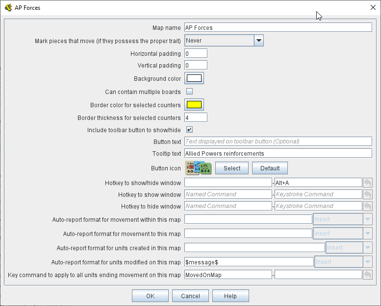
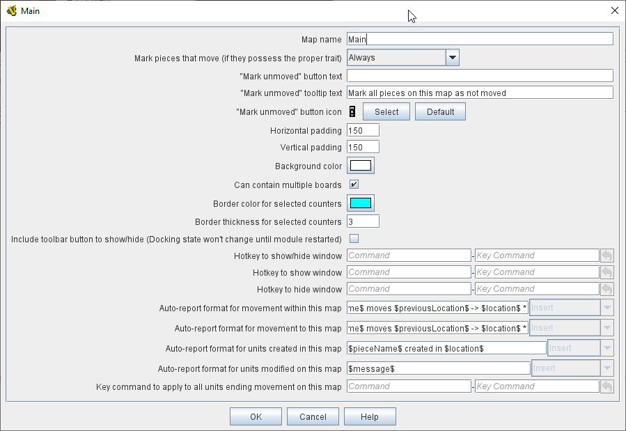
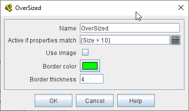

== VASSAL Reference Manual
[#top]

[.small]#<<index.adoc#toc,Home>> > <<GameModule.adoc#top,Module>> > *Map Window*#

'''''

[#MarkUnmoved]
=== Map Window

A Map Window contains the main interface for playing games with VASSAL.
It displays the playing surface on which the players move <<GamePiece.adoc#top,Game Pieces>> by dragging and dropping with the mouse.
It is possible to have two or more Map Windows; the players may drag and drop pieces between the different windows.
A Map Window should be configured with at least one Map Board (in the "Map Boards" component).

To add additional Map Windows to your module, use the Editor to navigate to the _[Module]_ entry at the very top of the Editor's configuration window hierarchy.
Right click on the _[Module]_ entry and select _Add Map Window_.
Your new Map Window will be added to the very bottom of your Module's list of components.
You can then open the _[Map Window]_ entry, where you should right click on the _[Map Boards]_ subcomponent and add at least one <<Board.adoc#top,Board>>. You can also add additional subcomponents by right-clicking the _[Map Window]_ entry and selecting one of the appropriate _Add_ options.
See <<#SubComponents,Sub-Components>>, below.

Every map window (including player hands and private windows) exposes a property _MapName_isVisible_ which will hold "true" if the map is currently visible, or "false" otherwise. This allows the
module to know whether Global Hotkeys sent to that map's components will currently be accepted or not. If the Map's name contains spaces, the property name can optionally include '_' characters in place of spaces.

*SEE ALSO:*  <<PlayerHand.adoc#top,Player Hands>> and <<PrivateWindow.adoc#top,Private Windows>> are specialized forms of Map Window and share most of its properties and subcomponents.
They are designed for holding pieces and cards that are private to one player or side.

[grid=none]
[frame=none]
[cols="a,a",]
|===
|*Map Name:*  The name of this map window.

*Mark pieces that move:* If checked, then any pieces with the <<MarkMoved.adoc#top,Mark When Moved>> trait will be marked whenever being moved in this map window.
The module designer can also allow players to control this option in their preferences.

*"Mark unmoved" button:*  Configuring _button text_ and/or a _button icon_ causes a button to appear on the map window's Toolbar; clicking this button clears the movement history for all Game Pieces on the map: this removes the movement "mark" from any such Game Pieces, and also clears their Movement Trails if they also contain a <<MovementTrail.adoc#top,Movement Trails>> trait.
Tooltip text can also be configured for this button.

*Vertical/Horizontal padding:*  The amount of blank space surrounding the boards in the window.

*Background color:*  The color to use in the blank space padding.

*Can Contain Multiple Boards:*  If checked, this map window can contain several boards arranged into rows and columns.

*Border color for selected counters:*  The color of the border to draw around pieces that have been selected.

*Border thickness for selected counters:*  The thickness of the border to draw around pieces that have been selected.

*Include toolbar button to show/hide:*  If checked, then this map window will not be automatically shown when a game begins.
Instead, a button to show/hide this window will be added to the main module Toolbar.
*NOTE:* changing this option will not take effect until the module has been reloaded (exit from the Module Editor and restart it).

*Button text:*  The name of the show/hide Toolbar button

*Tooltip text:*  Optional tooltip text for the show/hide Toolbar button

*Button icon:*  An icon for the show/hide Toolbar button

*Hotkey:*  The hotkey (or <<NamedKeyCommand.adoc#top,Named Key Command>>) for the show/hide Toolbar button

*Auto-report format for movement within this map:*  A <<MessageFormat.adoc#top,Message Format>> that will be used to automatically report movement of pieces completely within this map window:f _$pieceName$_ is the name of the piece being moved, _$location$_ is the location to which the piece is being moved (in the format specified below), _$previousLocation$_ is the location from which the piece is being moved.
*NOTE:* These reports are separate from, and in addition to, any reports the piece itself generates with <<ReportChanges.adoc#top,Report Action>> traits in response to the Key Command applied by the bottom field.

*Auto-report format for movement to this map:*  A <<MessageFormat.adoc#top,Message Format>> that will be used to report movement of pieces to this map window from another map window: In addition to the properties noted for the above item, _$previousMap$_ is the name of the map from which the piece is being moved.

*Auto-report format for units created in this map:*  A <<MessageFormat.adoc#top,Message Format>> that will be used to report pieces that are dragged to this map window directly from a <<PieceWindow.adoc#top,Game Piece Palette>>: The properties mentioned in the previous two items may be referenced as appropriate.

*Auto-report format for units modified on this map:*  When a <<ReportChanges.adoc#top,Report Action>> trait of a Game Piece on this map is activated, this <<MessageFormat.adoc#top,Message Format>> will be used to format the message that trait requests to display.
_$message$_ is the text message from the Report Action trait.
It could optionally be modified to include e.g.
the name of this Map.

*Key Command to apply to all units ending movement on this map:*  The Key Command or <<NamedKeyCommand.adoc#top,Named Key Command>> to be automatically applied to each piece that ends movement on this map, whether it is moved by drag-and-drop or by a <<SendToLocation.adoc#top,Send To Location>> trait.
This Key Command can be used, for example, to trigger actions that need to be taken when a piece enters or leaves a new space (for example maintaining piece type counts in a Zone -- see Example 4 in the <<TriggerAction.adoc#top,Trigger Action>> trait), or to generate more elaborate <<ReportChanges.adoc#top,Report Action>> chat log messages than can be created with the Auto-report format (for example, ensuring that the message is only displayed if the piece has actually changed regions rather than merely being adjusted in its space). |

|===

'''''

[#SubComponents]
=== Sub-Components

Map are created with several default sub-components, but new ones can be added.
To add sub-components to a map, navigate to the _[Map Window]_ component entry in the Editor, right click on the _[Map Window]_ component, and select the appropriate _Add_ option for the sub-component you would like to add.
Once you configure it, your new sub-component will appear at the bottom of the Map's list of sub-components.

[grid=none]
[frame=none]
|===
|<<#SelectionHighlighter,Additional Selection Highlighters>> |<<SetupStack.adoc#top,At-Start Stack>> |<<Deck.adoc#top,Deck>> |<<Flare.adoc#top, Flare>>
|<<GamePieceLayers.adoc#top,Game Piece Layers>> |<<#GlobalKeyCommand,Global Key Command>> |<<GlobalProperties.adoc#top,Global Properties>> |<<#HidePieces,Hide Pieces Button>>
|<<#ImageCapture,Image Capture Tool>>|<<#LastMoveHighlighter,Last Move Highlighter>> |<<#LOS,Line of Sight Thread>> |<<#MapBoards,Map Boards>> |<<#MapShading,Map Shading>>
|<<#StackViewer,Mouse-over Stack Viewer>> |<<#OverviewWindow,Overview Window>> |<<#PieceRecenterer,Recenter Pieces Button>> |<<#StackingOptions,Stacking Options>>
|<<#StartupGlobalKeyCommand,Startup Global Key Command>> |<<#TextCapture,Text Capture Tool>> |<<ToolbarMenu.adoc#top,Toolbar Menu>> |<<#Zoom,Zoom Capability>>
|===

'''''

[#MapBoards]
==== Map Boards

[grid=none]
[frame=none]
|===
|This component contains all the boards that may appear in this map window.
It contains <<Board.adoc#top,Board>> components and defines the dialog that is used to select boards when a new game is started.

*Dialog Title:* The title of the dialog window for choosing boards on this map.

*"Select Boards" prompt:*  The prompt message in the drop-down menu for selecting boards

*Cell scale factor:*  The relative size of the boards in the dialog compared to their final size during play.

*Cell width:*  The width of a cell when no board has been selected.

*Cell height:*  The height of a cell when no board has been selected.

*Default Board Setup:* Click this button to choose a default set of boards.
When a default has been set, the dialog will not be shown to players when a new game is begun.
Instead, the game will always be started with the boards you select.
If you click this button and then clear the boards, then dialog will again be shown at the start of each game.|image:images/BoardPicker.png[]
|===

[#StackingOptions]
==== Stacking Options

This component controls how stacking is handled in this Map Window.
It may not be removed.

[grid=none]
[frame=none]
|===
|image:images/StackingOptions.png[] |*Disable stacking:*  If checked, then pieces will never form stacks in this window

*Horizontal Separation when expanded:*  The distance in pixels from the left edge (right edge if negative) of a piece in a stack to the edge of the piece above it when the stack is expanded.

*Vertical Separation when expanded:*  The distance in pixels from the bottom edge (top edge if negative) of a piece in a stack to the edge of the piece above it when the stack is expanded.

*Horizontal Separation when not expanded:*  The distance in pixels from the left edge (right edge if negative) of a piece in a stack to the edge of the piece above it when the stack is compact.

*Vertical Separation when not expanded:*  The distance in pixels from the bottom edge (top edge if negative) of a piece in a stack to the edge of the piece above it when the stack is compact.

*Color of pieces when not expanded:*  If set, then pieces below the top piece in a compact stack will be drawn as plain squares of this color and a black border.
If not set (click the "Select" button and cancel the color-selection dialog to "unset" this) then pieces will be drawn normally.

|===

[#OverviewWindow]
==== Overview Window, or "Mini Map"

Adds a separate "Mini Map" subwindow that will be displayed whenever the Map Window is displayed.
A Toolbar button to turn this subwindow on and off will be placed on the Map Window's toolbar - it can be configured with any combination button text, a button icon, and tooltip text.
A hotkey or <<NamedKeyCommand.adoc#top,Named Key Command>> can also be supplied to open the mini map subwindow.

The subwindow will contain a view of the entire playing area at a smaller scale than displayed in the parent map window.
The area of the map currently visible in the map window is highlighted in the overview map with a colored rectangle.
A player may click on the Overview window to center the Map Window at the point clicked on.

The scale of the overview window relative to the map window can be specified in the "Scale Factor" property.
You may also specify the color of the rectangle indicating the area visible in the main Map Window.

[#LOS]
==== Line of Sight Thread

[grid=none]
[frame=none]
|===
| +|Adds a button to the Toolbar of the Map Window.
Clicking the button will allow the player to drag the mouse between any two points in the window, drawing a line between those two points.

**Hotkey:  **Specifies a keyboard shortcut or <<NamedKeyCommand.adoc#top,Named Key Command>> for the Toolbar button.

*Button text:*  The label on the Button in the Map Window's Toolbar

*Draw Range:*  If checked, draws the range between the two points, in hexes or squares, as appropriate for the board in use.

*Pixels per range unit:*  If drawing the range on a board without a grid, this determines how many pixels on the screen equal a single unit of range.

*Round fractions:* For distances that are a fraction of a range unit, specify whether to round fractions up, down, or to the nearest whole number.

*Hide Pieces while drawing:*  If checked, then all game pieces in the map will be hidden (or transparent) while the thread is being drawn.

*Opacity of hidden pieces:*  Set the transparency of game pieces while the thread is being drawn.
0 is completely transparent, 100 is completely opaque.

*Thread color:*  Specifies the color the thread on the screen.
If set to null (by clicking the "Select" button and then the "Cancel" button in the color-choosing dialog), then a Preferences option will determine the color of the thread at game time.

|===

==== <<ToolbarMenu.adoc#top,Toolbar Menu>>

[grid=none]
[frame=none]
|===
|Groups buttons in the toolbar into a single drop-down menu.
See <<ToolbarMenu.adoc#top,full article>> for details.

image:images/ToolbarMenuExample.png[] |image:images/ToolbarMenu.png[]
|===

[#HidePieces]
==== Hide Pieces Button

Adds a button to the Toolbar of the Map Window.
Clicking the button will temporarily hide all pieces on the map, until the button is clicked again.

[grid=none]
[frame=none]
|===
|image:images/HidePieces.png[]|**Button text:  **Specifies the button text for the Toolbar button

*Tooltip text:* Specifies optional tooltip text for the Toolbar button

*Hotkey:* Specifies a keyboard shortcut for the Toolbar button

*Icon when pieces are showing:*  Configures an icon which is shown when pieces on the map are currently visible.

*Icon when pieces are hidden:*  Configures an icon which is shown when pieces on the map have currently been hidden by this button.

|===

[#Zoom]
==== Zoom capability

Adds the ability to zoom in and out of the Map.
Toolbar buttons for "Zoom in", "Zoom out", and "Select Zoom Level" are added to the Map Window's toolbar.

[grid=none]
[frame=none]
|===
|*Preset Zoom Levels:*  Configures a series of fractional scale factors for display of the Map Window.
In the list on the right hand side, all of the currently configured scale factors are listed.
The one with an asterisk (*) indicates the scale factor at which the Map Window will begin when the module is started.
The other scale factors represent the settings along a range which clicking the "Zoom in" and "Zoom out" buttons will move the zoom level.

  *Add:*  To add a new scale factor, type it into the blank and then click the "Add" button.
The new scale factor will appear in the list to the right.

  *Remove:*  To remove an unwanted scale factor from the list, select it in the list at right and then click the "Remove" button.

  *Set Initial:*  To select the scale factor at which the Map Window will begin when the module is started, select it from the list at right and click the "Set Initial" button.
An asterisk (*) will appear next to the new at-start scale factor.

*Zoom In:*  Configures a Toolbar button and/or hotkey that cause the Map Window scale factor to jump to the next higher magnification level.

  *Tooltip Text:*  Configures optional tooltip text for the Toolbar button.

  *Button Text:*  Configures button text for the Toolbar button.

  *Button Icon:*  Configures an icon for the Toolbar button.

  *Hotkey:*  Designates a keyboard shortcut or <<NamedKeyCommand.adoc#top,Named Key Command>> for zooming in.

*Zoom Select:*  Configures a Toolbar button and/or hotkey that will allow the player to pick a specific scale factor, including by typing in an arbitrary scale factor manually.

  *Tooltip Text:*  Configures optional tooltip text for the Toolbar button.

  *Button Text:*  Configures button text for the Toolbar button.

  *Button Icon:*  Configures an icon for the Toolbar button.

  *Hotkey:*  Designates a keyboard shortcut or <<NamedKeyCommand.adoc#top,Named Key Command>> for selecting the zoom level.

*Zoom Out:*  Configures a Toolbar button and/or hotkey that cause the Map Window scale factor to jump to the next smaller magnification level.

  *Tooltip Text:*  Configures optional tooltip text for the Toolbar button.

  *Button Text:*  Configures button text for the Toolbar button.

  *Button Icon:*  Configures an icon for the Toolbar button.

  *Hotkey:*  Designates a keyboard shortcut or <<NamedKeyCommand.adoc#top,Named Key Command>> for zooming out. |image:images/Zoomer.png[] +
|===

[#StackViewer]
==== Mouse-over Stack Viewer

Adds a tool that displays the contents of a stack when the player leaves the mouse resting over it, after a specified delay.

[grid=none]
[frame=none]
|===
|image:images/CounterDetailViewer.png[] |*Recommended Delay before display:*  When the mouse has been stationary for this many milliseconds, the viewer will appear.
This can be overridden in the preferences.

*Keyboard shortcut to display:*  Players may display the viewer without waiting by pressing this shortcut key.
This can be disabled in the preferences.

*Background color:*  Pieces/text are drawn against a background of this color.

*Border/text color:*  Color of any text drawn and the border around the overall viewer.

*Display when at least this many pieces will be included:*  If set to 0, then the viewer will display even if the location is empty.
Otherwise, it will display only if 1 or 2 pieces have been included via the settings below.

*Always display when zoom level is less than:*  Regardless of the above "at least this many" setting, the viewer will also display when the map's magnification factor is less than this number.

*Draw pieces:*  If selected, then the included pieces will be draw in the viewer.

*Draw pieces using zoom factor:*  The magnification factor to use to draw the pieces in the viewer.

*Width of gap between pieces:*  Empty space in pixels to place between each drawn piece.

*Display text:*  If selected, then the viewer will draw some summary text and some individualized text for each piece.

*Font size:* Fort size for the text drawn by the stack viewer.

*Summary text above pieces:*  A <<MessageFormat.adoc#top,Message Format>> specifying the text to display above the drawn pieces in the viewer.
In addition to standard <<Properties.adoc#top,Properties>>, you can include $countPieces$ to count the pieces included in the display. You can also include a property with the name _sum(propertyName)_ where _propertyName_ is a property defined on a Game Piece.
The sum of the numeric values of this property for all included pieces will be substituted.

*Text below each piece:*  A <<MessageFormat.adoc#top,Message Format>> specifying the text to display below each included piece.

*Text for empty location*:  A <<MessageFormat.adoc#top,Message Format>> specifying the text to display when no pieces have been selected.

*Include individual pieces:*  Specifies how pieces are to be selected for inclusion in the viewer.
You may restrict the pieces according to the <<GamePieceLayers.adoc#top,Game Piece Layer>> that they belong.
Alternatively, you may specify an <<PropertyMatchExpression.adoc#top,Property Match Expression>> to match desired values of one or more <<Properties.adoc#top,Properties>> in order for a piece to be included.

*Include non-stacking pieces:*  If selected, then pieces with a <<NonStacking.adoc#top,Does not stack>> trait are eligible for inclusion in the viewer.
Otherwise they are excluded regardless of any other filters.

*Show pieces in unrotated state:*  If selected, then pieces that can rotate are drawn in the viewer as they look when not rotated.

*Include top piece in Deck:* If selected, then the top piece of a <<Deck.adoc#top,Deck>> is eligible for inclusion.

*Show all pieces overlapping the first piece found:* If selected, then all Game Pieces that overlap the mouse cursor location are eligible to be displayed; otherwise only pieces at the _exact_ X,Y position of the _top_ piece found are displayed.
|===

[#LastMoveHighlighter]
==== Last Move Highlighter

[grid=none]
[frame=none]
|===
|Draws a colored border around the last piece to have been moved, added, or deleted in a logfile or by an opponent during live play.
*Color* is the color of the border and *Thickness* is the border thickness.
The highlight is cleared by clicking on the map.|image:images/LastMoveHighlighter.png[]
|===

[#GamePieceLayers]
==== <<GamePieceLayers.adoc#top,Game Piece Layers>>

[grid=none]
[frame=none]
|===
|image:images/GamePieceLayers.png[] |Allows you designate certain "layers" of Game Pieces to be drawn before others.
Pieces in higher layers are always drawn on top of lower layers, and pieces never combine into stacks with pieces from other layers.

See full <<GamePieceLayers.adoc#top,Game Piece Layers>> article for details.
|===

[#ImageCapture]
==== Image Capture Tool

[grid=none]
[frame=none]
|===
|Adds a "Camera" button to the Toolbar of the Map Window.
Clicking the button will dump the contents of the Map Window to an image file.
This allows you to take a screen shot even if the Map Window is too large to fit entirely on the screen.|
|===

[#TextCapture]
==== Text Capture Tool

[grid=none]
[frame=none]
|===
| |Adds a "Save Text" Button to the Map Window's Toolbar.
Clicking the button will write a plain text summary of the contents of the map to a text file, using the names assigned to the pieces and the appropriate numbering and/or naming of the board's grid.

|===

==== <<Deck.adoc#top,Deck>>

[grid=none]
[frame=none]
|===
|A deck of cards, a bag of chits, or a fixed supply of counters.

Decks are versatile containers for collections of pieces -- especially the kind that need to be shuffled, randomized, hidden, and drawn from.

See <<Deck.adoc#top,full article>> for details.|image:images/DeckShort.png[]
|===

==== <<SetupStack.adoc#top,At-Start Stack>>

[grid=none]
[frame=none]
|===
|image:images/AtStartStack.png[] + |A group of one or more pieces which begin the game on the map.

See <<SetupStack.adoc#top,full article>> for more details.

|===

[#PieceRecenterer]
==== Recenter Pieces Button
[grid=none]
[frame=none]
|===
|Adds a button to the map window's Toolbar.
Clicking the button will shift the position of all pieces on the map such that they are centered around the middle of the map as much as possible.
This is useful for games where there are no absolute terrain features, such as some air and naval games.|image:images/PieceRecenterer.png[]
|===

[#StartupGlobalKeyCommand]
==== Startup Global Key Command

Can print a welcome message, or perform some other task that needs to be done whenever the module is started up.

[grid=none]
[frame=none]
|===
|image:images/StartupGlobalKeyCommand.png[]|
An extension of <<#GlobalKeyCommand,Global Key Command>> that fires automatically upon completion of module load, once all the key listeners are started up.
All fields behave identically to the corresponding ones in <<#GlobalKeyCommand,Global Key Command>>, except that those pertaining to the physical representation of a Toolbar button are suppressed as being inapplicable.

If multiple start-up commands need to be run in a particular order, they should be combined in a <<MultiActionButton.adoc#top,MultiAction Button>> and then launched from a single instance of Startup Global Key Command, as the sequence in which multiple instances of StartupGlobalKeyCommand are fired is undetermined.

*NOTE:*  Startup Global Key Commands fire _every_ time the module starts up, whether it is to begin a new game or to load and continue an existing one.
Thus if you need the Startup GKC to initiate an activity that should only be done once at the very _beginning_ of a game, then it would need to send a key command to a pre-designated piece, which could then check a Global Property (called, perhaps, "StartupDone") to determine whether the game had already been started -- if it hadn't, the piece could then perform those tasks and set "StartupDone" to true, which would prevent the actions from being taken on a subsequent load of a saved game.

|===

[#GlobalKeyCommand]
==== Global Key Command
[grid=none]
[frame=none]
[cols="a,a",]
|===
|Adds a button to the map window's Toolbar.
Clicking the button will pick certain pieces from the map window and apply the same key command to all of them.

*Description:*::  An optional description of the action (for distinguishing between multiple similar commands in the Editor window).

*Button text:*::  Text for the Toolbar button.

*Tooltip text:*::  Mouse-over hint text for the Toolbar button.

*Button icon:*::  Icon for the Toolbar button.

*Hotkey:*:: Keyboard shortcut or <<NamedKeyCommand.adoc#top,Named Key Command>> for the Toolbar button.
This is the key command that will _initiate_ the Global Key Command, not the one that will be sent to the matching pieces -- the command to be sent is the one defined in the "Global Key Command: " field below.

*Global Key Command:*:: The key command or <<NamedKeyCommand.adoc#top,Named Key Command>> that will be sent and applied to the selected pieces.

*Apply to counters on this map only?:*::  If checked, then only pieces on this map will be eligible to receive the key command.
Otherwise all pieces in the game will be eligible provide they match the expression above.

*Pre-select (Fast Match):*::  New from VASSAL 3.5, the *Fast Match* selections can be used to improve the performance of "slow" Global Key Commands by pre-matching the location and/or a single property value of the target piece. Essentially these run limited but much faster comparisons, to screen out some of the potentially hundreds of pieces needing to be checked for each Global Key Command. Fast Match expressions are _optional_ in that the same comparisons can always be run in the standard "Additional matching expression" field. Judicious use of them, however, can improve the performance of a Global Key Command by 25-33%.

*by location?*;; If this box is checked, potential target pieces will be pre-filtered based on their locations.

*Select By:*::: Selects the type of Location-based filtering that will be done on target pieces.
+
*_Specific Map_* - Only sends to pieces that are on the Map matching the supplied expression. The _expression_ is evaluated against Global Properties only, but then the result of the expression is compared to the Map of potential _target_ pieces to determine if they are valid targets.
+
*_Specific Zone_* - Only sends to pieces that are in the Zone matching the supplied expression (an optional Map expression can be supplied as well). The _expressions_ are evaluated against Global Properties only, but then the results of the expressions are compared to the CurrentZone (and optionally CurrentMap) of potential _target_ pieces to determine if they are valid targets.
+
*_Specific Location_* - Only sends to pieces that are in the Location matching the supplied expression (an optional Map expression can be supplied as well). The _expressions_ are evaluated against Global Properties only, but then the results of the expressions are compared to the LocationName (and optionally CurrentMap) of potential _target_ pieces to determine if they are valid targets.
+
*_Specific X,Y Position_* - Only sends to pieces that are at the X,Y location matching the supplied expressions (optional Map and Board expressions can be supplied as well). The _expressions_ are evaluated against Global Properties only, but then the results of the expressions are compared to the CurrentX and CurrentY (and optionally CurrentMap and CurrentBoard) of potential _target_ pieces to determine if they are valid targets.

*by property?*;; If this box is checked, a _single_ property of the target will be checked to determine if it is a valid target. This search will be performed more quickly than a similar search in the _Additional Matching Expression_ field.

*Property Name*::: Can be a simple string containing the name of a property in potential target pieces to be checked, _or_ an expression to be evaluated against Global Properties only. The result of evaluating the expression is then used to find a property name in the potential _target_ piece.

*Comparison*::: The type of comparison to be done with the value of the property specified above. Can be equals, not-equals, greater, greater-or-equal, less than, less-than-or-equal, or can be matches or non-matches a regular expression.

*Property Value*::: Can be a simple string or number containing a specific value which will be compared to the value of the property specified above, _or_ an expression to be evaluated against the Global Properties only. The result of evaluating the expression is then used as the value to be compared against the property specified above using the comparison specified above.

*Additional matching expression:*::  The command will apply to all pieces on the map that match the given <<PropertyMatchExpression.adoc#top,Property Match Expression>>. The Expression can use comparisons to match relevant <<Properties.adoc#top,Properties>> of the pieces on the map to determine which ones should receive the key command, such as _{ LocationName != "Rome" }_ or _{ ArmorValue < Hits + 5 }>_.
An empty expression field matches every piece it finds.

*Within a Deck, apply to:*::  Select how this command applies to pieces that are currently stacked in a <<Deck.adoc#top,Deck>>. +

_No pieces_;; means that pieces in a Deck ignore the command.

_All pieces_;; means that the command can apply to any piece in the entire Deck that matches the expression.

_Fixed number of pieces_;; allows you to specify the number of pieces (drawn from the top) that the command will potentially apply to--the piece(s) in question must still match the expression in order to be included.

*Suppress individual reports:*::  If selected, then any auto-reporting of the action by individual pieces via <<ReportChanges.adoc#top,Report Action>> traits will be suppressed.

*Report Format:*::  A <<MessageFormat.adoc#top,Message Format>> that will be echoed to the chat area when the button is clicked or the hotkey pressed.

*Example:*:: Suppose you have configured some pieces to contain a Layer indicating that a piece has fired, activated by Ctrl+F and with the name__Fired__.
Give each piece the <<PropertyMarker.adoc#top,Marker>> trait with property name _canFire_ and value _true_.
Configure the Global Key Command to apply to pieces whose properties match _{ canFire == "true" && Fired_Active == "true" }_. 
Specify CTRL-F as the key command.
Now clicking the Global Key Command's button will set all marked pieces on the map to not having fired. (Optionally take advantage of Fast Match
by checking _by Property_ in the Fast Match area, setting _Property name_ to _{"canFire"}_, the _Comparison_ to _==_, and _Property value_ to _{"true"}_. In this case
the _canFire == "true"_ can be removed from the _Additional matching expression_ as targets will be pre-screened for the _canFire_ property -- this will slightly speed
execution of the Global Key Command)|image:images/GlobalKeyCommand.png[]
|===
[#MapShading]
==== Map Shading

Applies a semi-transparent solid color or image tiling to the Map.
In background mode, can be used to overlay a repeating image over solid-color boards.
In foreground mode, the area is determined by the pieces on the map that name this Map Shading in an <<AreaOfEffect.adoc#top,Area of Effect>> trait.

[grid=none]
[frame=none]
|===
|image:images/MapShading.png[] |*Name:*  A short name of this shading for reference by pieces with the <<AreaOfEffect.adoc#top,Area of Effect>> trait.

*Shading Always On:*  If selected then the shading is always drawn.
Otherwise, visibility is controlled by a button on the Toolbar.

*Shading Starts turned on:*  If true, then the shading will begin visible when the module is loaded.

*Button text:*  Text for the Toolbar button.

*Tooltip text:*  Optional rollover text for the Toolbar button.

*Button icon:*  Icon for the Toolbar button.

*Hotkey:* Keyboard shortcut or <<NamedKeyCommand.adoc#top,Named Key Command>> for the Toolbar button.

*All boards in map get Shaded:*  Allows you to select which <<Board.adoc#top,Boards>> in the map to apply the shading to.

*Type:*  If set to _Background_ then the shaded area includes the entire board, minus the areas attached to any <<AreaOfEffect.adoc#top,Area of Effect>> traits.
If set to Foreground, then the shaded area includes only the areas attached to <<AreaOfEffect.adoc#top,Area of Effect>> traits.

*Draw Shade on top of Counters:* If selected, then the shading will be drawn over any pieces on the map.
Otherwise, it will be drawn underneath all pieces.

*Shade Pattern:* Choose between 100/75/50/25 % hatch patterns, or choose a custom image.

*Color:* The color of the shading (if not using a custom image).

*Opacity:* The opacity of the shading.
0 is completely transparent, 100 is completely opaque.

*Border:* If selected, will draw a border around the shading area.
You can specify the thickness, color, and opacity of the border.

|===

==== <<GlobalProperties.adoc#top,Global Properties>>

Maps can have their own Global Properties, which apply to and are accessible by pieces on that map.

[grid=none]
[frame=none]
|===
|image:images/ChangeGlobalProperty.png[] |image:images/MapGlobalProperties.png[]

To add a Global Property to your map, find the _[Global Properties]_ subcomponent in the Editor, right-click it, and select _Add Global Property_.
This will let you define the initial value and any numeric constraints.
Then, you can right-click on the _[Global Property]_ entry to optionally _Add Change-property Toolbar Button_, the configuration dialog for which is shown at left.

See the article on the <<GlobalProperties.adoc#top,Global Property trait>> of pieces for more details and examples.

|===

[#SelectionHighlighter]
==== Additional Selection Highlighters

[grid=none]
[frame=none]
|===
|Allows you to define additional ways to highlight the selected piece on a map.
The additional highlighters are drawn only if the selected piece matches the specified properties.
If a piece matches the properties of more than one highlighter, all will be drawn, in addition to the highlighting color/border specified in the Map's properties.

To add an Additional Selection Highlighter to your map, locate the _[Additional Selection Highlighters]_ subcomponent of your map in the Editor.
Right-click it and select _Add Highlighter_.
You can then configure your Highlighter using the dialog described below.

*Name:*  A short name for reference in the editor.

*Active if Properties Match:*  The highlighter will be drawn for all pieces on the map that match the given <<PropertyMatchExpression.adoc#top,Property Match Expression>>. The expression can refer to <<Properties.adoc#top,Properties>> of the pieces to determine which ones are an appropriate match.

*Use Image:*  Specify an optional image to be overlaid on top of the selected piece.
The center of the image will be offset from the center of the piece by the given number of pixels.

*Border Color:*  The color of the border to be drawn around selected pieces.

*Border thickness:*  The thickness of the border|image:images/SelectionHighlighterFind.png[]

|===

==== Flare

A <<Flare.adoc#top, Flare>> lets players their opponents' attention to something that
has happened on the map by clicking a with certain modifier keys held down. The flare will be visible to other players
both in online games and in play-by-email games using a log file.

[grid=none]
[frame=none]
|===
|image:images/Flare.png[] |

A Flare component is automatically added to each Map, so you will not normally need to add more. However, to add a Flare to your map, find your _[Map]_ component in the Editor, right-click it, and select _Add Flare_.

See the full <<Flare.adoc#top, Flare>> article for more details.
|===

