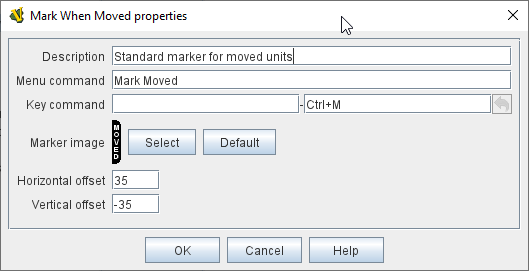

// Mark When Moved is internally known as MovementMarkable
== VASSAL Reference Manual
[#top]

[.small]#<<index.adoc#toc,Home>> > <<GameModule.adoc#top,Module>> > <<PieceWindow.adoc#top,Game Piece Palette>> > <<GamePiece.adoc#top,Game Piece>> > *Mark When Moved*#

'''''

=== Mark When Moved

Pieces which have the _Mark When Moved_ trait will automatically display a specifiable image after they have been moved.
Specify the image and the position relative to the center of the piece at which to draw the image.
A _Moved_ property will also be exposed on the piece, and will be set to _true_ whenever the piece is moved.
This _Moved_ property can be toggled back to _false_ with the configured key command and/or menu item.

*NOTES:*

* *In order to enable this feature*, you must also go to the <<Map.adoc#top,Map Window>> of the module and enable the _Mark pieces that move_ setting.
* A Toolbar button can also be configured in the properties of each <<Map.adoc#top,Map Window>> that clears the moved status of all pieces on the map.
* For pieces containing this trait, the <<Properties.adoc#top,Property>>  _Moved=true_ is set when the piece has been moved.
* When the trait is activated with the menu item or Key Command, then _Moved=false_ is set.
* Clearing the piece's move history with this trait (e.g.
using the menu item or Key Command) will also clear the <<MovementTrail.adoc#top,Movement Trails>> for the piece, if any.

SEE ALSO: <<MovementTrail.adoc#top,Movement Trails>>)

[width="100%",cols="50%a,50%a",]
|===
|
*Description:*:: A short description of this trait for your own reference.

*Menu command to toggle:*:: Right-click context menu item that will toggle the moved status (flipping _Moved_ property between _true_ and _false_ and clearing any <<MovementTrail.adoc#top,Movement Trails>> if set to false). If this item is left blank, no context menu entry will appear but the flag can still be toggled with the key command, below.

*Key command to toggle:*:: <<NamedKeyCommand.adoc#top,Keystroke or Named Command>> to toggle the piece's moved status (flipping _Moved_ property between _true_ and _false_ and clearing any <<MovementTrail.adoc#top,Movement Trails>> if set to false).

*Menu command to mark as moved:*:: Context menu item that will force the piece's moved status to _true_.

*Key command to mark as moved:*:: <<NamedKeyCommand.adoc#top,Keystroke or Named Command>> to force the piece's moved status to _true_.

*Menu command to mark as unmoved:*:: Context menu item that will force the piece's moved status to _false_ and clear any Movement Trails.

*Key command to mark as unmoved:*:: <<NamedKeyCommand.adoc#top,Keystroke or Named Command>> to force the piece's moved status to _false_ and clear any Movement Trails.

*Ignore moves which don't change either Location Name or Mat:*:: If checked, then don't the piece as moved if neither its Location Name nor its mat changed as a result of its move. This can be used to ignore insignificant moves (e.g. a couple pixels in an area movement game).

*Marker Image:*:: Use the _Select_ button to load a new image or the _Default_ button to return to the default image.

*Horizontal Offset:*:: Specify how many pixels to the right of the center of the piece to display the moved marker.

*Vertical Offset:*:: Specify how many pixels down from the center of the piece to display the moved marker.

| +
|===
