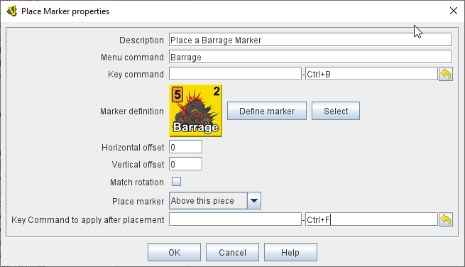

== VASSAL Reference Manual
[#top]

[.small]#<<index.adoc#toc,Home>> > <<GameModule.adoc#top,Module>> > <<PieceWindow.adoc#top,Game Piece Palette>> > <<GamePiece.adoc#top,Game Piece>> > *Marker*#

'''''

=== Place Marker

A Game Piece with this trait will have a menu command that places a different piece (the "marker") on at the same location as this one.
You can select any existing piece for the marker or define a new one from scratch.
A new piece will be placed each time this trait is activated.

It is also possible to set values into existing <<DynamicProperty.adoc#top,Dynamic Properties>> that exist in the placed Marker.

The new piece placed by this trait will have the <<Properties.adoc#parentId,ParentID>> property set to the value of the <<Properties.adoc#uniqueId,UniqueID>> property from the piece that placed it. This allows the placed marker to use the <<GlobalKeyCommand.adoc#top, Global Key Command>> trait or the <<SetPieceProperty.adoc#top,Set Piece Property>> trait to communicate with the parent piece by including the following in the <<PropertyMatchExpression.adoc#top,_Additional matching expression_>>: +

`{UniqueID=="$ParentID$"}` +

NOTE:  This trait should not be confused with the <<PropertyMarker.adoc#top,Marker>> trait which allows a piece to be assigned a <<Properties.adoc#top,Property>> with a static constant value.

*EXAMPLE:*  If a game uses a fortification counter to indicate fortified status of an army counter, this trait could be given to the army counter to place a fortification marker on the army with the right-click context menu or a keyboard shortcut, as an alternative to dragging the fortification counter from the Game Piece Palette.

*SEE ALSO:*  <<Replace.adoc#top,Replace with Other>> trait.

[width="100%",cols="50%a,50%a",]
|===
|

*Description:*:: A short description of this trait for your own reference.

*Menu command:*::  The right-click context menu entry for this trait, if desired.
If left blank, this trait will not produce a context menu item but may still be activated by the Key Command, below.

*Key Command:*::  A <<NamedKeyCommand.adoc#top,Keystroke or Named Command>> to initiate placing the new piece.

*Define Marker:*:: Use the _Define Marker_ button to open a <<GamePiece.adoc#top,Piece Definer>> to create a new definition of the marker from scratch.

*Select:*::  Use the _Select_ button to use the definition from an existing piece in the module.
This acts as a pointer to an existing definition: if the original piece is changed, the piece created by the _Place Marker_ trait will also change.

*Horizontal offset:*::  The new piece will be placed this many pixels to the right of the original piece.

*Vertical offset:*::  The new piece will be placed this many pixels above the original piece.

NOTE: A non-zero value in either Offset field will remove the piece from its parent stack and restrict the placement options to the Top or Bottom of a Stack, if joined (see below).

*Match Rotation:*::  If selected, and both the original piece and the new piece have the <<Rotate.adoc#top,Can Rotate>> trait, then the rotation angle of the new piece will be adjusted to match that of the original piece.

*Place marker:*::  Choose whether the new piece should be placed on the top of this piece's stack, on the bottom, or directly above/below this piece. If the new piece is to join a different stack, the above/below options are interpreted as top/bottom respectively. No effect if the new piece is not stackable.

*Set Dynamic Properties in marker:*::
Allows you to set the values of the named <<DynamicProperty.adoc#top,Dynamic Properties>> in the created marker. +
 +
The expression used to set the value can reference existing property values in both the piece creating the marker (Using $$ variables) and in the newly created marker. +
 +
The values are set into the new marker before the Keystroke after placement is applied. +
+
See <<PassingValues.adoc#marker,Passing values to pieces>> for more detailed information on using this feature.

NOTE: The named <<DynamicProperty.adoc#top,Dynamic Properties>> must exist in the Piece Definition of the Marker to be created. This option does not create new Dynamic Properties

*Keystroke to apply after placement:*::  Optional <<NamedKeyCommand.adoc#top,Keystroke or Named Command>> to be applied automatically to the new piece immediately after being placed.
This Key Command can be used to activate a trait in the new piece, for example to move it to a different location.

|

|===