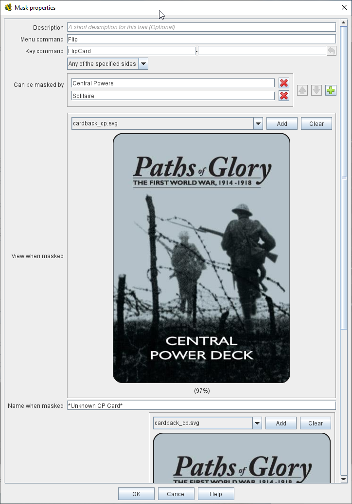

// Mask is internally known as Obscurable
== VASSAL Reference Manual
[#top]

[.small]#<<index.adoc#toc,Home>> > <<GameModule.adoc#top,Module>> > <<PieceWindow.adoc#top,Game Piece Palette>> > <<GamePiece.adoc#top,Game Piece>> > *Mask*#

'''''

== Mask

The Mask trait allows you to create a generic "reverse side" for pieces (like a deck of cards, or chits) which are intended to be "flipped over" to obscure their faces from opponents.

A masked piece looks different to players other than the player who hid it, but its existence remains visible to all players (unlike a piece with the <<Hideable.adoc#top,Invisible>> trait, which would not appear at all). The Mask trait is useful for playing cards: players may drag a card face down from their hand to the playing area.
The owning player will be able to see the identity of the card, but other players will only see the back until it is turned face up.
Board games with a concept of concealment can also make use this trait.

Like the <<Hideable.adoc#top,Invisible>> trait, this trait only hides traits that appear _before_ it in the piece's <<GamePiece.adoc#TraitOrder,list of traits>>. As a general rule of thumb, it should be placed _before_ any Invisible trait but _after_ all other traits of the piece.

A piece with the Mask trait is "owned" by the player who masks it.
If it is unmasked but then is masked again by a different player, the second player becomes the owner.
Menu commands of traits hidden by a masked piece are not available to non-owning players.
A setting in the <<GlobalOptions.adoc#top,Global Options>> determines whether non-owning players can unmask pieces.

*EXAMPLE:* An ordinary playing card can be implemented by setting the basic image to represent the front of the card.
In the "Mask" controls, specify an image for the back of the playing card.
When a player types Ctrl+F, that card will be known only to him (as though held in his hand). Typing Ctrl+F again will reveal the card to the other players (as when playing it on the table).

[width="100%",cols="50%a,50%a",]
|===
|
*Description:*:: A short description of this trait for your own reference.

*Menu command:*::  The name of the right-click context menu entry that mask/unmasks this piece.
If left blank, no context menu item will appear, but the piece can still be masked e.g.
by the Key Command below.

*Key command:*::  The <<NamedKeyCommand.adoc#top,Keystroke or Named Command>> to mask/unmask this piece.

*Can be masked by:*::  Defines who may "own" this piece (i.e.
mask it from other players). _Any Player_ means that any player may mask this piece, including observers.
+
_Any Side_ means that any player who has been assigned a <<GameModule.adoc#Definition_of_Player_Sides,side>> in a game (not an observer) can mask this piece.
If the player resigns and another player takes the side, then the new player for that side will be the owner.
+
_Any of the Specified Sides_ allows you to enter a list of sides.
Only players assigned to one of the named sides can mask the piece, but the players of all the listed sides will be able to see and modify the piece.
This is useful for referee players or games with multi-player teams.

*View when masked:*::  To non-owning players, the piece will be drawn using this image when it is masked.

*Name when masked:*::  To non-owning players, the piece will be reported with this name when it is masked.

*Display style:*:: Determines how a masked piece is seen by the owning player.
The following options are available:
+
_Inset_ draws the mask image at reduced size over top of the regular image, inset into the upper left corner.
+
_Inset Image_ draws the regular image at reduced size over top of the mask image, inset into the center.
+
_Background_ draws the mask image at full size and the regular piece at reduced size centered within it.
+
_Plain_ draws only the mask image, so the piece looks the same to all players.
A "Peek" command key may be specified.
When the owning player selects the "Peek" command, he will see the unmasked piece so long as it remains selected (i.e.
until he clicks elsewhere on the map). If the "Peek" command key is left blank, then the owning player will see all selected pieces in their unmasked state.
+
_Use Image_ draws the unmasked piece and then a specifiable image on top of the piece.
The image can make use of transparency to let some of the information through.

*Autopeek on Rollover:*::  If checked, then when displayed in any <<MouseOver.adoc#top, Mouse-over Viewer>> to a player eligible to see the piece, the
piece will appear unmasked.

|
image:images/Mask.png[]

|===

'''''

This trait sets the <<Properties.adoc#top,Property>> _ObscuredToOthers=true_ when the piece is masked.
