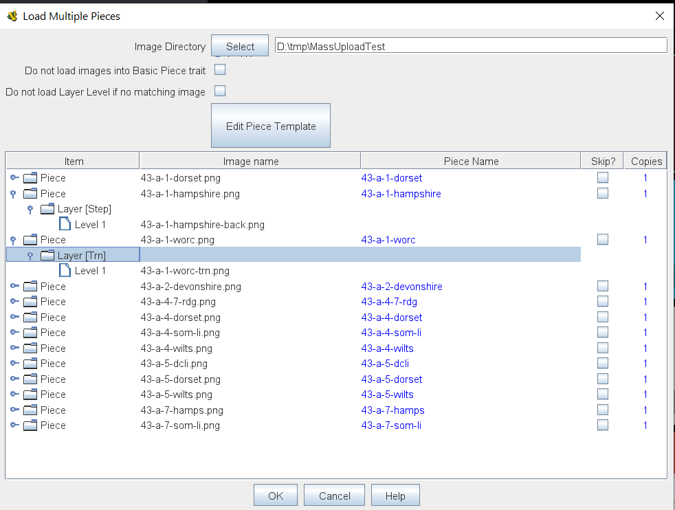
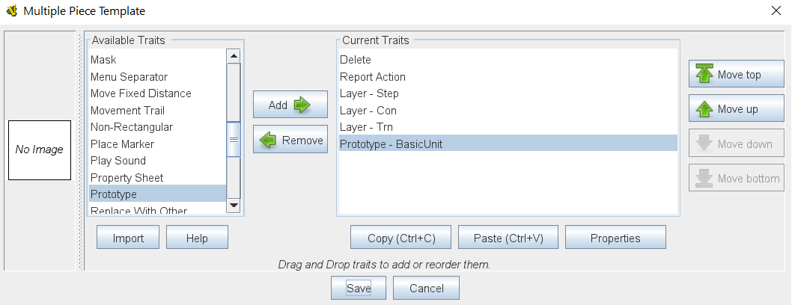
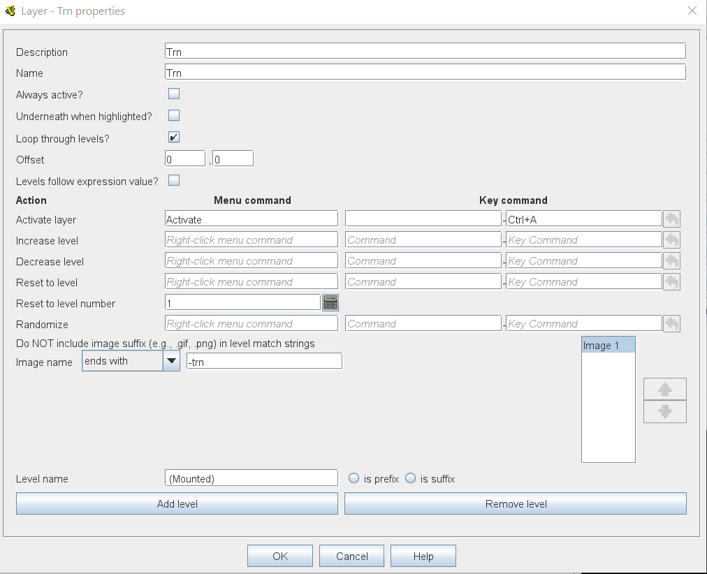

== VASSAL Reference Manual
[#top]

[.small]#<<index.adoc#toc,Home>> > <<GameModule.adoc#top,Module>> > <<PieceWindow.adoc#top,Game Piece Palette>> > *Mass Piece Loader*#

'''''

=== Mass Piece Loader

The Mass Piece Loader allows you to create multiple Game Pieces at once, based on a directory of appropriately named images.
All Game Pieces created will use the same Piece template, but will have different images loaded into their Layer traits.

Images can be loaded intothe Basic Piece trait and into multiple Levels within Layer traits.
A modified version of the Layer trait is used which defines how image names are matched and loaded into each level.

*The processing works as follows:*

. Locate all images that match any of the selection criteria in any level of any layer defined in the template.
. Any remaining images are used as the base images. Base images will be used in the Basic Piece trait and / or in a layer level, depending on the setting chosen.
. A level image is matched to a base image when it commences with the base image, but has a different suffix and matches the rule recorded against the level.
. Images that match one of the level definitions, but do not match any base image are ignored.
. A Layer trait is added to the counter only if it has at least one image in a level.
. By default all Levels in a Layer trait are created, whether the matching image is found or not. By checking the option 'Do not load Layer Level if no matching image found' only levels with a matching image will be created.

The table in the lower half of the screen shows the Game Pieces that will be created.

==== Display Columns

*Item:* A hierarchical display of the images that will be loaded into this piece in the various Layer traits within the piece template.
The items displayed here will update automatically as you add and remove Layer traits and Image levels with the Layer traits in the Piece Template.

*Image File:* The base image that will be loaded into the <<BasicPiece.adoc#top,Basic Piece>> trait.

*Piece Name:* The name of the Game Piece to be loaded.
Each piece is given a standard based on the base image name.
You can modify this field to give each piece a non-standard name.

*Skip?:* Select if you want to skip this Game Piece during the load.

*Copies:* This field can be modified to load multiple copies of a Game Piece based on one image.

==== Controls

**Image Directory:  **Select the directory containing your images.

**Do not load images into Basic Piece traits:  **Select this option if all of your images are to be loaded into Layer traits and you do not want any images loaded into the <<BasicPiece.adoc#top,Basic Piece>> trait.

**Do not load Layer Level if no matching image: **Select this option if you do not want a layer to be created in a piece when the matching image is not found.

**Edit Piece Template:  **Opens up a <<GamePiece.adoc#top,Game Piece Definition>> dialog to define the Game Piece template that will be used to create each new piece.

==== Piece Template

The Piece Template used to create each piece looks like the standard <<GamePiece.adoc#top,Piece Window>> used to define Prototypes.
You can add any traits to the template except for the <<BasicPiece.adoc#top,Basic Piece>> , this is created for you automatically.
Define each trait in exactly the same way as you would for a normal piece, they are all the same as the for the standard Piece Window with the exception of the Layer trait.
The Layer trait included in the Mass Piece Definer is a modified version that allows you to specify which images will be loaded into levels with the trait.

==== Modified Layer Trait

The Modified Layer trait is the same as a standard Layer trait except for the way the image for each level is defined.
Instead of an Image Picker to select any image, you define how the image name you want to load is related to the base image that defines the piece.

The options you have to choose from are:

* _Ends with:_
* _Includes:_
* _Matches:_
* _Same as:_
* _Use Base image:_

==== Base name and suffix limitations

The name of the file defining the base image of the piece cannot contain dots (apart from the file type separator).
The suffixes defined for the extra layers must not contain dots.

==== EXAMPLE:

(See image of Modified Layer Trait above) +
A set of counters has a 'back' side that shows the Transport side of the counter.
The image for the transport side of the counter is the same as for the front side, but with a suffix of '-trn'. Example counter names will be: +
unit1.png +
unit1-trn.png +
unit2.png +
unit2-trn.png +
The template will have a layer with a single level with the selection set to 'ends with -trn'. +
