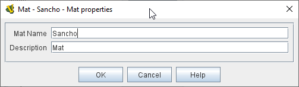

== VASSAL Reference Manual
[#top]

[.small]#<<index.adoc#toc,Home>> > <<GameModule.adoc#top,Module>> > <<PieceWindow.adoc#top,Game Piece Palette>># [.small]#> <<GamePiece.adoc#top,Game Piece>># [.small]#> *Mat*#

'''''

=== Mat

[cols=",",]
|===
|Mats are generally larger pieces that are designed to have smaller pieces (<<MatCargo.adoc#top,Mat Cargo>>) placed on top of them, and for the
cargo pieces to move along with the Mat and maintain their relative position.

When a <<GamePiece.adoc#top,Game Piece>> with this trait is selected by left-clicking on it, any game pieces with the <<MatCargo.adoc#top,Mat Cargo>>
trait that have been placed on top of the Mat piece will also become selected automatically. Therefore if the Mat game
piece is then moved with a drag-and-drop, the cargo pieces conveniently move along with it and maintain their relative
positions.

Similarly, when a Mat piece is moved with a <<SendToLocation.adoc#top,Send to Location>> trait or a <<Translate.adoc#top,Move Fixed Distance>> trait, cargo pieces on top
of it will follow.

If a Mat piece is <<Rotate.adoc#top,rotated>> or <<Pivot.adoc#top,pivoted>>, any cargo pieces on top can also match their facing to the Mat, if that option is
selected in the Mat Cargo trait.

*Mat Name:* An identifier for the Mat. This is exposed to the module via the _MatName_ property, and is also used when
filling the _CurrentMat_ property of <<MatCargo.adoc#top,Mat Cargo>> pieces.

*Description:* Description of the trait - displayed only in the Editor, in the piece definer dialog.

|

image:images/Mat2.png[]
*Above:* a Mat and its <<MatCargo.adoc#top,Mat Cargo>> pieces rotated 45 degrees in _Almoravid_

|===

'''''

==== Properties

A Mat trait exposes the following <<Properties.adoc#top,Properties>>:

* _MatName_ contains the name of the Mat, taken from the _Mat Name_ field.

