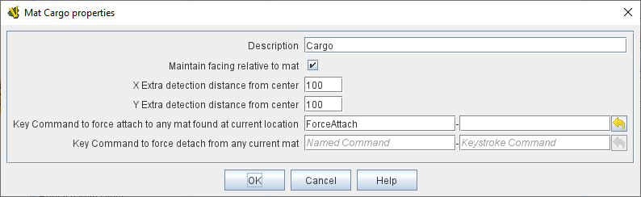

== VASSAL Reference Manual
[#top]

[.small]#<<index.adoc#toc,Home>> > <<GameModule.adoc#top,Module>> > <<PieceWindow.adoc#top,Game Piece Palette>># [.small]#> <<GamePiece.adoc#top,Game Piece>># [.small]#> *Mat Cargo*#

'''''

=== Mat Cargo

A Mat Cargo piece has special capabilities when placed on top of a larger <<Mat.adoc#top,Mat>> piece: they will select automatically
when their parent Mat is left clicked, and will attempt to move with it and even optionally maintain the same facing.

When a <<GamePiece.adoc#top,Game Piece>> with the <<Mat.adoc#top,Mat>> trait is selected by left-clicking on it, any game pieces with the Mat Cargo
trait that have been placed on top of the Mat piece will also become selected automatically. Therefore if the Mat game
piece is then moved with a drag-and-drop, the Mat Cargo pieces conveniently move along with it and maintain their relative
positions.

Similarly, when a Mat piece is moved with a <<SendToLocation.adoc#top,Send to Location>> trait or a <<Translate.adoc#top,Move Fixed Distance>> trait, cargo pieces on top
of it will follow.

If a Mat piece is <<Rotate.adoc#top,rotated>> or <<Pivot.adoc#top,pivoted>>, any cargo pieces on top can also match their facing to the Mat, if that option is
selected in the Mat Cargo trait.
[width="100%",cols="50%a,50%a",]
|===
|

*Description:*:: Description of the trait - displayed only in the Editor, in the piece definer dialog.

*Maintain facing relative to mat:*:: If checked, then the cargo piece will attempt to maintain its relative facing to any
Mat it has been placed on, changing facing if/when the Mat rotates.

NOTE: This means that like a Can Rotate trait,
the Mat Cargo trait should be placed _below_ the graphical elements (e.g. Layer and Non-Rectangular Traits) to
potentially be rotated. A Mat Cargo piece does _not_ need a separate Can Rotate trait in order to be able to maintain
relative facing, although it is permitted to have its own Can Rotate trait as well.

*X Extra detection distance from center:*:: If non-zero, then VASSAL will look this distance to the left and right of the piece's center when trying to attach it to a mat. Useful e.g. for cards that are tucked halfway under a mat surface, as it does not require the precise center of the card to be on the mat.

*Y Extra detection distance from center:*:: If non-zero, then VASSAL will look this distance above and below the piece's center when trying to attach it to a mat. Useful e.g. for cards that are tucked halfway under a mat surface, as it does not require the precise center of the card to be on the mat.

*Key Command to force attach to any mat found at current location:*:: If the piece receives this key command, it will immediately search for (and attempt to attach itself to) any available mat at its current location; if it was already attached to a mat but is no longer overlapping it, it will be detached. Note that attachment and detachment are normally handled automatically whenever a cargo piece is moved, but this allows a check to be forced explicitly in special situations. An example of such a situation would be if you've just "shrunk" the mat (changed its visual shape to be smaller) and want to drop of all the pieces no longer overlapping the mat.

*Key Command to force detach from any current mat:*:: If the piece receives this key command, it will immediately detach itself from any mat it is currently sitting on. This does not in-and-of-itself _move_ the piece from being in its current map position, but _does_ mean that if the mat is subsequently moved, clicked, or dragged it will not take this piece with it.

|

image:images/Mat2.png[]
_A <<Mat.adoc#top,Mat>> and its Mat Cargo pieces rotated 45 degrees in_ _Almoravid_

|===

'''''

==== Properties

A Mat Cargo trait exposes the following <<Properties.adoc#top,Properties>>:

* _CurrentMat_ contains the name of any <<Mat.adoc#top,Mat>> that the Mat Cargo piece is currently sitting atop, taken from the
Mat's _Mat Name_ field. If the piece is not sitting on any Mat, this property will contain the empty string "".

* _CurrentMatID_ contains a unique string identifier for the Mat that the Mat Cargo piece is currently sitting atop. The string will be unique among even Mat pieces sharing the same Mat Name property. If the piece is not sitting on any Mat, this property will contain the empty string "".

* _CurrentMatX_ contains the X position of the Mat that the Mat Cargo piece is currently sitting on. If the piece is not sitting on any Mat, this property will contain the empty string "".

* _CurrentMatY_ contains the Y position of the Mat that the Mat Cargo piece is currently sitting on. If the piece is not sitting on any Mat, this property will contain the empty string "".

* _CurrentMatOffsetX_ contains an offset from this piece's X position to the X position of the Mat that the Mat Cargo piece is currently sitting on. For example if the Mat is at 10 and the Cargo is at 20 then this property will contain -10. If the piece is not sitting on any Mat, this property will contain the empty string "".

* _CurrentMatOffsetY_ contains an offset from this piece's Y position to the Y position of the Mat that the Mat Cargo piece is currently sitting on. For example if the Mat is at 10 and the Cargo is at 20 then this property will contain -10. If the piece is not sitting on any Mat, this property will contain the empty string "".

* _CurrentMatPieceName_ contains the PieceName of the Mat, if any

* _CurrentMatBasicName_ contains the BasicName of the Mat, if any

* _CurrentMatLocationName_ contains the LocationName of the Mat, if any

* _CurrentMatZone_ contains the CurrentZone of the Mat, if any

* _CurrentMatBoard_ contains the CurrentBoard of the Mat, if any

* _CurrentMatMap_ contains the CurrentMap of the Mat, if any

* _CurrentMatProp0_ - _CurrentMatProp9_ will contain the value of the identically named property __of the Mat__. For example if the __Mat__ contains a CalculatedProperty trait called "CurrentMatProp0" and that trait presently evaluates to 7, then CurrentMatProp0 on any Mat Cargo sitting on that mat will also return 7. The Mat can use a Marker, Dynamic Property, or Calculated Property to expose these values to its cargo.

* _IsCargo_ will always contain the string _"true"_ for a Mat Cargo piece (it will contain an empty string, "" for a
piece which does not have this trait).

* _OldMat_ contains the previous Mat name, if any (former contents of CurrentMat).

* _OldMatID_ contains the previous Mat unique ID, if any (former contents of CurrentMatID)

* _OldMatPieceName_ contains the previous Mat's piece name, if any

* _OldMatBasicName_ contains the previous Mat's basic name, if any

* _OldMatOffsetX_ contains the cargo's previous _CurrentMatOffsetX_ value (offset from X position to X of Mat), if any

* _OldMatOffsetY_ contains the cargo's previous _CurrentMatOffsetY_ value (offset from Y position to Y of Mat), if any

