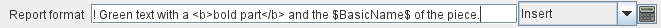
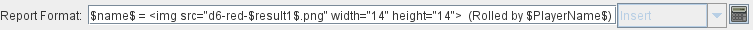
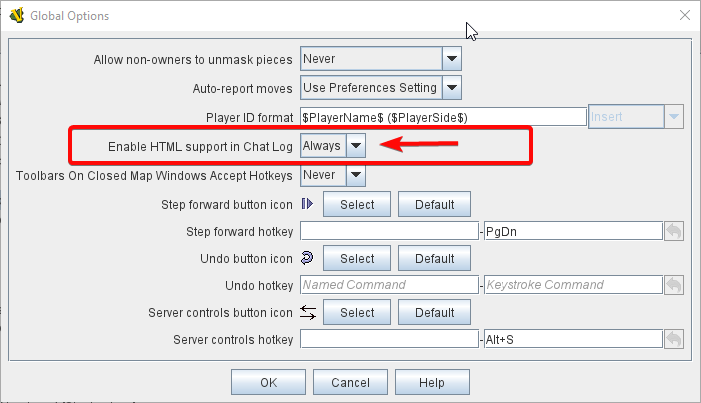

== VASSAL Reference Manual
[#top]

[.small]#<<index.adoc#toc,Home>> > * Message Format*#

'''''

=== Message Format

A Message Format allows you to format the text messages that are generated by VASSAL during play.
It is essentially a text message, except that the values of <<Properties.adoc#top,Properties>> can be substituted into the message.
Any word surrounded by $ characters (e.g.
$CurrentMap$) substitutes the value of the named Property in place of the $..$ name.
The value is taken during play at the time the message is generated.

Click on the _Insert_ drop-down menu for a list of available Properties.
Selecting one of the Properties from the menu will insert it at the current cursor position.

==== Quick Colors

VASSAL provides several "quick color" shortcuts to allow colored text to be put into the chat log by <<ReportChanges.adoc#top,Report Action>> traits and other <<MessageFormat.adoc#top,Message Formats>>. This is done by placing a special character as the first character of a message.
The special first character, if any, will be removed automatically from the message when it is displayed.
Each of these characters activates one of the five chat log colors from the Chat Preferences tab; default colors are provided but players are allowed to reconfigure the colors as they wish.

_EXAMPLE:_ If a <<ReportChanges.adoc#top,Report Action>> trait's message said _Hello World._ and you wanted to change the text to green, you could simply change the message text to _!Hello World._ The exclamation point would be automatically removed, and the message would appear as Hello World.

[cols=",,",]
|===
|*First Character* |*Name* |*Color*
|none or "\|" |vertical separator |defaults to black text
|"!" |exclamation point |defaults to green text
|"?" |question mark |defaults to pink text
|"~" |tilde |defaults to red text
|"`" |back apostrophe |defaults to purple text
|===

image:images/ChatLog.png[]
<<ReportChanges.adoc#top,Reports>> displayed in <<ChatLog.adoc#top,Chat Log>>

==== HTML in Chat Log

VASSAL's chat log now supports HTML as well as regular text, as long you turn on the proper <<GlobalOptions.adoc#top,Global Options>> setting (this is to maintain compatibility with modules created with earlier versions of VASSAL that did not account for such support). To turn on HTML support for your module, in the Editor window navigate to the _[Global Options]_ component and open its _properties_ dialog.
Find the _Enable HTML support in Chat Log_ option (see illustration at right) and set it to _Always_.
Any message with a "Quick Colors" first character, including "|" will also parse HTML regardless of the Global Options setting.

With HTML support enabled, you can include many types of HTML tags in your <<ReportChanges.adoc#top,Report Action>> traits and other <<MessageFormat.adoc#top,Message Formats>>. This opens up even more possibilities than the Quick Colors shortcuts and allows you to create an unlimited number of new styles.

*IMPORTANT*: When HTML is enabled in the chat log, it is important to remember that the `<` character will be interpreted as the beginning of an HTML tag, rather than simply displaying a "less than" or "left angle bracket" symbol. Thus, modules which use the `<` symbol to indicate "less than" or to "draw an arrow" or enclose a user name, etc, will need to have those instances changed to `\&lt;` (the HTML escape code which causes a literal `<` character to be printed). Otherwise you may
experience odd behaviors such as chat log messages failing to appear (or seeming to be delayed until the next chat message is printed).

[cols=",",]
|===
|*Tags* |*Results*
|<b>bold text</b> |*bold text*
|<i>italic text</i> |_italic text_
|<u>underscore text</u> |[.underline]#underscore text#
|blue text |blue text
|hex color text |hex color text
| dice image |image:images\d6-6-grey.png[image,width=14,height=14]dice image
|===

==== Properties available in Message Format

Available Properties will vary depending on the component being configured.
Some commonly-used Properties are:

_$playerName$_ is the player's name as specified in the Preferences.
Note that this is the name of the player running the current session "on this computer", not e.g.
the name of the player who owns a particular piece.

_$playerSide$_ is the side chosen by the player from the <<GameModule.adoc#Definition_of_Player_Sides,Definition of Available Sides>>

_$playerId$_ is a combination of playerName and playerSide specified in the <<GameModule.adoc#GlobalOptions,Global Options>>

_$<<GlobalProperties.adoc#top,Global Property>>$_ names can also be referenced.

_$result1$_, etc, from the roll of a <<SpecialDiceButton.adoc#top,Symbolic Dice Button>> can also be checked.

_$<<Properties.adoc#top,Properties>>$_ of a Game Piece can be referenced when a Message Format is used in conjunction with a particular Game Piece.
See the Properties article <<Properties.adoc#top,for a handy list of properties associated with pieces>>.

*SEE ALSO:* <<ChatLog.adoc#top,Chat Log>>, <<ReportChanges.adoc#top,Report Action>>, <<Label.adoc#top,Text Label>>

Enabling <<ChatLog.adoc#top,Chat Log>> HTML Support in <<GlobalOptions.adoc#top,Global Options>>
