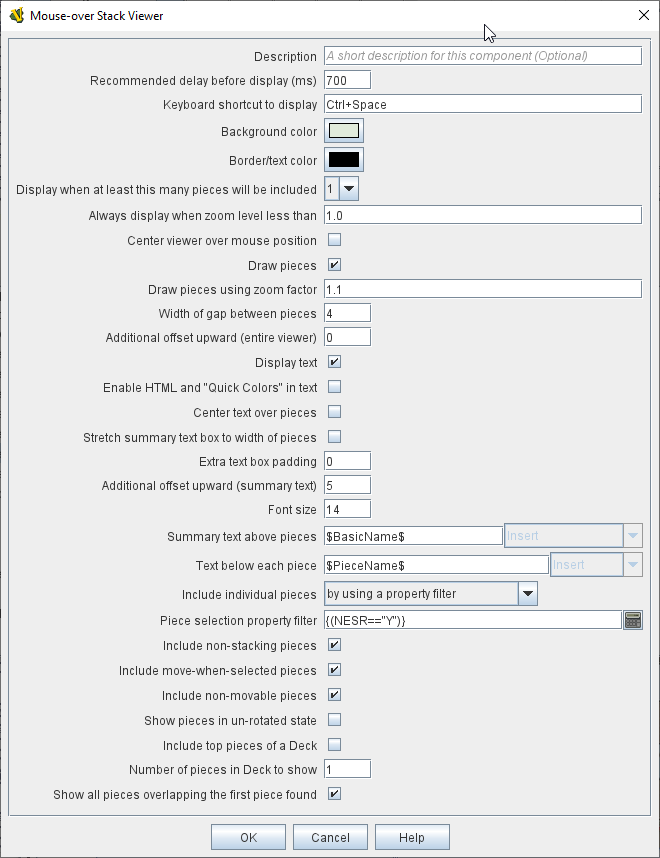

// Mouseover Stack Viewer: internally known as CounterDetailViewer
== VASSAL Reference Manual
[#top]

[.small]#<<index.adoc#toc,Home>> > <<GameModule.adoc#top,Module>> > <<Map.adoc#top,Map>> > *Mouse-over Stack Viewer*#

'''''

=== Mouse-over Stack Viewer
A Mouseover Stack Viewer displays a "rollover" or "tooltip" for a stack when the mouse cursor is moved over it, after a specified delay. The tooltip can be configured to include images and/or display descriptive text about the pieces in the stack. Note that a "stack" for this purpose can consist of a single piece or multiple pieces, or even a deck.

Occasionally pieces will want to "draw themselves differently" inside of a Mouseover Stack Viewer. For this purpose they can check the property `DrawingMouseover` in e.g. a Calculated Property or a Label's "Follows Expression Value" field. Alternatively the property `DrawingMouseoverIndex` will contain 2 while drawing the mouseover, 1 otherwise; this can be useful as an index for a Follows Expression layer because it avoids the substantial performance cost of a full Beanshell expression e.g. `{ DrawingMouseover ? 2 : 1 }`.

If a Map contains multiple Mouse-over Stack Viewers, they will be processed in order from the top until one of them causes a rollover to be drawn, after which no further rollovers will be drawn. If you change the order of the Mouseover-stack Viewers, you will need to restart VASSAL before the ordering change will take effect.

[width="100%",cols="50%a,^50%a",]
|===
|
*Description:*:: A brief description of this component for your reference.

*Recommended Delay before display (ms):*::  When the mouse has been stationary for this many milliseconds, the viewer will appear.
This can be overridden in the preferences.

*Keyboard shortcut to display:*::  Players may display the viewer without waiting by pressing this shortcut key.
This can be disabled in the preferences.

*Background color:*::  Pieces/text are drawn against a background of this color.

*Text color:*::  Color of any text drawn.

*Border color:*::  Color of border around the overall viewer.

*Display when at least this many pieces will be included:*::  If set to 0, then the viewer will display even if the location is empty.
Otherwise, it will display only if 1 or 2 pieces have been included via the settings below.

*Always display when zoom level is less than:*:: Regardless of the above "at least this many" setting, the viewer will also display when the map's magnification factor is less than this number.

*Center viewer over mouse position:*:: If checked, attempts to center the viewer over the mouse position.

*Outer border thickness:*:: Thickness in pixels of the border drawn around the rollover display.

*Inner border thickness:*:: If _both_ Stretch options, below, are selected, then the inner border (between the pieces display and any text boxes) can be given a separate pixel thickness.

*Draw pieces:*::  If selected, then the included pieces will be drawn in the viewer.

*Center pieces vertically in box (if different sizes):*:: If selected, and multiple pieces of different heights are being shown, the smaller pieces will be vertically centered in the viewer

*Draw pieces using zoom factor:*::  The magnification factor to use to draw the pieces in the viewer.

*Width of gap between pieces:*::  Empty space in pixels to place between each drawn piece.

*Display text:*::  If selected, then the viewer will draw some summary text and some individualized text for each piece.

*Enable HTML and "Quick Colors" in text:*:: Enable the use of <<ChatLog.adoc#html,HTML>> and  <<ChatLog.adoc#quick,Quick Colors>> in the display text.

*Center text over pieces:*:: When selected, the text displayed above each piece will be centered over the piece, otherwise it will be left-justified.

*Stretch summary text box to width of pieces:*:: Stretch the size of the summary text piece to be the same width as the display of pieces, even if it would normally be narrower. Has no effect when text is already at least as wide as the pieces.

*Stretch pieces box to width of summary text:*:: Stretch the size of the pieces box to be the same width as the display of the summary text above the pieces, even if pieces display would normally be narrower. Has no effect when pieces already at least as wide as the text.

*Combined counter summary text box:*:: When stretching the summary text box to the full width, also don't draw individual boxes around each summary entry.

*Only show first piece's summary entry:*:: When stretching the summary text box to the full width, only show the summary entry for the first piece displayed.

*Additional offset upward (summary text):*:: The number of pixels to adjust the summary text box upwards from its usual position. Use negative numbers to adjust it down.

*Font size:*:: Fort size for the text drawn by the stack viewer.

*Summary text above pieces:*::  A <<MessageFormat.adoc#top,Message Format>> specifying the text to display above the drawn pieces in the viewer.
In addition to standard <<Properties.adoc#top,Properties>>, you can include $countPieces$ to count the pieces included in the display. You can also include a property with the name _sum(propertyName)_ where _propertyName_ is a property defined on a Game Piece.
The sum of the numeric values of this property for all included pieces will be substituted. **Note:** If you are using a Beanshell expression here instead of just substitution with $..$ then for _sum_ you will need to use _sumProperties_ as Beanshell has its own separate sum keyword as documented in <<Expression.adoc#top, Expressions>>.

*Text below each piece:*::  A <<MessageFormat.adoc#top,Message Format>> specifying the text to display below each included piece.

*Text for empty location:*::  A <<MessageFormat.adoc#top,Message Format>> specifying the text to display when no pieces have been selected.

*Include individual pieces:*::  Specifies whether/how pieces are to be selected for inclusion in the viewer based on their layer.
You may restrict the pieces according to the <<GamePieceLayers.adoc#top,Game Piece Layer>> to which they belong.

*Piece selection property filter:*::  You may specify a <<PropertyMatchExpression.adoc#top,Property Match Expression>> to match desired values of one or more <<Properties.adoc#top,Properties>> in order for a piece to be included.

*Include terrain beneath as an additional "piece":*::  If set to _Always_, the map/board surface beneath the pieces will be shown as if it were an additional piece. If set to _If at least one other piece_, the mapboard surface will be shown as long as at least one actual piece is found by this mouseover. If set to _Never_, the map/board surface beneath the piece(s) will not be shown.

*Force snap to map grid when displaying terrain:*::  If selected, then when showing terrain the center point will be determined by "snapping" the cursor location to the nearest region/hex/square in the map grid, regardless of whether the grid is normally set to "snap to".

*Width of terrain on map to grab for display:*::  When showing terrain, this specifies the width (in map coordinates) to be grabbed for display.

*Height of terrain on map to grab for display:*::  When showing terrain, this specifies the height (in map coordinates) to be grabbed for display.

*Zoom factor to display terrain:*::  When showing terrain, this specifies the zoom factor to display the terrain after it has been grabbed from the map.

*Text below terrain:*::  When showing terrain, this specifies optional summary text to display beneath the grabbed terrain icon (a similar function to the _Text below each piece_ field).

*Show only top piece in stack:*:: If selected, then only the top piece in a stack is eligible to be displayed; otherwise the whole stack is shown.

*Include non-stacking pieces:*::  If selected, then pieces with a <<NonStacking.adoc#top,Does not stack>> trait specifying the piece does not Stack are eligible for inclusion in the viewer.
Otherwise, they are excluded regardless of any other filters.

*Include move-when-selected pieces:*::  If selected, then pieces with a <<NonStacking.adoc#top,Does not stack>> trait specifying the piece may only move when selected are eligible for inclusion in the viewer.
Otherwise, they are excluded regardless of any other filters.

*Include non-movable pieces:*::  If selected, then pieces with a <<NonStacking.adoc#top,Does not stack>> trait specifying the piece may not move are eligible for inclusion in the viewer.
Otherwise, they are excluded regardless of any other filters.

*Show pieces in unrotated state:*::  If selected, then pieces that can rotate are drawn in the viewer as they look when not rotated.

*Include top piece in Deck:*:: If selected, then the top piece of a <<Deck.adoc#top,Deck>> is eligible for inclusion.

*Include face down pieces in a Deck:*:: If selected, then face-down members of a deck are eligible for inclusion

*Number of pieces in Deck to show:*:: This many cards/pieces from the top of a deck are eligible for inclusion.

*Show all pieces overlapping the first piece found:*:: If selected, then all Game Pieces that overlap the mouse cursor location are eligible to be displayed; otherwise only pieces at the _exact_ X,Y position of the _top_ piece found are displayed.

*Don't process further Mouse-over Stack Viewers when this one displayed:*:: If selected, then whenever this viewer is actively displaying (i.e. has found sufficient targets to display either pieces or text), then no further Mouse-over Stack Viewers will be processed -- any additional viewers listed lower in the editor's list of viewers for this map will be ignored. This can be used to prevent multiple viewers from drawing over top of each other without the need for highly elaborate filter logic.
|
|===
