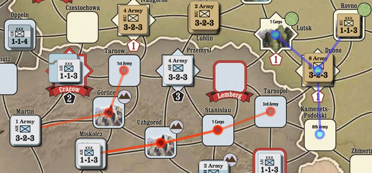

// Movement Trail is internally known as Footprint
== VASSAL Reference Manual
[#top]

[.small]#<<index.adoc#toc,Home>> > <<GameModule.adoc#top,Module>> > <<PieceWindow.adoc#top,Game Piece Palette>> > <<GamePiece.adoc#top,Game Piece>> > *Movement Trail*#

'''''

=== Movement Trail

Pieces with this trait will leave behind a graphic trail showing the positions through which the piece has been moved.
The trail consists of a circle for each past location, connected by straight lines.

If it is desirable for players to be able to clear this movement history during play, then the piece should also contain a <<MarkMoved.adoc#top,Mark When Moved>> trait.
The movement trail will be reset whenever the _Moved_ property of the _Mark When Moved_ trait is cleared.

*Example: Movement Trails in Paths of Glory*

[width="100%",cols="50%a,50%a",]
|===
|
*Description:*:: A short description of this trait for your own reference.

*Menu command:*::  The right-click context menu command to show/hide the movement trail.
If left blank, no context menu entry appears, although the key command may still be used.

*Key command:*::  A <<NamedKeyCommand.adoc#top,Keystroke or Named Command>> to show/hide the movement trail.
Toggles the trail on and off.
If left blank, the trail is always visible.

*TURN ON key command:*::  A <<NamedKeyCommand.adoc#top,Keystroke or Named Command>> to turn the movement trail display on.
+
Unlike the main Key Command which toggles the trail state, this one always turns the trails on (shows them). It can be useful for e.g.
implementing a Toolbar button to show trails for all pieces.

*TURN OFF key command:*  A <<NamedKeyCommand.adoc#top,Keystroke or Named Command>> to turn the movement trail display off.
+
Unlike the main Key Command which toggles the trail state, this one always hides the trails.
It can be useful for e.g.
implementing a Toolbar button to show trails for all pieces.

*CLEAR TRAIL key command:*::  A <<NamedKeyCommand.adoc#top,Keystroke or Named Command>> to clear the movement history for this piece.
+
This erases any existing trails, but leaves the trail's _showing_ or _hidden_ state alone -- so a piece with trails showing that has its movement history cleared will simply resume showing new trails the next time it is moved.

*Trails start visible:*::  If checked, the piece will begin the game displaying movement trails.

*Trails visibility synchronized for all players:*::  If selected, then toggling the visibility of the trail will affect all players' views and will be saved along with the game.
Otherwise, each player controls the visibility of trails on that player's view.

*Circle radius:*:: The radius in pixels of the circle representing each location in the trail.

*Circle fill color:*:: The color of the location circles.

*Line color:*:: The color of the connecting lines.

*Line thickness:*:: The thickness in pixels of the connecting lines.

*Selected unit trail transparency (0-100):*::  The transparency of the trail when the piece is selected.
0 is transparent; 100 is opaque.

*Unselected unit trail transparency (0-100):*::  The transparency of the trail when the piece is not selected.
0 is transparent; 100 is opaque.

*Display trail points off-map (pixels):*::  If the map has buffer space surrounding the boards, the trail circles will be drawn within this distance from the board edges.

*Display trails off-map (pixels):*  If the map has buffer space surrounding the boards, the trail lines will be drawn within this distance from the board edges.

|image:images/MovementTrail.png[]
|===
