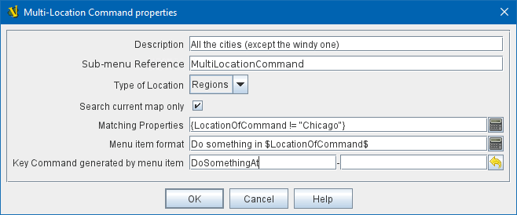
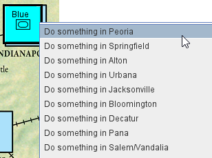

== VASSAL Reference Manual
[#top]

[.small]#<<index.adoc#toc,Home>> > <<GameModule.adoc#top,Module>> > <<PieceWindow.adoc#top,Game Piece Palette>># [.small]#> <<GamePiece.adoc#top,Game Piece>># [.small]#> *Multi-Location Command*#

'''''

=== Multi-Location Command

Sometimes it is useful for a piece to have context menu items representing actions at multiple map locations (e.g. "Send me to London", "Send me to Paris"), but creating an individual trait for e.g. every location on the map can be prohibitive.

Multi-Location Commands solve this problem by allowing a single trait to generate multiple menu items, filtering locations through a property expression. Each location that matches the property expression will be given its own menu item, with the text of the menu item being generated on the fly using the specified report format.

Whenever the player selects _any_ of the menu items associated with a Multi-Location Command trait, the trait's single _key command_ will be generated, and can be intercepted by other traits (e.g. Trigger Action, Send to Location). To identify which map location was associated with the menu item picked by the player, these other traits can use the properties _LocationOfCommand_, _ZoneOfCommand_, _BoardOfCommand_, and _MapOfCommand_.

**NOTE:** It is recommended that Named Key Commands (rather than actual keystrokes) be used for Multi-Location Commands. If an actual keystroke is used and the user manually types the key command, the trait properties (e.g. _LocationOfCommand_) will be set to the first location found.

[width="100%",cols="50%a,50%a",]
|===
|
*Description:*:: Description of the trait - displayed only in the Editor, in the piece definer dialog.

*Type of Location:*:: The type of location that will be scanned (_Regions_ or _Zones_)

*Search current map only:*:: If selected, then only locations on the same map as the piece will be searched; otherwise all maps will be searched.

*Matching Properties:*:: An expression to determine which of the scanned locations will be included as commands. If left blank, all of them will.

*Menu item format:*:: The format for constructing menu items from the locations. The trait's properties (e.g. _LocationOfCommand_, etc) can be used with $..$ to make string substitutions.

*Key command generated by menu item:*:: Whenever any menu item generated by this trait is picked by the player, this key command will be generated.

|

|===

'''''

==== Properties

A Multi-Location trait exposes the following <<Properties.adoc#top,Properties>>. They can be used both for filtering which locations are included as commands, for substitution into menu text for commands, and for identifying which location's command was picked after the key command has been picked up by another trait.

* _LocationOfCommand_ The location (region or zone) of the command

* _ZoneOfCommand_ The zone (if any) of the command

* _BoardOfCommand_ The board of the command

* _MapOfCommand_ The map of the command

