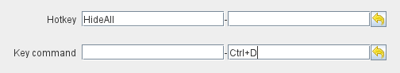
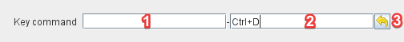

== VASSAL Reference Manual
[#top]

[.small]#<<index.adoc#toc,Home>>  > *Key Commands*#

'''''

=== Keystroke Commands, Named Commands, Key Commands and Hotkeys

_Keystroke Commands_ and _Named Commands_ (collectively known as _Key Commands_ or _Hotkeys_) let Vassal know when to activate traits and components. (e.g.
when should a Clone trait make a copy of the piece, when should the Delete trait delete it, when should a Map Window be opened).

Hotkeys and Key Commands are essentially the same thing, an encoded command that is interpreted by Vassal traits and components that are waiting to see it.

For historical reasons, the term _Key Commands_ is used to refer to Commands that are recognized by GamePiece traits (like Delete) and _Hotkeys_ is used to refer to Commands that are recognized by Vassal components (like Map Windows).

Vassal maintains this distinction when Commands are generated and sent to other components. _Key Commands_ (generated by the Global Key Command trait for example) are only sent to Game Pieces. _Hotkeys_ (generated by the Global Hotkey trait for example) are only sent to Game Components.

==== Keystroke Commands
A traditional Keystroke Command is simply the name of a keystroke, such as _Ctrl+K_ or _Alt+Shift+X_ that can be typed by a player on a Keyboard.
If a trait is assigned a traditional Keystroke Command, then whenever the player presses that keystroke while the piece is selected, the trait will be activated.
If the trait is also assigned a Menu Command string, then the keystroke for the Key Command will be displayed in the context menu for the piece as a shortcut.

==== Named Commands
A Named Command, by contrast, can be any text message at least two characters long, such as FireForwardPhasers or EliminateUnit or SpinTurretRight.
These names will not be displayed on screen during play, they are private to the module, and function much like naming a variable, method, or function in a programming language.
If a Named Command is paired with a Menu Command string, then it will still generate an entry on the piece's context menu, but no keystroke will be displayed.
If the player then selects that menu item, the Named Key Command will "fire" and any trait in the piece with that Named Key Command assigned will be activated.

==== Activating Key Commands
In addition to being activated when the player selects the corresponding menu item from the context menu, and (in the case of regular Key Commands) when the player presses the designated keystroke combination while the piece is selected, both types of Key Command can _also_ be generated by a <<TriggerAction.adoc#top,Trigger Action>> trait from the same piece, or by a <<GlobalKeyCommand.adoc#top,Global Key Command>> from any piece.
This allows module designers to chain several actions together to create sophisticated modules.

Earlier versions of Vassal supported _only_ traditional Key Commands (i.e.
actual keystrokes), and so every aspect of a trait of any piece potentially needing to be activated had to be assigned its own keystroke.
This quickly made the keyboard seem very crowded for designers of sophisticated modules! So the Named Command was introduced to allow modules more breathing room to create useful traits and commands.

==== Editing Key Commands

The standard Key Command configurer contains 3 parts::
+
*1:* Named Command entry. Type or paste the text of a Name Command in this section.
+
*2:* Keystroke Command entry. Click in this section, then press a Keyboard key or key combination. The name of the Keystroke Command will be displayed.
+
*3:* Undo Button. Clicking in this button will undo the last change you made in either of the Named or Keystroke Command entry fields.
