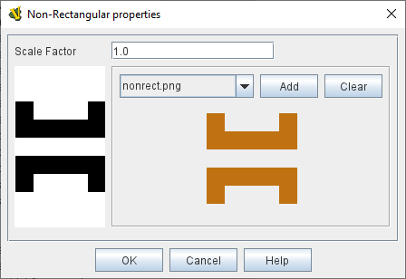

== VASSAL Reference Manual
[#top]

[.small]#<<index.adoc#toc,Home>> > <<GameModule.adoc#top,Module>> > <<PieceWindow.adoc#top,Game Piece Palette>> > <<GamePiece.adoc#top,Game Piece>> > *Non-Rectangular*#

'''''

=== Non-Rectangular

This trait allows you to specify an arbitrary shape for a Game Piece, so that the piece will only be selected when its image is clicked on precisely, rather than being selected whenever the player clicks anywhere inside its "bounding box".

*Scale Factor:* A scale factor can be applied to the shape (mostly for use with original images that needed downscaling in a Layer trait: allows use of the original image as the "shape" for the piece without needing to separately scale it).

The shape of a piece is used to determine where the player must click to drag a piece or bring up its popup menu.
It also is used to highlight the outline of the piece when it has been selected.
Ordinarily a _bounding box_ around the maximum rectangular limits of the image provides the shape for both the piece's selection boundaries and its highlight outline.

By using transparency in your image, you can arrange for your piece be _drawn_ with any shape.
However, without the Non-Rectangular trait, the piece can be selected even by clicking on the transparent portions of the image, which can lead to confusion.
The Non-Rectangular trait allows you to specify the shape of the piece to be identical to the non-transparent portion of an image.
Simply select the appropriate image from the drop-down list.

NOTE: For the most common case, a piece with a simple image that has some transparent portions, and that transparency is contained in the image file as "a transparent color", simply provide the same image again to the Non-Rectangular trait, and this will remove the transparent portions of the piece from the selectable part of the piece.
[width="100%",cols="50%a,50%a",]
|===
|
*Scale Factor:*:: Applies a scale factor to the supplied image when creating the Non-Rectangular shape. A scale factor greater than 1 will make the shape larger than the image (e.g. 2 = double sized. A Scale factor less than 1 will make the shape smaller (e.g. 0.25 = quarter sized).

*Image Block:*:: The left-hand side of the image area shows a representation of what the Non-Rectangular shape will be. The black shap shows the non-transparent parts of the source image and the shape of the generated image.
+
The right-hand size shows the actual selected image and allows you to select an existing module image from the drop-down, to load a new image into the module using the _Add_ button, or to clear the existing image using the _Clear_ button.

|

*EXAMPLE:* In this example, the file _test.png_ has some orange regions representing the visible parts of a piece, and transparent areas in which nothing will be drawn.
At the left, the _mask_ is shown -- the black portions representing areas which can be clicked on to select the piece, and the white areas representing transparent regions, clicking on which will not select the piece.
This helps verify that the mask is being read properly.

|===
