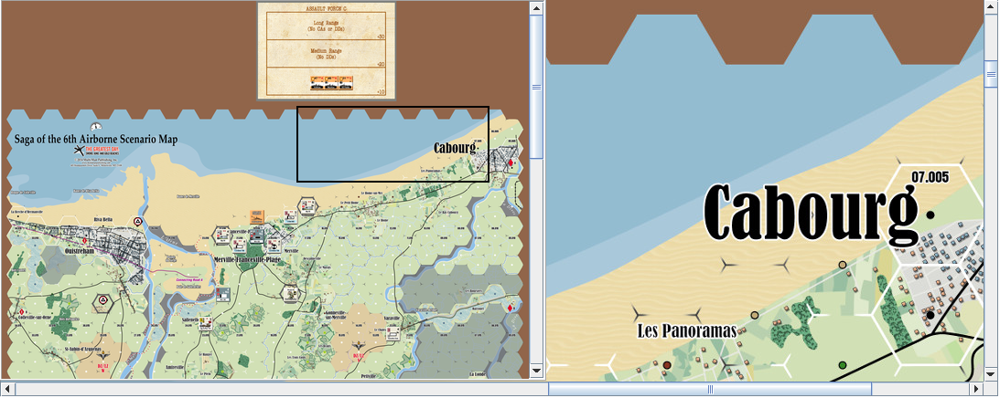

== VASSAL Reference Manual
[#top]

[.small]#<<index.adoc#toc,Home>> > <<GameModule.adoc#top,Module>> > <<Map.adoc#top,Map>> > *Overview Window*#

'''''

=== Overview Window

Adds a separate "Mini Map" subwindow that can be displayed over the top of the main map display.

The Overview map can be displayed by a Toolbar Button or by a Hotkey.

The subwindow will contain a view of the entire playing area at a smaller scale than displayed in the parent map window.

The area of the map currently visible in the map window is highlighted in the overview map with a colored rectangle.
A player may click on the Overview window to center the Map Window at the point clicked on.

A Toolbar button to turn this subwindow on and off will be placed on the Map Window's toolbar
A hotkey or <<NamedKeyCommand.adoc#top,Named Key Command>> can also be supplied to open the mini map subwindow.

[width="100%",cols="50%a,50%a",]
|===
|
*Tooltip text:*:: Tooltip text for the Toolbar button.

*Button text:*:: Text of the Toolbar button.

*Button icon:*:: Icon for the Toolbar button.

*Hotkey to show/hide:*:: A <<NamedKeyCommand.adoc#top,Keystroke or Named Command>> to show or hide the overiew window.

*Scale factor:*:: The scale of the Overview window when showing. e.g. A scale factor of 0.2 will show the Overview window at 20% of full size.

*Visible rectangle highlight color:*:: Sets the color of the box showing the section of the main map currently visible.

|image:images/OverviewWindow.png[]
|===
