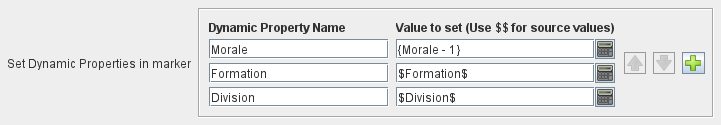

== VASSAL Reference Manual
[#top]

[.small]#<<index.adoc#toc,Home>> > <<Concepts.adoc#top,Concepts>>  > *Passing values to pieces*#

''''
=== Passing values to pieces

There are several techniques that can be used to pass the values of properties between different pieces

* <<#marker,Set multiple Dynamic Property values>> in a newly created Markers created with the <<Marker.adoc#top, Place Marker>> or <<Replace.adoc#top,Replace With Other>> trait.
* <<#gkc,Set multiple Dynamic Property values>> when running any <<GlobalKeyCommand.adoc#top,Global Key Command>>.
* <<#spp,Set individual Dynamic Property values directly>> using the <<SetPieceProperty.adoc#top,Set Piece Property>> trait.
* <<#gp,Passing values via Global properties>>.
* <<#read, Reading values from other pieces>> using <<ExpressionProperty.adoc#general,Get Property>> functions.

[#marker]
==== Newly created markers
When creating a new marker with the <<Marker.adoc#top, Place Marker>> or <<Replace.adoc#top,Replace With Other>>, you can set any number of Dynamic Properties in the created marker to calculated properties:

Each property is set in the order listed to the values of the specified <<Expression.adoc#top,Expressions>>. The values used to satisfy the Properties included the expressions are taken from the new marker, not from the piece that is creating the marker.

You can reference properties in the piece creating the marker using $$ variables. These are literally replaced in the expression before it is evaluated on the new marker.

So, in our examples above, The `Morale` Dynamic Property in the markers i

[#spp]
==== Set Piece Property

[#gkc]
==== Global Key Commands

[#gp]
==== Passing values via Global properties>

[#read]
==== Using GetProperty functions.