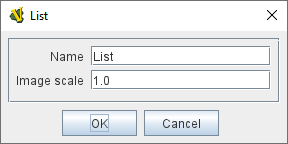
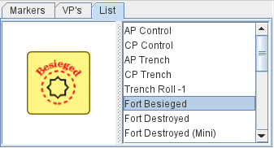

== VASSAL Reference Manual
[#top]

[.small]#<<index.adoc#toc,Home>> > <<GameModule.adoc#top,Module>> > *Game Piece Palette*#

'''''

=== Game Piece Palette

[cols=",",]
|===
|The Game Piece Palette is a panel which contains Game Pieces that the players may drag to the playing area during a game.
An unlimited supply of each Game Piece is available through the palette.
If you need to limit the number of pieces available during play, use a <<Deck.adoc#top,Deck>>, an <<SetupStack.adoc#top,At-Start Stack>>, or <<GameModule.adoc#PredefinedSetup,Default Setups>>.

If the player has the _Use combined application window_ preference checked, then the first Game Piece Palette in the module will dock into the main module window to the left of the chat log.
All others will appear in their own window.

*Name:*  If the palette appears in its own window, this will be used for the title.

*Hidden:*  If checked, then this Game Piece Palette will not appear at all during play.
This is useful if you need to define pieces for a <<GameModule.adoc#PredefinedSetup,Default Setup>> but don't want to allow players to create new pieces during play.
You must restart VASSAL for this change to take effect.

*Button Text:*  The text on the Toolbar button that shows and hides the Game Piece Palette.

*Button Icon:*  The icon image on the Toolbar button.

*Hotkey:*  A keyboard shortcut or <<NamedKeyCommand.adoc#top,Named Key Command>> for the Toolbar button.

*Image scale for all child members:*  A scale factor to be used to draw the images for pieces displayed by this panel or its members.
If an inner widget (e.g.
a panel, a list, etc) contains its own scaling factor, that one overrides any factor provided in an outer member.

The Game Piece Palette is highly configurable, and can contain any combination of tabs, lists, and pull-down menus containing individual Game Pieces.
For example, the window may contain a tabbed pane with two entries, called "Info" and "Armies", each of which contain a list of pieces.
Every component in the Toolbar should end with a Single Piece.
Since a typical game has many pieces that differ in only minor ways, you may find it convenient to clone Single Pieces.
Also, the order of the pieces can be changed by dragging them within the configuration tree.
|image:images/PieceWindow.png[]

image:images/PaletteExample.png[] +
|===

'''''

=== Sub-Components

Each sub-component (except a Single Piece) of a Game Piece Palette can contain any combination of the other sub-components.

==== <<GamePiece.adoc#top,Single Piece>>

A Game Piece that can be dragged onto a playing area.

==== <<MassPieceLoader.adoc#top,Multiple Pieces>>

The Mass Piece Loader allows you to create multiple pieces at once, based on a folder of appropriately named images.

==== Pull-down menu

A pull-down menu in which each menu item corresponds to a subcomponent.
The name of the menu item will be the name of the subcomponent.

==== Scrollable List

A scroll list in which each entry corresponds to a subcomponent.
The name of the entry will be the name of the subcomponent.
An image scale can be applied to the images drawn pieces in the list.

==== Tabbed Pane

A panel with tabs, each of which corresponds to a Chart, Panel, or other Tabbed Pane subcomponent.
The label of the tab will be the name of the subcomponent.

==== Panel

[cols=",",]
|===

|A panel that can contain Single Pieces, Tabbed Panes, or other panels.
The "Fixed cell size" box allows you to specify a fixed number of columns that the panel will have.
Otherwise, the subcomponents will appear in a single row, or a single column if the "Vertical layout box is checked.
An image scale can be applied to the images drawn for pieces shown on the panel.

|
image:images/PanelWidget.png[]

image:images/PanelWidget2.png[]
|===

