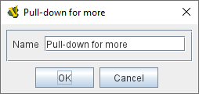
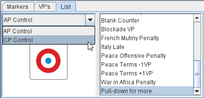
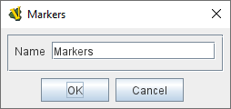

== VASSAL Reference Manual
[#top]

[.small]#<<index.adoc#toc,Home>> > <<GameModule.adoc#top,Module>> > *Game Piece Palette*#

'''''

=== Game Piece Palette

The Game Piece Palette is the root of a hierarchy of Game Piece Containers and Game Pieces.
Game Pieces are always at the end (leaves) of the hierarchy. Game Piece Container can be nodes or leaves of the hierarchy.
Note that since Vassal version 3.5.0 the topmost node of the Game Piece Palette must be a Game Piece Container.

During a game players may drag to the playing area the Game Pieces contained inside Game Piece Palettes.
An unlimited supply of each Game Piece is available through the palette.
If you need to limit the number of pieces available during play, use a <<Deck.adoc#top,Deck>>, an <<SetupStack.adoc#top,At-Start Stack>>, or <<GameModule.adoc#PredefinedSetup,Default Setups>>.

If the player has the _Use combined application window_ preference checked, then the first Game Piece Palette in the module will dock into the main module window to the left of the chat log.
All others will appear in their own window.

The Game Piece Palette is highly configurable, and can contain any combination of tabs, lists, and pull-down menus containing individual Game Pieces.
For example, the window may contain a tabbed pane with two entries, called "Info" and "Armies", each of which contain a list of pieces.
Every component in the Palette should end with one or more Game Pieces.
Since a typical game has many pieces that differ in only minor ways, you may find it convenient to clone Single Pieces.
Also, the order of the pieces can be changed by dragging them within the configuration tree.

[width="100%",cols="50%a,^50%a",]
|===
|

*Name:*::  If the palette appears in its own window, this will be used for the title.

*Hidden (requires restart):*::  If checked, then this Game Piece Palette will not appear at all during play.
This is useful if you need to define pieces for a <<GameModule.adoc#PredefinedSetup,Default Setup>> but don't want to allow players to create new pieces during play.

NOTE: You must restart VASSAL for this change to take effect.

*Button text:*::  The text on the Toolbar button that shows and hides the Game Piece Palette.

*Tooltip text:*::  The Tooltip text on the Toolbar button.

*Button icon:*::  The icon image on the Toolbar button.

*Hotkey to show/hide:*::  A <<NamedKeyCommand.adoc#top,Keystroke or Named Command>> for the Toolbar button.

*Image scale for all child members:*::  A scale factor to be used to draw the images for pieces displayed by this panel or its members.
If an inner widget (e.g.
a panel, a list, etc) contains its own scaling factor, that one overrides any factor provided in an outer member.

|

image:images/PieceWindow.png[]

image:images/PaletteExample.png[] +
|===

'''''

=== Sub-Components
The top level of a Game Piece Palette must contain a Game Piece Container, all levels below can also contain Game Pieces.

Each Game Piece Container of a Game Piece Palette can contain any combination of Game Piece Containers and Game Pieces.

==== Game Piece Containers
[width="100%",cols="50%a,^50%a",]
|===
|Pull-down menu

A pull-down menu in which each menu item corresponds to a subcomponent.
The name of the menu item will be the name of the subcomponent.

Pull-down menus work well as items in a Scrollable list.
|

|Scrollable List

A scroll list in which each entry corresponds to a subcomponent.
The name of the entry will be the name of the subcomponent.
An image scale can be applied to the images drawn pieces in the list.
|

image:images/ListExample.png[]

| Tabbed Panel

A panel with tabs, each of which corresponds to a Sub Component (or Game Piece).

The label of the tab will be the name of the subcomponent.
|

image:images/PaletteExample.png[]
| Panel

A panel that can contain Game Pieces, Tabbed Panes, or other panels.
The "Fixed cell size" box allows you to specify a fixed number of columns that the panel will have.
Otherwise, the subcomponents will appear in a single row, or a single column if the "Vertical layout box is checked.
An image scale can be applied to the images drawn for pieces shown on the panel.

|
image:images/PanelWidget.png[]

image:images/PanelWidget2.png[]
|===

==== Single <<GamePiece.adoc#top, Game Piece>>

A Game Piece that can be dragged onto a playing area. A Game Piece can only be created inside a Game Piece Container.

==== Multiple Game Pieces
Game Pieces can be added individually inside a Game Piece Palette or the <<MassPieceLoader.adoc#top,Mass Piece Loader>> can be used to create multiple pieces at once, based on a folder of appropriately named images.

