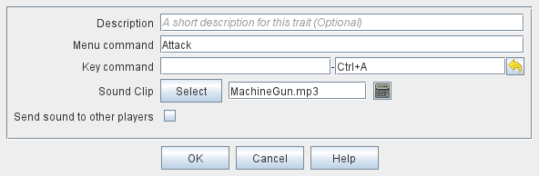

== VASSAL Reference Manual
[#top]

[.small]#<<index.adoc#toc,Home>> > <<GameModule.adoc#top,Module>> > <<PieceWindow.adoc#top,Game Piece Palette>> > <<GamePiece.adoc#top,Game Piece>> > *Play Sound*#

'''''

=== Play Sound

This trait allows you to specify a command that plays an audible sound.

[width="100%",cols="50%a,^50%a",]
|===
|
*Description:*:: A brief description for your own reference.

*Menu command:*::  The name of the menu item in the right-click context menu.
If left blank, no context menu item will appear, but the sound can still be played by sending the Key Command.

*Key command:*::  The <<NamedKeyCommand.adoc#top,Keystroke or Named Command>> which will cause the sound to be played.

*Sound Clip:*::  Select a file in _.au, .aiff, .wav or .mp3_ format to add it to the module.
The sound file specified in this field will be played when the menu item or Key Command is invoked.
You can select a specific Sound file using the _Select_ button, or you can load multiple sound files into your module and use an <<Expression.adoc#top,Expression>> to define the name of the sound file at the time the play command is invoked.

*Send sound to other players?*::  If selected, then the Command to play the sound will be echoed to other players when playing live or reading from a logfile.
Otherwise, the sound is only audible to the player who invoked the command.

|
|===
