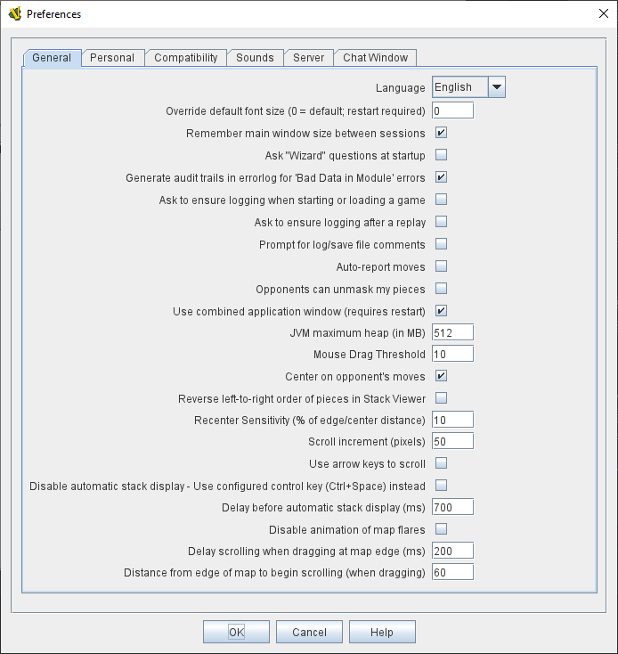

== VASSAL Reference Manual
[#top]

<<index.adoc#toc,Home>> > [.small]#*Preferences*#

'''''

=== Preferences
The VASSAL Preferences dialog allows you to configure VASSAL for your system and to personalize its preference options to suit your needs.

The number of tabs displayed will depend on the module you are using at the time (for example a module without
a <<TurnTracker.html#top,Turn Tracker>> won't display a Turn Tracker tab). You will find the preferences sorted under the following tabs:

* <<#General,*General*>> - Common preferences.
* <<#Compatibility,*Compatibility*>> - Platform-specific troubleshooting and very old modules.
* <<#Personal,*Personal*>> - Your username and password for multiplayer games.
* <<#Sounds,*Sounds*>> - Sound file mappings.
* <<#Server,*Server*>> - Which server to connect to for online play.
* <<#Chat Window,*Chat Window*>> - Fonts and colors for the <<ChatLog.html#top,Chat Log>>
* <<#Turn Counter,*Turn Counter*>> - <<TurnTracker.html#top,Turn Tracker>> display configuration.

[#General]
==== General Preferences
[width="100%",cols="50%,50%",]
|===
|*Language*: Sets the language the VASSAL will use, when localized translations are available. When none are available for a language, VASSAL will default to English.

*Show Wizard at startup?* If checked, VASSAL modules will use "wizard-style" introductory screens when starting a new game. If unchecked, the main menu will appear when starting a new module, and the _New Game_, _Load Game_, etc options from the _File_ menu can be used to start a new game.

*Ask to ensure logging when starting or loading a new game?* If you are playing by email (PBEM), you will usually want to start a log file when you begin playing a new module or load a saved game, thus ensuring that you log all your actions into a .VLOG file which can be sent to your opponent. Checking this preference will provide a reminder prompt in these situations.

*Ask to ensure logging after a replay?* Checking this option will produce a reminder prompt to start recording a logfile when you finish playing through a .VLOG replay, e.g. from your PBEM opponent.

*Prompt for log/save file comments* Checking this option will prompt you for comments whenever you save a game or begin a log file. From VASSAL 3.5 onward, these comments will be displayed in the chat log whenever the save or log file is loaded.

*Use combined application window (requires restart)?* If this option is checked, the first <<Map.html#top,Map>> in each module will be opened as part of the same window
that includes the <<ChatLog.html#top,Chat Log>> and main module menu. If unchecked, all Maps will have their own windows.

*JVM initial heap (in MB)* This sets the initial size (in megabytes) of the heap that Java uses to manage memory for the VASSAL application. Normally this setting will be sufficient for most modules and devices. When troubleshooting a memory error, we recommend you start by adjusting the _maximum_ heap size.

*JVM maximum heap (in MB)* This sets the maximum size (in megabytes) of the heap that Java uses to manage memory for the VASSAL applications. The two times you should consider increasing this value are: (1) if you receive an Out of Memory exception, and (2) you notice that map tiles are taking a really long time to paint. If either of these two things happens, try bumping it up by increments of 256 -- it is uncommon enough to need to adjust it at all, and e.g. 768 is often fine. 1024 handles even most very large modules, and we've never encountered a module in 20 years that needed more than 2048. Note that increasing this number in situations where it is not needed will end up disincentivizing Java from managing memory as tightly -- so don't increase this to massive numbers "just because you can". _NOTE: changing this value will have no effect until the next time you start the module in the VASSAL Player or Editor.

*Mouse Drag Threshold* When VASSAL is distinguishing a mouse "click" from a mouse "drag", this is the minimum distance in pixels that the mouse must be moved (with a button pressed) in order to be considered a "drag". Smaller values will allow more sensitive drag detection, but can result in "clicks" being misinterpreted as drags. Larger numbers mean a piece will have to be dragged further before it begins "dragging". _NOTE:_ Pieces can be dragged to a position "inside" the drag threshold by first dragging them outside and then dragging them back (can be all in the same drag).

*Center on opponents' moves* If checked, whenever an opponent makes a move (either online or while replaying a PBEM log file), VASSAL will ensure that the position is visible on the screen, recentering if necessary. This is generally desirable behavior, but in online games where multiple players make moves simultaneously it can be annoying, and thus the ability to turn it off is provided. _NOTE:_ Previous versions of VASSAL had a feature which let the value of this preference be forced by a module's settings. This seemed to create problems, so it was removed as of VASSAL 3.4, and now this player preference is always available in every module.

*Recenter Sensitivity (% of edge/center distance)* Adjusts the sensitivity when VASSAL decides whether to recenter the screen on an action. Larger numbers will produce more recentering.

*Scroll increment (pixels):* Sets the increment, in mapboard pixels, by which the map is scrolled by its scrollbars.

*Use arrow keys to scroll?* If checked, the arrow keys will be mapped to scroll the currently focused <<Map.html#top, Map>> window.

*Disable automatic stack display - use configured control key (Ctrl+Space) instead?* If checked, <<Map.html#StackViewer, Mouseover Stack Viewers>> do not pop up automatically when the mouse is held over the top of a piece or stack. Instead, the viewer appears only when _Ctrl+SPACE_ is then pressed.

*Delay before automatic stack display (ms)* Sets the number of milliseconds that the mouse must be held above a piece or stack to activate a <<Map.html#StackViewer, Mouseover Stack Viewer>>.

*Delay scrolling when dragging at map edge (ms)* Sets the number of milliseconds of delay before scrolling the map when a piece is dragged near to the edge.
|

|===
[#Compatibility]
==== Compatibility
[width="100%",cols="50%,50%",]
|===
|Compatibility preferences are useful for troubleshooting certain rare platform-specific bugs. Others exist to maintain compatibility with very old modules.

*Disable DirectX D3D pipeline? (Can resolve some graphics glitching issues)* ...

*Drag ghost bug correction? (Use if shadow image missing when dragging counters)* ...

*Use Classic Move Fixed Distance trait move batching?* ...

*Moving stacks should pick up non-moving pices?* ...

| image:images/PreferencesCompatibility.png[]

|===
==== Personal

x

==== Sounds
x

==== Server
x

==== Chat Window
x

==== Turn Counter

