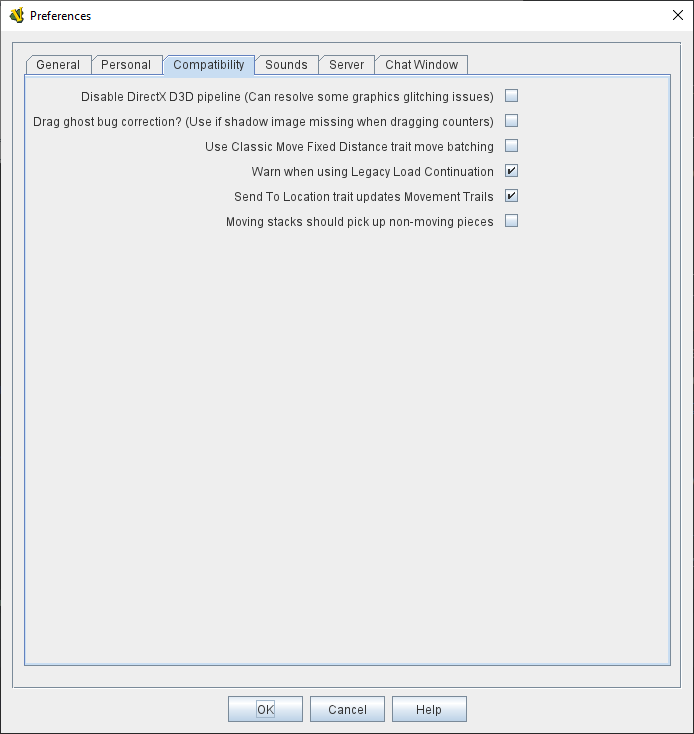
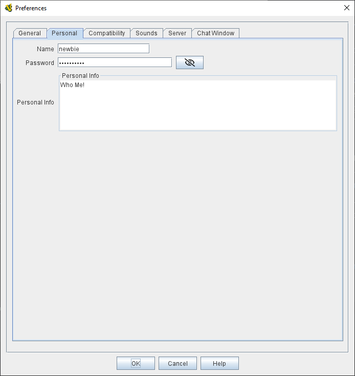
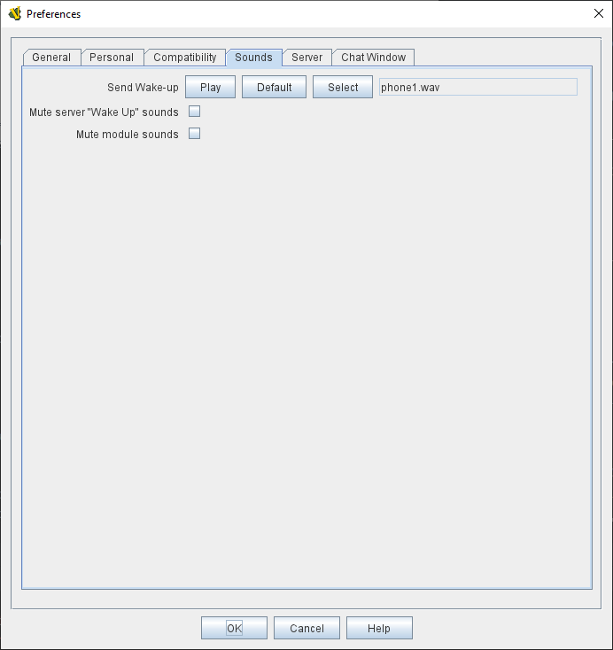
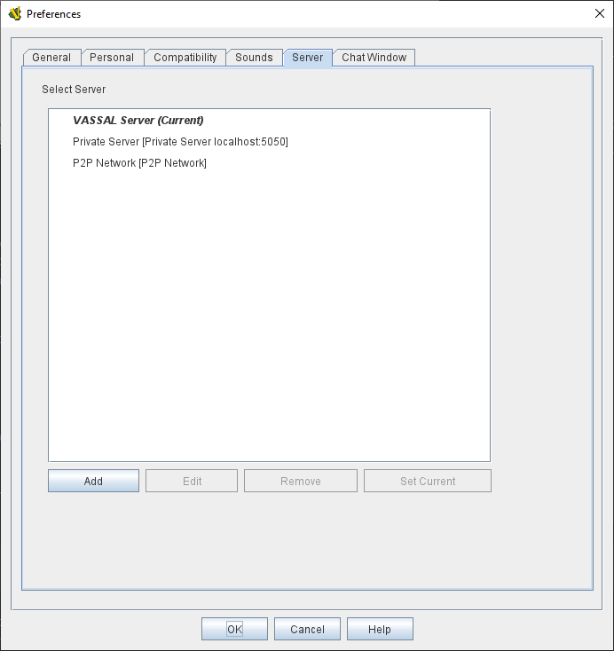
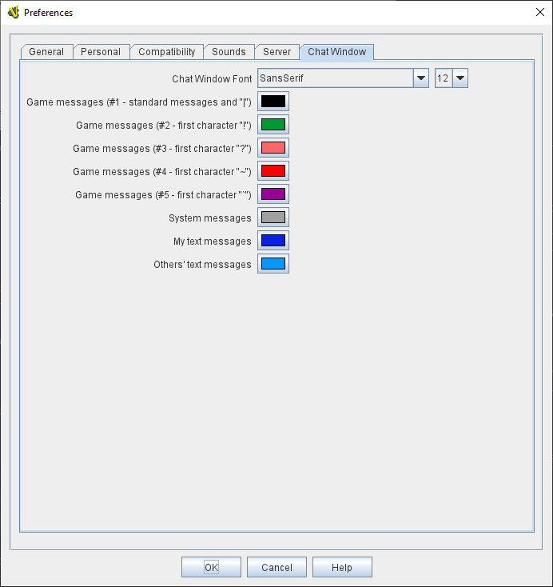
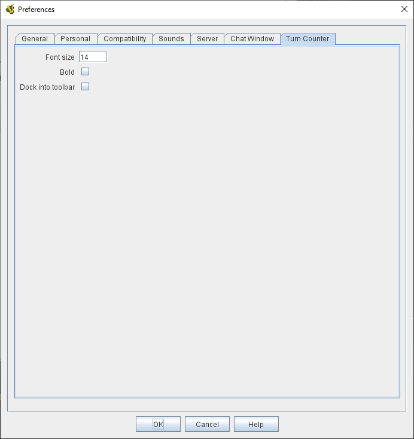

== VASSAL Reference Manual
[#top]

[.small]#<<index.adoc#toc,Home>> > *Preferences*#

'''''

=== Preferences
The VASSAL Preferences dialog allows you to configure VASSAL for your system and to personalize its preference options to suit your needs.

The number of tabs displayed will depend on the module you are using at the time (for example a module without
a <<TurnTracker#top,Turn Tracker>> won't display a Turn Tracker tab). You will find the preferences sorted under the following tabs:

* <<#General,*General*>> - Common preferences.
* <<#Compatibility,*Compatibility*>> - Platform-specific troubleshooting and very old modules.
* <<#Personal,*Personal*>> - Your username and password for multiplayer games.
* <<#Sounds,*Sounds*>> - Sound file mappings.
* <<#Server,*Server*>> - Which server to connect to for online play.
* <<#ChatWindow,*Chat Window*>> - Fonts and colors for the <<ChatLog#top,Chat Log>>
* <<#TurnCounter,*Turn Counter*>> - <<TurnTracker#top,Turn Tracker>> display configuration.

[#General]
==== General Preferences
[width="100%",cols="50%,50%",]
|===
|The _General_ tab includes common preferences for configuring VASSAL's user interface.

*Language*: Sets the language the VASSAL will use, when localized translations are available. When none are available for a language, VASSAL will default to English.

*Override default font size (0 = default; restart required)*: Sets the default font size to use for text in menus and buttons.

*Remember main window size between sessions*: When checked, Vassal will save the size of the main window between different sessions.

*Ask "Wizard" questions at startup*: If checked, VASSAL modules will use "wizard-style" introductory screens when starting a new game. If unchecked, the main menu will appear when starting a new module, and the _New Game_, _Load Game_, etc options from the _File_ menu can be used to start a new game.

*Generate audit trails in errorlog for 'Bad Data in Module' errors*: By default, 'Bad Data in Module' errors only generate a brief error message in the Chat Window and the error log. Checking this option will cause a detailed report to be written to the errorlog. Details will include the component or trait that generated the error and if it involved a Beanshell expression, then details of the values of any properties referenced in the Expression. *NOTE*: This option is intended for debugging and can degrade the performance of a module.

*Ask to ensure logging when starting or loading a new game*: If you are playing by email (PBEM), you will usually want to start a log file when you begin playing a new module or load a saved game, thus ensuring that you log all your actions into a .VLOG file which can be sent to your opponent. Checking this preference will provide a reminder prompt in these situations.

*Ask to ensure logging after a replay*: Checking this option will produce a reminder prompt to start recording a logfile when you finish playing through a .VLOG replay, e.g. from your PBEM opponent.

*Prompt for log/save file comments*: Checking this option will prompt you for comments whenever you save a game or begin a log file. From VASSAL 3.5 onward, these comments will be displayed in the chat log whenever the save or log file is loaded.

*Auto-report moves*: Use the Map defined Move Report to automatically report the movement of pieces during play.

*Opponents can unmask my pieces*: Allows your opponent to unmask pieces that you have masked.

*Use combined application window (requires restart)*: Check this option to have the first Map#top,Map>> in each module open as part of the same window
that includes the ChatLog#top,Chat Log>> and main module menu. If unchecked, all Maps will have their own windows.

*JVM maximum heap (in MB)*: This sets the maximum size (in megabytes) of the heap that Java uses to manage memory for the VASSAL applications. The two times you should consider increasing this value are: (1) if you receive an Out of Memory exception, and (2) you notice that map tiles are taking a really long time to paint. If either of these two things happens, try bumping it up by increments of 256 -- it is uncommon enough to need to adjust it at all, and e.g. 768 is often fine. 1024 handles even most very large modules, and we've never encountered a module in 20 years that needed more than 2048. Note that increasing this number in situations where it is not needed will end up disincentivizing Java from managing memory as tightly -- so don't increase this to massive numbers "just because you can". _NOTE: changing this value will have no effect until the next time you start the module in the VASSAL Player or Editor.

*Mouse Drag Threshold*: When VASSAL is distinguishing a mouse "click" from a mouse "drag", this is the minimum distance in pixels that the mouse must be moved (with a button pressed) in order to be considered a "drag". Smaller values will allow more sensitive drag detection, but can result in "clicks" being misinterpreted as drags. Larger numbers mean a piece will have to be dragged further before it begins "dragging". _NOTE:_ Pieces can be dragged to a position "inside" the drag threshold by first dragging them outside and then dragging them back (can be all in the same drag).

*Center on opponents' moves*: If checked, whenever an opponent makes a move (either online or while replaying a PBEM log file), VASSAL will ensure that the position is visible on the screen, recentering if necessary. This is generally desirable behavior, but in online games where multiple players make moves simultaneously it can be annoying, and thus the ability to turn it off is provided. _NOTE:_ Previous versions of VASSAL had a feature which let the value of this preference be forced by a module's settings. This seemed to create problems, so it was removed as of VASSAL 3.4, and now this player preference is always available in every module.

*Reverse left-to-right order of pieces in Stack Viewer*: When checked, the normal left-to-right ordering of pieces in the Mouse-over Stack Viewer is reversed.

*Recenter Sensitivity (% of edge/center distance)* Adjusts the sensitivity when VASSAL decides whether to recenter the screen on an action. Larger numbers will produce more recentering.

*Scroll increment (pixels)*: Sets the increment, in mapboard pixels, by which the map scrolls when using its scrollbars.

*Use arrow keys to scroll*: If checked, the arrow keys will be mapped to scroll the currently focused Map#top, Map>> window.

*Disable automatic stack display - use configured control key (Ctrl+Space) instead*: If checked, Map#StackViewer, Mouseover Stack Viewers>> do not pop up automatically when holding the mouse over a piece or stack. Instead, the viewer appears only when _Ctrl+SPACE_ is then pressed.

*Delay before automatic stack display (ms)*: Sets the number of milliseconds that the mouse must be held above a piece or stack to activate a Map#StackViewer, Mouseover Stack Viewer>>.

*Delay scrolling when dragging at map edge (ms)*: Sets the number of milliseconds of delay before scrolling the map when dragging a piece near to the edge of the view.

*Disable animation of map flares*: When checked, the Map Flares are displayed with a static image instead of an animated target image.

*Delay scrolling when dragging at map edge (ms)*: Change the time delay before map scrolling starts when the cursor nears the edge of a Map.

*Distance from edge of map to begin scrolling (when dragging)*: Sets how close to the edge of a Map the cursor must be before scrolling is initiated.

|image:images/Preferences.png[]

|===
[#Compatibility]
==== Compatibility
[width="100%",cols="50%,50%",]
|===
|Compatibility preferences are useful for troubleshooting certain rare platform-specific bugs. Others exist to maintain compatibility with very old modules.

*Disable DirectX D3D pipeline? (Can resolve some graphics glitching issues)*: This option is worth a try if you are experiencing "tearing" in your maps while running on Windows. If this option doesn't help, or if you are not running on Windows, please refer to https://vassalengine.org/wiki/Troubleshooting_Common_Problems[additional steps to try] on the VASSAL wiki.

*Disable OpenGL FBOs (Recommended for M1 Macs)*: If you are having poor graphics performance (slow scrolling, e.g.) on a Mac, and particularly on a non-Intel, Apple Silicon Mac, go to Vassal's preferences and check the box for Disable OpenGL FBOs.

*Drag ghost bug correction? (Use if shadow image missing when dragging counters)*: When dragging pieces on a map, the intended behavior involves semi-transparent images of the pieces being dragged. On some Windows machines these images don't appear -- in that case, select this option for an alternate drag image.

*Use Classic Move Fixed Distance trait move batching*: The Translate#top,Move Fixed Distance>> trait changed in VASSAL 3.3 to correct several old bugs. Part of the fix involved changing some behaviors of the trait when firing off multiple versions of the trait with a TriggerAction#top,Trigger Action>> trait. Check this box to use the old trait behavior with modules that depend on the old unintended behavior (in other words, if the bug was actually a "feature" for your module).

*Warn when using Legacy Load Continuation*: If checked, then you will get a warning if you select the legacy 'Load continuation' menu option. Check this if you use this option regularly, understand the consequences and do not need to be warned.

*Send To Location trait updates Movement Trails*: When checked, Send to Location traits will update Movement Trails as if a piece was manually moved.

*Moving stacks should pick up non-moving pieces*: If you move a piece onto another piece and then move it again without deselecting, the default behavior is that it will not "pick up" that intermediate piece. Check this box to cause intermediate pieces to be picked up.

| 

Example of Image Tearing


|===
[#Personal]
==== Personal
[width="100%",cols="50%,50%",]
|===
|The _Personal_ section of the preferences allows you to set your _user name_ and _password_ to be used in logging into multiplayer games, both online _server_ games and e-mail based _PBEM_ games. You can also enter some personal information to be displayed to other players in multiplayer "rooms".

*Name*: Your name as you wish to appear in multiplayer games.

*Password*: Your password which will secure your side and prevent anyone else from viewing your private cards and maps.

*Personal Info*: Optional additional info displayed for other players in multiplayer rooms.

*IMPORTANT*: Your password secures your place in a multiplayer game, preventing anyone else from taking your position and/or looking at your private cards or maps. This means that if you lose your password it can be difficult to recover your position in a game, much to your (and everyone else in the game's) chagrin.

If you are changing computers but cannot remember your password, you will first need to "retire" from your
side on the computer that has the password recorded on it (switch to observer status, and then save the game). This will create a clean copy of the game without your side being locked - you can then join the game on your new system using whatever new username and password you like.

|

|===
[#Sounds]
==== Sounds
[width="100%",cols="50%,50%",]
|===
|If the module supports sounds and sound effects, the _Sounds_ tab will allow you to configure the files for each sound.
|

|===
[#Server]
==== Server
[width="100%",cols="50%,50%",]
|===
|The _Server_ tab lets you pick which server you will use to connect to online games.
|

|===
[#ChatWindow]
==== Chat Window
[width="100%",cols="50%,50%",]
|===
|The _Chat Window_ tab lets you configure the font and colors for the ChatLog#top,Chat Log>>.

*Chat Window Font*: Allows you to choose the style and size of the font displayed in the Chat log.

*Game Messages*: Configures the color used for normal game messages.

*Game Messages (#2 - first character "!")*: Configures the #2 color for game messages. The module designer can cause this color to be used for a ReportChanges#top,Report Action>> trait or other MessageFormat#top,Message Format>> by putting the character `!` as the very first character in the message.

*Game Messages (#3 - first character "?")*: Configures the #3 color for game messages. The module designer can cause this color to be used for a ReportChanges#top,Report Action>> trait or other MessageFormat#top,Message Format>> by putting the character `?` as the very first character in the message.

*Game Messages (#4 - first character "~")*: Configures the #4 color for game messages. The module designer can cause this color to be used for a ReportChanges#top,Report Action>> trait or other MessageFormat#top,Message Format>> by putting the character `~` as the very first character in the message.

*Game Messages (#5 - first character "`")*: Configures the #5 color for game messages. The module designer can cause this color to be used for a ReportChanges#top,Report Action>> trait or other MessageFormat#top,Message Format>> by putting the character ``` as the very first character in the message.

*System Messages*: Configures the color used to display messages from the VASSAL system in the Chat Log.

*My text messages*: Configures the color used to display messages that you type into the Chat Log.

*Others' text messages*: Configures the color used to display message that other players type into the Chat Log.

|

|===
[#TurnCounter]
==== Turn Counter
[width="100%",cols="50%,50%",]
|===
|If your module contains a TurnTracker#top,Turn Counter>>, this tab will let you configure preferences about its appearance.

*Font Size*: Sets the size of the font used in the Turn Counter.

*Bold?*: Controls whether the Turn Counter uses bold text.

*Dock into Toolbar*: Controls whether the Turn Counter begins docked to the Toolbar#top,Toolbar>>.
|
|===


