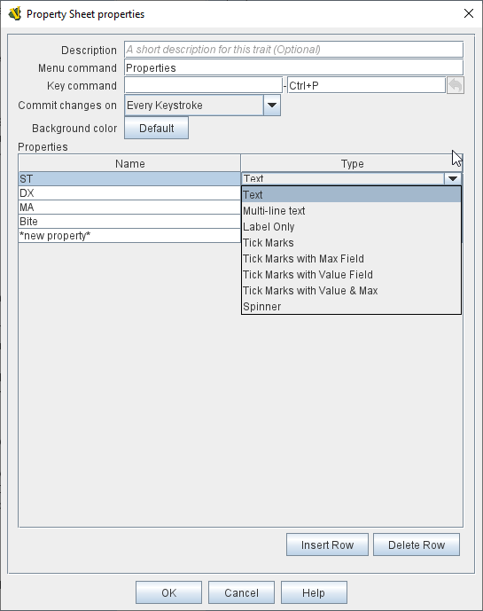

== VASSAL Reference Manual
[#top]

[.small]#<<index.adoc#toc,Home>> > <<GameModule.adoc#top,Module>> > <<PieceWindow.adoc#top,Game Piece Palette>> > <<GamePiece.adoc#top,Game Piece>> > *Property Sheet*#

'''''

=== Property Sheet

This trait attaches an arbitrary set of editable <<Properties.adoc#top,properties>> to a Game Piece.

These properties are exposed by name as properties of the piece, and may be accessed by name from other traits.

[width="100%",cols="50%,50%",]
|===
a|
*Menu Text:*  Text for right-click context menu item that will show the properties window during play.
If left blank, no context menu item will appear, but the properties window can still be activated with the key command.

*Keystroke:*  Keyboard shortcut or <<NamedKeyCommand.adoc#top,Named Key Command>> to show the properties window during play.

When a player edits the properties window during play, there are three methods for committing  changes:

. *Commit on Every Keystroke* - Every keystroke and tick-mark click you make are immediately committed as you make them.
Other players see your changes immediately.
. *Commit on Apply Button or Enter Key* - Changes are not communicated to other players until you press the APPLY button at the bottom of the property sheet, or press the ENTER key on your keyboard, or close the Property Sheet window.
. *Commit on Window Close or Enter Key* - Changes are not communicated to other players until you press the ENTER key or close the Property Sheet window.

You may customize the background color of each PropertySheet window, for example to use different colors for the pieces belonging to different sides.

You may select from 8 different formats in which to display properties:

. *Text* - A simple, single-line field that accepts text.
. *Multi-line text* - A field that accepts multi-line text.
This type of field stretches to fill extra space on the property sheet window.
It is suitable for free form notes.
. *Label Only* - This is not really a property, it simply adds text to your property sheet.
It is useful for documenting your property sheet.
. *Tick Marks* - Displays one or more rows of checkboxes.
Suitable for tracking ammo or damage.
Players specify a current and maximum value range.
. *Tick Marks with Max Field* - As above, but the _maximum value_ is displayed in an editable field to the left of the checkboxes.
Suitable for Role-Playing games where damage-tracking is based on a character attribute that is also important.
. *Tick Marks with Value Field* - As Tick marks, but the _current value_ is displayed in an editable field.
Suitable for large-value properties where clicking ticks might be impractical and when the exact tick value is important.
For example weapons that track 100+ rounds of ammo.
. *Tick Marks with Value & Max* - As Tick marks, but both _current value_ and _maximum_ values are editable.
. *Spinner* - A numeric property that includes increment and decrement buttons.

| +
|===

'''''

==== Example

Here's an example of using PropertySheets to maintain character fighting stats, demonstrating the Tick Marks, Text, Spinner, and Multi-line text types:

image:images/property_sheet_map.png[]

==== Using Tick Marks

[cols=",,",]
|===
|image:images/propertysheet-edit2.png[] |image:images/propertysheet-edit4.png[] |image:images/propertysheet-edit5.png[]
|===

Tick Mark property types have a value and a maximum.
Either, both, or neither may be displayed as a text box in addition to the tick marks.
Initially, the maximum and value are both 0, so no tick marks appear.
To set the value and/or maximum when the box is not shown, right-click in the area where the tick marks would appear.
