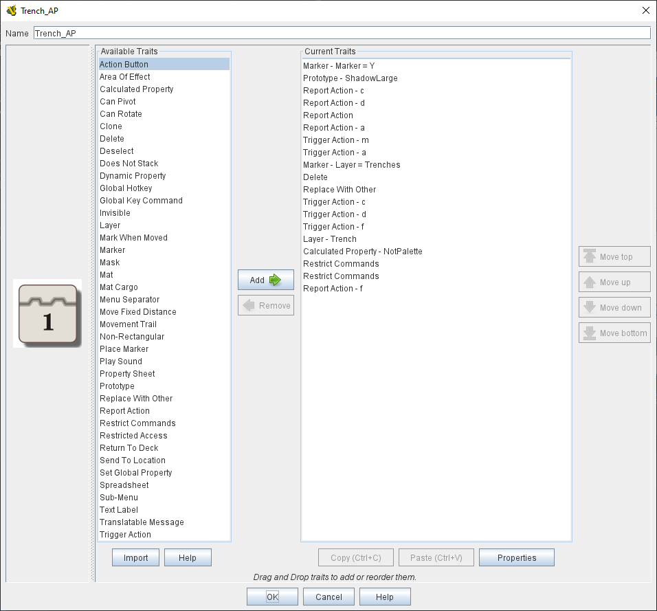

== VASSAL Reference Manual
[#top]

[.small]#<<index.adoc#toc,Home>> > <<GameModule.adoc#top,Module>> > *Prototypes*#

'''''

[#Prototypes]
=== Prototypes

Most games have many pieces which share similar categories of similar traits -- "French Units", "German Units", "Tanks", "Cards", "Control Markers", "Units with shadows".  Prototypes are templates to vastly simplify the creation and maintenance of groups of game pieces with similar traits.
You first create a Prototype _Definition_ in the _[Game Piece Prototype Definitions]_ section of the Editor and give it a set traits just as you would give traits to a Game Piece.
Then, you add a <<UsePrototype.adoc#top,Prototype trait>> to the definition of one or more Game Pieces.
All of these Game Pieces will thenceforth function _as if they had all of the exact traits listed in the Prototype Definition._

Use of Prototypes means a lot less copy-and-pasting of the same traits will be necessary to create large groups of units.
Even better, when you change the traits in a Prototype, they are immediately changed for every piece that uses the Prototype, so you can update and maintain your modules much more quickly and accurately (and without having to try to remember whether you got every single one of the 57 different armored units...)

*Notes:*

. Any number of Prototypes may be referenced within the same piece.
For example a piece could refer to separate prototypes to indicate that it has Morale, Firepower, and Range.
. Prototypes can themselves refer to other prototypes, and so on, allowing complex "nested" relationships to be built.
For example the Army of the Potomac might refer to the prototype "Army" containing general traits of all armies, which in turn refers to a prototype for "Units" which contains traits for all combat units.
. For situations where traits care about which order they appear in the traits list (e.g.
Mask and Invisible traits which only hide the traits above them in the list), you can imagine each prototype's list of traits inserted into the piece's list of traits at the point the Prototype trait itself is placed.

*Saved Games and Prototypes:*  Once a piece based on a Prototype has been created _during a game_ and/or _saved to a save game_, it loses memory of being based on that prototype.
Therefore, the definition of the prototype can change in a later version of the module without invalidating saved games from previous versions.
All pieces in a Game Piece Palette, At Start Stack, or Deck will reset when a prototype definition changes while editing a module.

If you want your pieces in the palette to start in a certain state, then you can edit the traits that appear in this prototype by right-clicking in the area below the name.
You may need to resize the window to expose that area.

|image:images/PrototypeComponent.png[]

*SEE ALSO:*  <<UsePrototype.adoc#top,Prototype (Trait)>>

'''''

== Sub-Components

[#Definition]
=== Definition

To add a <<#Prototypes,Prototype Definition>>, navigate to the _[Game Piece Prototype Definitions]_ component of the Editor.
Right-click on it and select _Add Definition_.
You can then give your Prototype a set traits just as you would give traits to a Game Piece.
Then, you add a <<UsePrototype.adoc#top,Prototype trait>> to one or more Game Pieces.
All of these Game Pieces will thenceforth function as if they had all of the exact traits listed in the Prototype Definition.

The dialog for defining a prototype is just the same as for defining a Game Piece, but with a name and without the innermost Basic Piece.
Prototypes may contain other prototypes.

*SEE ALSO:*  <<UsePrototype.adoc#top,Prototype (Trait)>>
