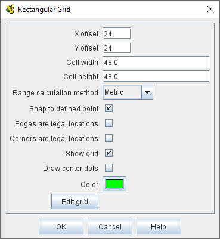
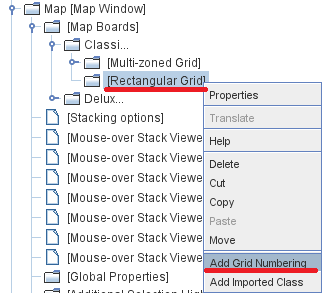

== VASSAL Reference Manual
[#top]

[.small]#<<index.adoc#toc,Home>> > <<GameModule.adoc#top,Module>> > <<Map.adoc#top,Map>> > <<Board.adoc#top,Board>> > *Rectangular Grid*#

'''''

=== Rectangular Grid
A standard rectangular grid for regulating movement on a Board.
[width="100%",cols="50%a,^50%a",]
|===
|

*X,Y offset:*:: The horizontal and vertical position of the center of the first cell of the grid

*Cell width/height:*:: Pixel dimensions of each cell.

*Range calculation metric:*:: Determines the algorithm to be used in range calculations.
+
*_Euclidean_* range uses the largest of the X distance and the Y distance in cells. It is analogous to King Moves in chess, where the range represents the number of moves the King would have to make to reach the target space from the source: moving diagonally is permitted.
+
*_Manhattan_* range uses the sum of the X distance and the Y distance, in cells. It is analogous to walking blocks in its eponymous city: moving diagonally isn't allowed when counting ranges, and the distance from the corner of 3rd St and 5th Ave to the corner of 1st St and 3rd Ave is 4, since four non-diagonal blocks must be walked.

*Snap to defined point:*:: If checked, pieces placed anywhere within the grid will automatically snap to the nearest legal location.
+
By default, the only legal location is the center of each grid cell.
+
If unchecked, pieces may be placed anywhere.
+
If it is useful for most pieces to snap to legal locations, but for certain types of markers to be allowed anywhere, this can be accomplished by checking this box but adding a <<NonStacking.adoc#top,Does Not Stack>> trait to the pieces which should ignore the grid and selecting the trait's "Ignore map grid when moving" option.

*Edges are legal locations:*:: If snapping is enabled, then an additional snap point is created at the center of each grid cell side.

*Corners are legal locations:*:: If snapping is enabled, then an additional snap point is created at the corner of each grid cell.

*Show grid:*:: If checked, then the grid will be drawn over the Board image using the specified color.

*Draw center dots:*:: If checked, dots are drawn at the center of each cell using the specified color.

*Color:*:: Color used to draw the grid and center dots.

*Edit Grid:*:: Clicking the Edit Grid button brings up a graphical interface for positioning and sizing the grid over top of the Map.

|

|===

'''''

=== Sub-Components

==== <<GridNumbering.adoc#top,Grid Numbering>>

Used to assign names to cells on the grid.
Used primarily for automatically reporting moves.

To add Grid Numbering to a Rectangular Grid, it is necessary to first add the Rectangular Grid.
Then right+click on the Rectangular Grid's entry in the Editor, and select "Add Grid Numbering" (see diagram at right).

