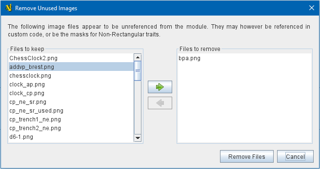

== VASSAL Reference Manual
[#top]

[.small]#<<index.adoc#toc,Home>> > <<Tools.adoc#top,Tools>> > *Remove Unused Images*#

'''''

=== Remove Unused Images
Module development often involves changing out art files -- for example you may use temporary art at first and then put in the final art when it becomes available.
Or you may discover images that need to be resized. Or improved images may become available.

But when you point your layers and maps and pieces at new image files, that doesn't mean the old image files automatically go away -- having been copied into the ZIP structure of the module's VMOD file, they remain waiting to be called back to service. Obviously over time this can result in module files being a good deal bigger than they really need to be.

The _Remove Unused Images_ tool on the <<Editor.adoc#top,Editor's>> _Tools Menu_ can help you sort this situation out. It will provide a list of all the image files in the module that are not referenced in the module's components, traits, and any linked HTML (e.g. HTML help files on the Help menu).

You will have a chance to inspect the list of unused images and to select which ones to remove and which ones to keep, before any are removed. Files are only removed when you click the _Remove Files_ button at the end of the process, and only files you have manually moved to the _Files to remove_ column will be removed.

**NOTE:** VASSAL cannot detect references to images from any custom Java code you have imported into the module. Images used only by custom code may appear on the unreferenced list, and it will be up to you as the module designer/maintainer to remember to keep them.

[width="100%",cols="50%,^50%",]
|===
|To remove unused images from the currently loaded module, go to the _Tools_ menu in the _Editor_ and select _Remove Unused Images_.

You will be shown a list of images that appear to VASSAL to be unreferenced in the module. Select the image files that you want to remove and use the green arrow buttons to move them to the _Files to remove_ side of the window.

Once you have moved the files you want to delete from the module to the right-hand side of the window, click the _Remove Files_ button to remove them.

|+
|===

You should then save the module to finalize the removal.

