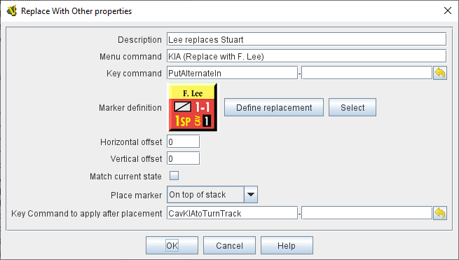

== VASSAL Reference Manual
[#top]

[.small]#<<index.adoc#toc,Home>> > <<GameModule.adoc#top,Module>> > <<PieceWindow.adoc#top,Game Piece Palette>> > <<GamePiece.adoc#top,Game Piece>> > *Replace With Other*#

'''''

=== Replace With Other
A Game Piece with this trait will have a command that replaces this piece with a different piece.
You can select any existing piece for the replacement or define a new one from scratch.

*EXAMPLE:*  A unit that can be destroyed but still leaves a wreck behind can be given this trait to turn it into a wreck.
This is more convenient than dragging a new piece from the Game Piece Palette and can't be accidentally undone, as a Layer trait could.

*EXAMPLE:*  A unit representing a General is killed in battle.
This trait can be used to replace him with a counter for a new more junior General who will appear as a replacement, and then the "Keystroke to apply after placement" can be used to activate a <<SendToLocation.adoc#top,Send to Location>> trait on the replacement General's piece to send that piece to the Turn Track to await availability.

[width="100%",cols="50%a,^50%a",]
|===
|

*Description:*::  A brief description of this trait that will appear in the <<GamePiece.adoc#top,Piece Definer>> window.

*Menu command:*::  The right-click context menu text for this trait.
If left blank, no context menu item will appear, but the trait can still be activated with the Key Command.

*Key command:*::  The <<NamedKeyCommand.adoc#top,Keystroke or Named Command>> to initiate this trait.

*Marker definition:*::  Click the *_Define Replacement_* button to open a Piece Definer to create a definition for the new piece from scratch (or to edit the definition you have already created).
+
Click the *_Select_* button to use the definition from an existing piece in the module.
This acts as a pointer to an existing definition: if the original piece is changed, the piece created by the _Replace with Other_ trait will also change.

*Horizontal offset:*::  The center of the replacement piece will be placed this many pixels to the right of the center of the original piece.

*Vertical offset:*::  The center of the replacement piece will be placed this many pixels above the center of the original piece.

*Match current state:*::  If selected, VASSAL will attempt to put the replacement piece in the same state as the original piece.
Layers will be set to the same level, labels will be given the same value, rotation angles will match, etc.
The state of a particular trait will carry over only if it has an exact match in the replacement, i.e.
the properties settings of that trait are the same in both the original and replacement piece.

*Only match states above this trait:*::  If selected, VASSAL will only replace states in traits that appear above this one in the list traits in the <<GamePiece.adoc#top,game piece editor>>. For example, the state of a <<PropertyMarker.adoc#top,Marker>> that's above this one _will_ change if the state in the new game piece.
If it's below, then it _will not_ change if the new game piece has the same marker property.

*Place marker:*::  Choose whether the new piece should be placed on the top of this piece's stack, on the bottom of the stack, or directly above/below the triggering piece.

*Key Command to apply after placement:*:: Optional <<NamedKeyCommand.adoc#top,Keystroke or Named Command>> to be applied automatically to the new piece immediately after being placed.

*SEE ALSO:*  <<Marker.adoc#top,Place Marker>> trait, <<SendToLocation.adoc#top,Send to Location>> trait.

|
image:images/Replace.png[]

|===
