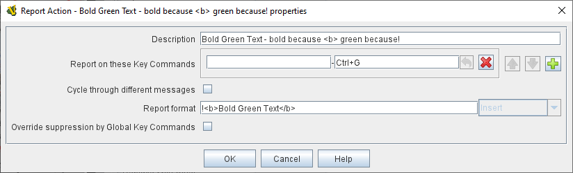

== VASSAL Reference Manual
[#top]

[.small]#<<index.adoc#toc,Home>> > <<GameModule.adoc#top,Module>> > <<PieceWindow.adoc#top,Game Piece Palette>> > <<GamePiece.adoc#top,Game Piece>> > *Report Action*#

'''''

=== Report Action

[width="100%",cols="50%,50%",]
|===
a|
A Game Piece with this trait will report a configurable message to the <<ChatLog.adoc#top,Chat Log>> in the main window when any of a given set of Key Commands or <<NamedKeyCommand.adoc#top,Named Key Commands>> are either typed or activated by other traits.

*Report on these keystrokes:*  Specifies the key commands or <<NamedKeyCommand.adoc#top,Named Key Commands>> that this trait will respond to.
Hit the _Add_ button to specify more than one key command.

*Cycle through different messages:* If left unchecked, the same message will be reported whenever any of the above key commands are received.
If checked, the message to be reported will cycle through the list specified below.
Each time one of the key commands is received, the next message in the list will be reported, returning to the beginning after the end is reached.

*Report Format:* The <<MessageFormat.adoc#top,Message Format>> for the message that will appear in the <<ChatLog.adoc#top,Chat Log>>.

*Override suppression by Global Key Commands:* If this box is checked, the message will be displayed when triggered even if it is triggered by a Global Key Command with the "Suppress Individual Reports" option checked. This can be used to ensure that certain key messages are displayed no matter what.

*ENHANCED CHAT LOG:* Note that the Chat Log now supports *bold text*, _italicized text_, *and even colored text* and image:images/ChatLogDice.png[]. See the <<ChatLog.adoc#top,Chat Log>> article for full details.

*IMPORTANT*: When HTML is enabled in the chat log, it is important to remember that the `<` character will be interpreted as the beginning of an HTML tag, rather than simply displaying a "less than" or "left angle bracket" symbol. Thus, modules which use the `<` symbol to indicate "less than" or to "draw an arrow" or enclose a user name, etc, will need to have those instances changed to `\&lt;` (the HTML escape code which causes a literal `<` character to be printed). Otherwise you may
experience odd behaviors such as chat log messages failing to appear (or seeming to be delayed until the next chat message is printed).

*Additional Properties*:  _$menuCommand$_ inserts the name of the piece's right-click context menu command that corresponds to the key command received, _$oldPieceName$_ is the name of the piece before the action is applied, _$newPieceName$_ is the name of the piece after the action is applied, __$mapName$__is the name of the map where the piece is located, _$oldMapName$_ is the name of the map before the action, _$location$_ is the map location where the piece is located, _$oldLocation$_ is the location before the action is applied.
_Note:_ if a piece is deleted or replaced as the result of an action, then the value of _oldLocation_ and _oldMapName_ will depend on the order of the traits, while _mapName_ and _location_ will be blank.

*Message Formats:*  A list of <<MessageFormat.adoc#top,Message Formats>> for cycling messages.
Available properties are the same as above.
Any <<Properties.adoc#top,Properties>> defined on the piece will be substituted.
To access the value of a Property before the change, add _old_ to the name.
For example, if a piece has a property _hitPoints,_ then _$hitPoints$_ gives the value after the key command and _$oldhitPoints$_ gives the value before.

*Report previous message on these keystrokes:*  When any of these key commands are received, the message reported will be the one the precedes the last reported message, instead of the following one.

*Troubleshooting:* (If a Report Action trait doesn't seem to be showing a message)

. Check to make sure that the <<Map.adoc#top,Map>> where the piece is located has its _Auto-report format for units modified on this map_ field set to include the string $message$ since otherwise Report Action traits will not generate messages for pieces on that map.
. If the Report Action trait is activated by a <<GlobalKeyCommand.adoc#top,Global Key Command>>, then it will only generate a message if the Global Key Command's _Suppress individual reports_ field is not checked.

*EXAMPLE:*  A unit named "Infantry" has a single Layer trait that is activated with a Ctrl+F "Flip" command.
By adding a Report Action trait with report key Ctrl+F and message _$newPieceName$ flips in $location$_ the chat text will echo "Infantry flips in A9" whenever a player flips the unit.

*EXAMPLE:*  If the unit above has the <<Hideable.adoc#top,Invisible>> trait activated by Ctrl+I , then an additional Report Action trait with report key Ctrl+I and two cycling messages _$oldPieceName$ goes invisible in $location$_ and _$newPieceName$ revealed in $location$_ will report when the unit becomes invisible/revealed.

*EXAMPLE:*  If the counter above has the <<Rotate.adoc#top,Can Rotate>> trait with 4 facings controlled by Ctrl+] and Ctrl+[, then an addition Report Action trait with report key Ctrl+] and report-previous key Ctrl+[ and cycling messages _$newPieceName$ rotates to face North_, etc., will automatically report the appropriate facing.

a|

Simple Report, Single Message

Adding Multiple Cycling Messages

*Bold*, _Italicized_, and Colored text are <<ChatLog.adoc#top,supported>>.

|===

*SEE ALSO:* <<ChatLog.adoc#top,Chat Log>>
