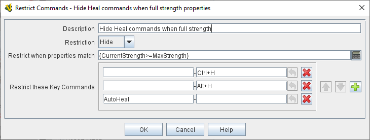

== VASSAL Reference Manual
[#top]

[.small]#<<index.adoc#toc,Home>> > <<GameModule.adoc#top,Module>> > <<PieceWindow.adoc#top,Game Piece Palette>> > <<GamePiece.adoc#top,Game Piece>> > *Restrict Commands*#

'''''

=== Restrict Commands

This trait allows you to either grey out or hide completely particular items from the right-click context menu of a piece when specified conditions apply.
Hiding or disabling a key command _*also*_ prevents that key command from being triggered by other traits, Global Key Commands, etc.

_Example:_ A piece may remove certain commands based on where it is on the map by matching the <<BasicPiece.adoc#top,CurrentZone>> property.
A piece with a <<Layer.adoc#Properties,Layer>> specifying a damage level may disable commands based on the Level property of that Layer.

[width="100%",cols="50%a,^50%a",]
|===
|

*Description:*::  A brief description of this trait that will appear in the piece's Trait list in the Editor, and is mainly used to distinguish different Restrict Commands trait from each other.
Typically, the command to be disabled or hidden is referenced here.

*Restriction:*::  Select _Hide_ to remove a command from the right-click context menu entirely.
+
Select _Disable_ to disable (grey out) the command.
In either case, the restricted key command(s) will not be invoked when the corresponding <<NamedKeyCommand.adoc#top,Keystroke or Named Command>> is received.

*Restrict when properties match:*::  The commands will be restricted when the <<Properties.adoc#top,Properties>> of this piece match the given <<PropertyMatchExpression.adoc#top,Property Match Expression>>. If this is left blank they will always be restricted.

*Restrict these Key Commands:*:: Specify the <<NamedKeyCommand.adoc#top,Keystroke and/or Named Commands>> that will be restricted.
The corresponding right-click context menu item(s), if any, will be hidden or greyed out.

|
|===
