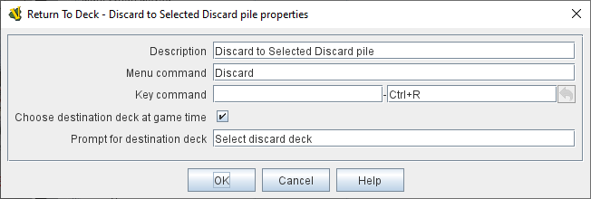

== VASSAL Reference Manual
[#top]

[.small]#<<index.adoc#toc,Home>> > <<GameModule.adoc#top,Module>> > <<PieceWindow.adoc#top,Game Piece Palette>> > <<GamePiece.adoc#top,Game Piece>> > *Return to Deck*#

'''''

=== Return to Deck
The _Return to Deck_ is used to move a piece into a <<Deck.adoc#top,Deck>> when the designated key command is received or the right-click context menu item is selected.
If there is only one Deck in the module the piece will be added to it.
If the module has more than one Deck, you may select the Deck that the piece will be placed in.
Alternatively, you may prompt the players to choose a deck when the trait is activated.

*EXAMPLE:* +
For a game in which cards are drawn from a deck, used, and placed into a discard pile, both the deck and the discard pile will be represented by a Deck component.
By adding a _Return to Deck_ trait to each card, with the text 'Discard' and the command _Ctrl+R_, then hitting _Ctrl+R_ on with a card selected will automatically send it to the discard pile.
[width="100%",cols="50%a,^50%a",]
|===
|
*Description:*:: A brief description of the purpose of this trait for your own reference.

*Menu command:*:: Text for the right-click context menu option that will move the piece to the Deck.
If left blank, no context menu item will appear but the trait can still be activated by the Key Command.

*Key command:*:: The <<NamedKeyCommand.adoc#top,Keystroke or Named Command>> that initiates moving this piece to the Deck.

*Choose destination deck at game time:*::  Check this option to let the player select a Deck to use at the time the trait is activated as opposed to predefining which Deck to return to beforehand.

*Deck name:*:: Enter the name of the target Deck as a simple String or click the _Select_ button to select from a list of the Decks available in this module.
+
Alternatively you can enter an <<Expression.adoc#top,Expression>> to calculate the name of the taget Deck at the time the trait executes.

*Prompt for destination deck:*::  Text to display when asking the player to select a Deck to return the piece to.

|image:images/ReturnToDeck.png[]

|===
