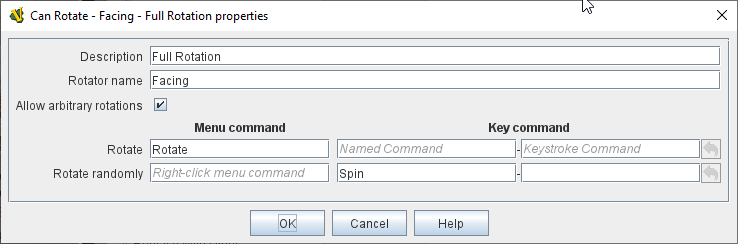

== VASSAL Reference Manual
[#top]

[.small]#<<index.adoc#toc,Home>> > <<GameModule.adoc#top,Module>> > <<PieceWindow.adoc#top,Game Piece Palette>> > <<GamePiece.adoc#top,Game Piece>> > *Can Rotate*#

'''''

=== Can Rotate

This trait allows a piece to be rotated through an arbitrary number of facings.
You can choose the number of valid facings.
For example, a hex-based game may have 6 (or possibly 12) possible facings, while a game with a square grid game might have 4 or 8.
Alternatively, you can allow any arbitrary facing.
In this case, selecting the _Rotate_ command will change the cursor and let the user drag the cursor to select the facing of the piece interactively.
An optional additional command will rotate the piece to a random facing (in one of the valid facings, if applicable).

NOTE:  The _Can Rotate_ trait will rotate only those traits that _appear above it_ in the list of traits for a Game Piece.
Traits below the "Can Rotate" trait will be drawn on top of the rotated image.

*Description:*  A descriptive name for this rotation trait.

*Number of allowed facings:*  Number of fixed facings.

*Command to rotate clockwise:*  Key Command or <<NamedKeyCommand.adoc#top,Named Key Command>> to rotate clockwise through fixed facings.

*Menu text:*  The associated menu text for the right-click context-menu for each Key Command.
If left blank no context menu item will appear.

*Command to rotate counterclockwise:*  Key Command or <<NamedKeyCommand.adoc#top,Named Key Command>> to rotate counterclockwise through fixed facings.

*Allow arbitrary rotations:*  Check the box to enable arbitrary rotation instead of rotation through a fixed number of facings.

*Command to rotate:* Key Command or <<NamedKeyCommand.adoc#top,Named Key Command>> to initiate free rotation.

*Command to rotate randomly:* Key Command or <<NamedKeyCommand.adoc#top,Named Key Command>> to select a random facing.

NOTE:  Since the rotations are created on the fly from a bitmapped image, the image quality of a rotated counter may be lower than the unrotated version.
Alternatively, you may get better image quality for your rotations by creating separate images for each rotation in an external paint program (If your images are based on vector objects, you can rotate them without degrading quality) and putting them into different levels of a <<Layer.adoc#top,Layer>>.

image:images/Rotate.png[]

'''''

==== Properties

A Can Rotate trait defines a number of <<Properties.adoc#top,Properties>>.  In the name of the properties, <name> is the "Description" name specified in the above fields. To avoid trouble, do not insert spaces or other special characters in "Description" field if you plan to use these properties.

* _<name>_Facing_ returns the current facing if the number of facings is fixed. The value is an integer that ranges from 1 (the original, un-rotated state) to the the number of allowed facings. For example, if the number of facings is 4, then this property returns a value from 1 to 4.
* _<name>_Degrees_ returns the current rotation angle if arbitrary rotations are allowed.
