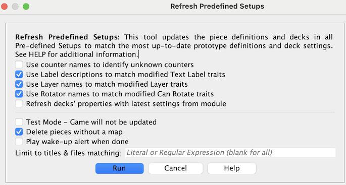

== VASSAL Reference Manual
[#top]

[.small]#<<index.adoc#toc,Home>> > <<Editor.adoc#top,Editor>> > *Refresh Predefined Setups*#

'''''

=== Refresh Counters
When you update the <<Prototypes.adoc#top,Prototypes>> in a module, those changes will affect any *future* games started using that module, but the changes will not--by default at least--affect pieces in any ongoing games that you load with the new version of the module. VASSAL saved games include the complete definition of each piece in order to maintain saved game compatibility with older versions of a module: so that replays and saves sent to you by someone with an earlier version of the module will continue to work in the same way they always did with the old version.

But particularly since the <<GameModule.adoc#PredefinedSetup, Predefined Setups>> for module scenarios are stored internally as saved games, it is often important to module designers to be able to update an existing game to use the latest prototypes. That way a module designer can often avoid re-doing complex setups simply because prototypes have been updated and improved.

Running the _Refresh Predefined Setups_ tool is equivalent to running the <<SavedGameUpdater.adoc, Refresh Counters Tool>> on each of the predefined setups in a module.

[width="100%",cols="50%,^50%",]
|===
|To use the refresher on all the <<GameModule.adoc#PredefinedSetup, Predefined Setups>> in a module go to the _Editor's_ _Tools_ menu and select _Refresh Pre-Defined Setups_. You will be shown a dialog with several choices affecting the manner in which the operation is to be carried out.

Click the _Run_ button when you are ready to perform the refresh. _All_ Predefined Setups in the module will be updated, _which may take some time, especially for complex modules with many pre-defined setups._ The chat log will show output and statistics from the operation. Once the operation is finished, pieces in all pre-defined setups will have been updated to use the latest prototypes.
|+
|===

Note that you should then save your module to complete the update.

