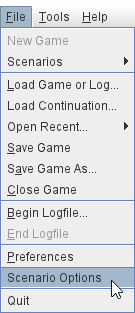
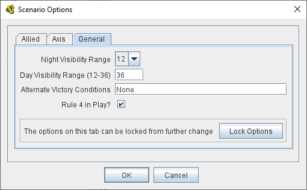
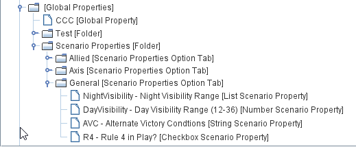
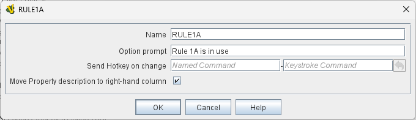
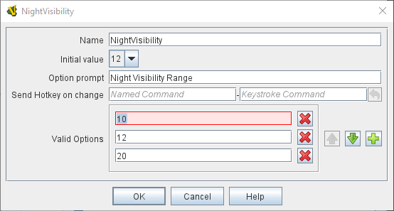
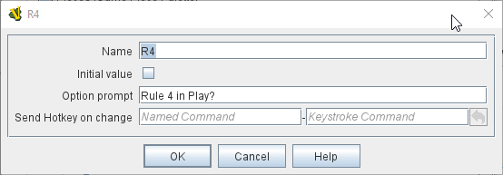
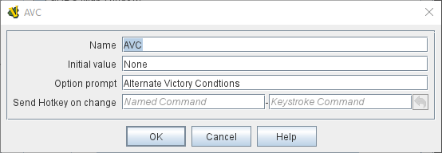
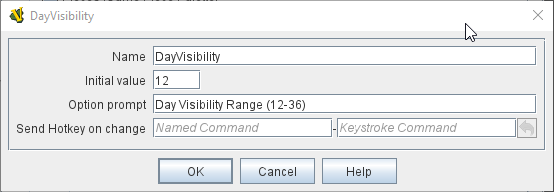

== VASSAL Reference Manual
[#top]

[.small]#<<index.adoc#toc,Home>> > <<GameModule.adoc#top,Module>> > *Scenario Options*#

'''''

=== Scenario Properties

<<ScenarioProperties.adoc#ScenarioProperty,Scenario Properties>> are a special kind of Global Property that are collected into groups in tabs within a single dialog box that is activated by the _File_ -> _Scenario Options_ menu option.

Scenario Options are designed to be a central place to record scenario specific options such as special rules, visibility, weather etc.

Scenario Properties (or Scenario Options) are grouped together in named <<ScenarioProperties.adoc#ScenarioPropertiesOptionTab,Scenario Properties Option Tabs>>, which are created within the module level Global Properties component and Scenario Options are created within each Scenario Option Tab.

<<ScenarioProperties.adoc#ScenarioPropertiesOptionTab,Scenario Properties Option Tabs>> can be locked from further changes.

The values of all Scenario Options are saved in each Save Game.

 

In this example, which matches the image above, a Folder has been used to group the <<ScenarioProperties.adoc#ScenarioPropertiesOptionTab,Scenario Properties Option Tabs>> in the Global Properties component.

[#ScenarioPropertiesOptionTab]
==== Scenario Properties Option Tabs
A Scenario Properties Option tab groups a set of Scenario Properties in a named tab.

Each tab can be Locked (by any user) to prevent further changes to the properties defined on that tab by players. Once locked, a Scenario Option Tab can only be unlocked by the user who locked it.

NOTE: Game Components can still change Scenario Properties on locked tabs. Only Players are prevented from changing the Scenario Property values.

[#ScenarioProperty]
==== Scenario Property

Each Scenario Property creates a Global Property that can be referenced by game components in the usual way.

NOTE: One of the main differences between a Scenario Property and a Globa Property is that you cannot create Change-Property Toolbar Buttons on Scenario Properties.

The Global Property has a small User Interface created within it's owning Option Tab that allows the value of the Global Property to be changed manually by players.

The value of the Global Property can also be changed by standard Vassal mechanisms such as the Set Global Property trait.

There are 4 kinds of Scenario Options that define the style of control that players see to change the value of the property:

* <<ScenarioProperties.adoc#ListScenarioProperty,List Scenario Property>>
* <<ScenarioProperties.adoc#CheckboxScenarioProperty,Checkbox Scenario Property>>
* <<ScenarioProperties.adoc#StringScenarioProperty,String Scenario Property>>
* <<ScenarioProperties.adoc#NumberScenarioProperty,Number Scenario Property>>

===== Scenario Property Common Fields
The following 3 fields are common to all Scenario Property types

[width="100%",cols="50%a,50%a",]
|===
|

*Name:*:: Sets the name of the Global Property that will be created. This is the property name that can be used by game components to access the value of this Scenario Property.

*Option prompt:*:: The text that is displayed to users next to the option in the user interface.

*Send Hotkey on change:*:: The specified Hot Key will be sent whenever a player (NOT a game component) changes the value of this Scenario Property.

|

|===

[#ListScenarioProperty]
===== List Scenario Property
Defines a Scenario Property where players can choose from a list of values

[width="100%",cols="50%a,50%a",]
|===
|

*Initial value:*:: Sets the initial value the Global Property will have when a new game is started. If you change the values in the list below, the drop-down list of initial values will be updated next time you save and re-open this property.

*Valid options:*:: The list of valid values to choose from.

|

|===

[#CheckboxScenarioProperty]
===== Checkbox Scenario Property

Defines a Scenario Property that can have a true or false value.

[width="100%",cols="50%a,50%a",]
|===
|

*Initial value:*:: Set the initial value of the Global Property to true by clicking on the checkbox

|

|===

[#StringScenarioProperty]
===== String Scenario Property

Defines a Scenario Property that can hold any text.

[width="100%",cols="50%a,50%a",]
|===
|

*Initial value:*:: Sets the initial value the Global Property will have when a new game is started. Any kind of value can be types into this box.

|

|===

[#NumberScenarioProperty]
===== Number Scenario Property
Defines a Scenario Property where players are restricted to changing the value to a whole number.

[width="100%",cols="50%a,50%a",]
|===
|

*Initial value:*:: Sets the initial value the Global Property will have when a new game is started. Any kind of value can be types into this box, but only whole numbers will be saved when OK is clicked.

|

|===