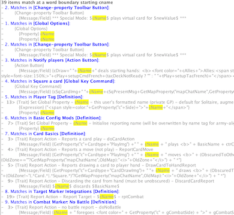

== VASSAL Reference Manual
[#top]

[.small]#<<index.adoc#toc,Home>> > <<Editor.adoc#top,Editor>> > *Search*#

'''''

=== Search

VASSAL's Module Editor has a powerful Search facility to find components and pieces in a number of different ways.

The default scope is a simple search that targets the names and descriptions of module components. Options can be used to search through all module data or to limit the search to data types of interest. Special search types offer additional flexibility.

Initiate a search with the "Next" button [PgDn] and repeat this to advance the output item by item. The "Prev" button [PgUp] allows you to return to the previous item.

Search output indicates the number of items (traits and components) found and details each in order, positioning the editor on the found item. Traits are reported with a prefix indicating the line number of the trait within the found item (sample output below). Matched strings are high-lighted.

Note that a search will continue from the last item found and will wrap-around, until you restart the editing session.

'''''

==== Editing Modules

[width="100%",cols="50%a,^50%a",]
|===
a|

===== Type
Search may be normal, start of word or https://en.wikipedia.org/wiki/Regular_expression[Regular Expression]. "Start of word" uses a pre-formatted regular expression to find matches on words or phrases starting with the search string.

===== Exact Case
Force an Exact case search (i.e. abc is different to ABC).

===== Scope
Choose from a basic search of component and piece names, a full search of all supported data or use "advanced filters" to select specific data types. Note that there are a few data fields that search does not check.

When editing an <<Concepts.adoc#extension,Extension>>, default search scope is limited to Extension contents. A scope option appears that allows module contents to be included.

===== Match component names & descriptions
Match against the names and descriptions of components and pieces.

===== Match [Class names]
Match against the Java Class Name of components (in the editor these are the names in square brackets).

===== Match trait descriptions
Match against text recorded in the description fields of traits.

===== Match expressions and fields
Match against expressions defined in piece traits, both legacy and Beanshell.

===== Match property names
Match against the names of Properties provided by piece traits.

===== Match key commands
Match against Key Commands defined in piece traits. You can search against user defined Named Key Strokes, or for the standard name of defined Key Strokes (e.g., Ctrl+C or Alt+Shift+C).

===== Match UI text

Match against the Menu Text provided for piece trait right-click menus.

===== Match message formats
Match against the Formatted Strings defined in piece traits.

.Basic
|image:images/search_basic.png[]

_Basic Search_

image:images/search_advanced.png[]

_Advanced Filters._

_Sample Output._

|===

