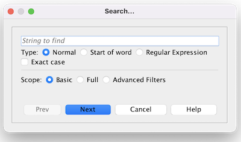
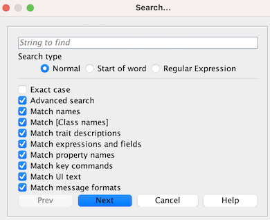

== VASSAL Reference Manual
[#top]

[.small]#<<index.adoc#toc,Home>> > <<Editor.adoc#top,Editor>> > *Search*#

'''''

=== Search

VASSAL's Module Editor has a powerful Search facility to find components and pieces in a number of different ways.

The default search is to search for everything, but the Advanced Searh options can be used to limit the type of search performed.

'''''

==== Editing Modules

[width="100%",cols="50%a,^50%a",]
|===
a|
===== Exact Case
Force an Exact case search (i.e. abc is different to ABC).

===== Advanced Search
Show the advanced search options. All search options are on in a simple search. The advanced options allow you to turn off options to narrow your search.

===== Match names
Match against the names of components or pieces.

===== Match [class names]
Match against the Java Class Name of components.

===== Match trait descriptions
Match against text recorded in the description fields of traits.

===== Match expressions and fields
Match against Beanshell expressions defined in piece traits.

===== Match property names
Match against the names of Properties provided by piece traits.

===== Match key commands
Match against Key Commands defied in piece traits. You can search against user defined Named Key Strokes, or for the standard name of defined Key Strokes (e.g. Ctrl-C).

===== Match UI text

Match against the Menu Text provided for piece trait right-click menus.

===== Match message formats
Match against the Formatted Strings defined in piece traits.

|

_Basic Search._

_Advanced Search._
|===

