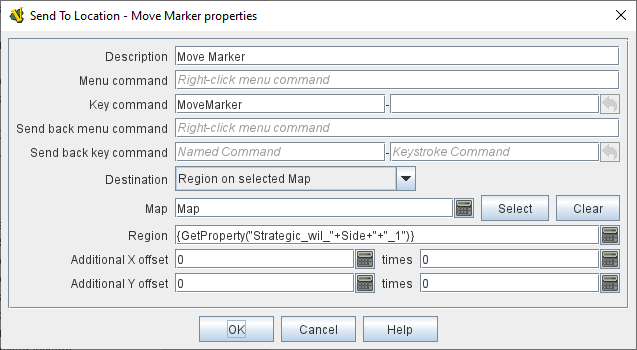
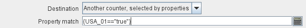

== VASSAL Reference Manual
[#top]

[.small]#<<index.adoc#toc,Home>> > <<GameModule.adoc#top,Module>>> <<PieceWindow.adoc#top,Game Piece Palette>> > <<GamePiece.adoc#top,Game Piece>> > *Send to Location*#

'''''

=== Send to Location

Adds a command that moves a piece directly to another location.

*Description:*
a brief description of the command which will appear in the Trait list of the piece.
Helpful when distinguishing between several different Send to Location traits.

*Command Name:*
Text for a right-click context menu that will cause the piece to be moved.
If left blank, no context menu item will appear, but the trait can still be activated with the key command.

*Key command:*
The <<NamedKeyCommand.adoc#top,Keystroke or Named Command>> which will activate this trait, causing the piece to be moved.

*Send Back Command Name:*
The menu text for an "undo" command to return the piece to its original location.

*Send Back Key Command:*
The <<NamedKeyCommand.adoc#top,Keystroke or Named Command>> for the "undo" command

*Destination:*

[cols=",",]
|===

|_Location on Selected Map_
|An (x,y) position on a specific map, optionally offset as described below;

|_Zone on Selected Map_
|The center of a Zone on a map, optionally offset as described below;

|_Region on Selected Map_
|
The named Region on a map, optionally offset as described below.
In the case of <<ZonedGrid.adoc#top,Multi-Zone Grids>>, this format makes use of the _Location Format_ field in any <<ZonedGrid.adoc#top,Zone>>: for Zones whose Location Format is configured to _$name$_, the name of the Zone will be the name of the Region.
For Zones whose Location Format is configured to _$gridLocation$_, then the grid location inside the zone will be used.

|_Another counter selected by properties_
|The location of the piece selected by the <<PropertyMatchExpression.adoc#top,Property Match Expression>> specified, optionally offset as described below

|_Grid Location on Selected Map_
|
A named location on a map using the appropriate grid numbering (or the named location on an <<IrregularGrid.adoc#top,Irregular Grid>>.
No additional offset is available at this time, as it is intended that this be an offset in grid units instead of pixels, which is not yet implemented.
|===

*NOTE:* Because the fields below accept <<Expression.adoc#top,Expressions>>, they can be computed from other <<Properties.adoc#top,Properties>> of the piece, and/or <<GlobalProperties.adoc#top,Global Properties>>.

*Map:*
An <<Expression.adoc#top,Expression>> specifying the Map Window name that the piece will be sent to.
If unspecified, then the piece's current map is used.
You can use the _Select_ button to select a Map Window currently defined in the module.

*Board:*
An <<Expression.adoc#top,Expression>> specifying name of the board that the piece will be sent to.
Positions below are relative to the board's position.
If no board is specified, positions are relative to the Map Window.
You can use the _Select_ button to select a Board currently defined in the module.

*Zone Name:*  An <<Expression.adoc#top,Expression>> specifying the Zone name that the piece will be sent to.

*Region Name:* An <<Expression.adoc#top,Expression>> specifying the Region name that the piece will be sent to.In the case of <<ZonedGrid.adoc#top,Multi-Zone Grids>>, this format makes use of the _Location Format_ field in any <<ZonedGrid.adoc#top,Zone>>: for Zones whose Location Format is configured to _$name$_, the name of the Zone will be the name of the Region.
For Zones whose Location Format is configured to _$gridLocation$_, then the grid location inside the zone will be used.

*Grid Location:* The Grid Location that the piece will be sent to.
In the case of an <<IrregularGrid.adoc#top,Irregular Grid>>, this is name of an individual Region defined in the grid.

*Property Match:* A <<PropertyMatchExpression.adoc#top,Property Match Expression>> that selects a counter that the piece will be sent to.

*X position:* An <<Expression.adoc#top,Expression>> specifying the horizontal position of the destination point in pixels.

*Y position:* An <<Expression.adoc#top,Expression>> specifying the vertical position of the destination point in pixels.

*Advanced Options:* If checked, then an additional set of <<Expression.adoc#top,Expression>> fields will be displayed, two each for X and Y.
Each pair of expressions will be evaluated, multiplied together, and then applied as offsets to the position specified above to give the final destination for the piece.

*Additional offset:* The value of these two <<Expression.adoc#top,Expressions>> will be multiplied together and added to the position specified above to give the final destination position for the piece.

*EXAMPLE:* +
A game may require that damaged units are returned to a Damaged pool for repairs.
Different boxes in the pool represent the amount of time before the unit is fully repaired.
A game piece may be given a _Send to Location_ trait with menu text "Send to Damaged Pool" and key command Ctrl+P, with the target position corresponding to the first box of the pool, with an additional offset, determined by the level of a <<Layer.adoc#top,Layer>> representing the damage, to place it in the appropriate box in the pool.

image:images/SendToLocationR.png[]

