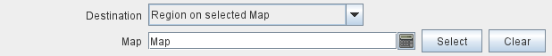

== VASSAL Reference Manual
[#top]

[.small]#<<index.adoc#toc,Home>> > <<GameModule.adoc#top,Module>>> <<PieceWindow.adoc#top,Game Piece Palette>> > <<GamePiece.adoc#top,Game Piece>> > *Send to Location*#

'''''

=== Send to Location

Adds a command that moves a piece directly to another location.

*EXAMPLE:* +
A game may require that damaged units are returned to a Damaged pool for repairs.
Different boxes in the pool represent the amount of time before the unit is fully repaired.
A game piece may be given a _Send to Location_ trait with menu text "Send to Damaged Pool" and key command Ctrl+P, with the target position corresponding to the first box of the pool, with an additional offset, determined by the level of a <<Layer.adoc#top,Layer>> representing the damage, to place it in the appropriate box in the pool.

NOTE: The *Menu Command* of a *Send to Location* trait will be greyed out and unavailable if the destination cannot be determined for any reason.

[width="100%",cols="50%a,^50%a",]
|===
|

*Description:*::
A brief description of the command which will appear in the Trait list of the piece.
Helpful when distinguishing between different _Send to Location_ traits.

*Menu command:*::
Text for a right-click context menu that will cause the piece to be moved.
If left blank, no context menu item will appear, but the trait can still be activated with the key command.

*Key command:*::
The <<NamedKeyCommand.adoc#top,Keystroke or Named Command>> which will activate this trait, causing the piece to be moved.

*Send back menu command:*::
The menu text for an "undo" command to return the piece to its original location.

*Send back Key Command:*::
The <<NamedKeyCommand.adoc#top,Keystroke or Named Command>> for the "undo" command

*Destination:*:: The destination drop-down provides different methods to determine where the piece will be sent to.
+
Depending on the Destination type, additional options will be available to specify the destination exactly.
+
All destinations can be further offset by the <<#offsets,additional offset options>> provided below.

_Location on Selected Map_:::
An (x,y) position on a specific map.

_Zone on Selected Map_:::
The center of a Zone on a map.

_Region on Selected Map_:::

The named Region on a map.
In the case of <<ZonedGrid.adoc#top,Multi-Zone Grids>>, this format makes use of the _Location Format_ field in any <<ZonedGrid.adoc#top,Zone>>:
+
* for Zones whose Location Format is configured to _$name$_, the name of the Zone will be the name of the Region.
+
* for Zones whose Location Format is configured to _$gridLocation$_, then the grid location inside the zone will be used.

_Any counter, selected by properties_:::
The location of the _first_ piece selected by the <<PropertyMatchExpression.adoc#top,Property Match Expression>> specified.
Compared to the two subsequent property match options (Cycle and Nearest), this option usually executes the most quickly and
efficiently. If you expect there to be only one piece matching the expression, or if you don't care which matching piece is
picked as long as it matches the expression, then this is the option you want.

_Cycle through counters, selected by properties_:::
The location of the _next_ piece selected by the <<PropertyMatchExpression.adoc#top,Property Match Expression>> specified.
If there are multiple matching counters then sending this command multiple times will cycle through the counters.

_Nearest counter, selected by properties_:::
The location of the _nearest_ piece selected by the <<PropertyMatchExpression.adoc#top,Property Match Expression>> specified.

_Grid Location on Selected Map_:::

A named location on a map using the appropriate grid numbering (or the named location on an <<IrregularGrid.adoc#top,Irregular Grid>>.

*Map:*::
An <<Expression.adoc#top,Expression>> specifying the Map Window name that the piece will be sent to.
If unspecified, then the piece's current map is used.
You can use the _Select_ button to select a Map Window currently defined in the module.

*Board:*::
An <<Expression.adoc#top,Expression>> specifying name of the board that the piece will be sent to.
Positions below are relative to the board's position within the Map.
If no board is specified, positions are relative to the Map Window.
You can use the _Select_ button to select a Board currently defined in the module.

*Zone:*::  An <<Expression.adoc#top,Expression>> specifying the Zone name that the piece will be sent to.

*Region:*:: An <<Expression.adoc#top,Expression>> specifying the Region name that the piece will be sent to. In the case of <<ZonedGrid.adoc#top,Multi-Zone Grids>>, this format makes use of the _Location Format_ field in any <<ZonedGrid.adoc#top,Zone>>:
+
* for Zones whose Location Format is configured to _$name$_, the name of the Zone will be the name of the Region.
* for Zones whose Location Format is configured to _$gridLocation$_, then the grid location inside the zone will be used.

*Grid location:*:: The Grid Location that the piece will be sent to.
In the case of an <<IrregularGrid.adoc#top,Irregular Grid>>, this is name of an individual Region defined in the grid.

*Property match:*:: A <<PropertyMatchExpression.adoc#top,Property Match Expression>> that selects a counter that the piece will be sent to.

*X position:*:: An <<Expression.adoc#top,Expression>> specifying the horizontal position of the destination point in pixels.

*Y position:*:: An <<Expression.adoc#top,Expression>> specifying the vertical position of the destination point in pixels.

[#offsets]
*Additional Offsets:*::

After the destination of the piece has been determined based on the _Destination_ type, the final position is further adjusted by the multiplied values of the two pairs of offsets <<Expression.adoc#top,Expressions>>.
+
Each pair of expressions (X and Y) will be evaluated, multiplied together, and then applied as offsets to the X,Y position calculated from the destination above to give the final destination for the piece.

|image:images/SendToLocation.png[]
_Sample *Send to Location* trait_

image:images/SendToLocationL.png[]
_Map destination options_

image:images/SendToLocationZ.png[]
_Zone destination options_

_Region destination options_

image:images/SendToLocationA.png[]
_Counter destination options_

image:images/SendToLocationG.png[]
_Grid Location destination options_

image:images/SendToLocationAdv.png[]
_Offset example_

|===